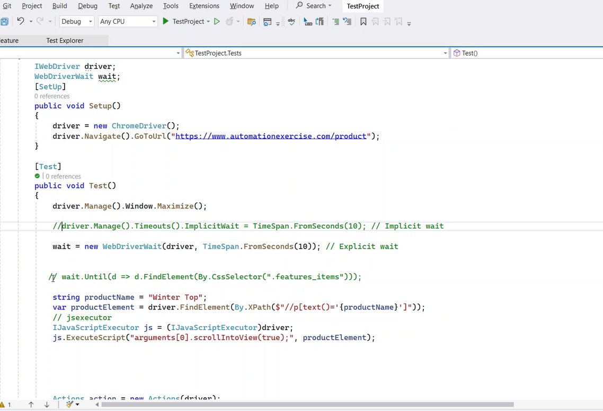

# .Net:
- we don't have any full form for this .net or defination for this .net
- It is a software or product that came from microsoft can be used for developing various kinds of applications.
- ### Categories of applications:
     - Desktop app
     - web app
     - mobile app

- .net has 30+ languages, in this we can choose the language what ever we want
- csharp is an extension of c++
## C sharp:
- c -> c++ -> c sharp
- c sharp is used to develop desktop,mobile and web apps
- ### features:
  - Object oriented: security, reusability
  - platform independent - can run on multiple platforms
  - Language Independent- means csharp can be used in other 30 languages of .net and vice versa.

- ### Visual Studio.Net:
  - It's an IDE provided by microsoft for developing .net application.
  - It's used for developing, concole, windows, web applications.
  - the project comes with a default class program

 ```c#
 using System;
  namespace FirstProject
{
    class Program
    {
        static void Main(string[] args)
        {
        }
    }

}
```
- the namespace is a logical container of types
- it doesn't have a physical existance
- generally we use it for grouping the items
- so if we have 10 classes in our prj and we want to group 5 and 5 sepearte then we can use namespace
- to import a name space we use using namespace_name;
- in solution explorer we have collection of projects
- a project is collection of items(classes,structures, enums, interfaces etc)
- default class program
- we can add n number of classes to our project
- right click on project select add and newitem then it will show you the list of items that a prj can have and select class
- when we create a new class in the same project a new file is created and it will have the same namespace as the program class coz, all classes in a prj have same namespace
- every main method is the entry point.
- ### Constructors in c#:
   - it is a special method present under a class responsible for initializing the vars of that class.
   - the name of a constructure is same as class.
   - it's non-value returining method, it doesnot return anything.
   - if we want to create the instace of a class we should have constructor.
   - It's the responsibility of the programmer to define a constructor if he doesn't then the complier will create a default one.
   - when we create any instance vars in our class thay will get the default values right the implictit constructor will assign the default values to the vars depending on their data types.
   ```c#
   class Test
   {
    int i;
    string s;
    bool b;
    public Test()
    {
        i=0; // Initializing the var
        s=null;
        b=false;
    }
   }
   ```
  - implicitly defined constructors are parameter less and called as default constructors anf they are public.
```c#
  using System;
namespace FirstProject
{
    class Program
    {
        int i;bool b;
        static void Main(string[] args)
        {
            Program p=new Program();
            Console.WriteLine(p.i);
            Console.WriteLine(p.b);
        }
    }

}
// output 0 false
```
```c#
using System;
namespace FirstProject
{
    class Program
    {
        int i;bool b;
        public Program()
        {
            i = 10;
            b = true;
        }
        static void Main(string[] args)
        {
            Program p=new Program();
            Console.WriteLine(p.i);
            Console.WriteLine(p.b);
        }
    }

}
// output: 10 true
```
- when we create instance to the class it will calls the constructor
- #### Types of Constructors:
     - Default or parameter less constructor- doesn't take any parameters
     - Parameterized constructor - will take parameters
     - copy constructor - 
     - static constructor
```c#
namespace FirstProject
{
     class ParameterizedConDemo
    {
        public ParameterizedConDemo(int i)
        {
            Console.WriteLine("Parameterized Constructot is called: " + i);
        }
        static void Main()
        {
            ParameterizedConDemo p = new ParameterizedConDemo(10);
        }
    }
}
```
- 
```c#
namespace FirstProject
{
     class ParameterizedConDemo
    {
        int x;
        public ParameterizedConDemo(int i)
        {
            x = i;
            Console.WriteLine("Parameterized Constructot is called: " + i);
        }
        public void display()
        {
            Console.WriteLine("The value of x is: "+x);
        }
        static void Main()
        {
            ParameterizedConDemo p1 = new ParameterizedConDemo(10);
            ParameterizedConDemo p2 = new ParameterizedConDemo(20);
            p1.display();
            p2.display();

        }
    }
}
// output: 
Parameterized Constructot is called: 10
Parameterized Constructot is called: 20
The value of x is: 10
The value of x is: 20
```
## Note: Class is a user defined type/ a data type

- #### Copy Constructor:
     - If we want to create multiple instances with the same value then we use these copy constructors.
     - in copy constructor the constructor takes same class as a paramter to it.
     - If we want to pass the same value to the constructor instaed of passing the value manually
     - A copy constructor is useful when you want to create a new object that has the same values as an existing objec
```c#
     using System;
using System.Collections.Generic;
using System.Linq;
using System.Text;
using System.Threading.Tasks;

namespace FirstProject
{
     class CopyConDemo
    {
        int x;
        public CopyConDemo(int i) // parameterzed con
        {
            x = i;
        }
        public CopyConDemo(CopyConDemo obj) // copy cons
        {
            x=obj.x;
        }
        public void Display()
        {
            Console.WriteLine("Value of x is: " + x);
        }
        static void Main(string[] args)
        {
            CopyConDemo c1 = new CopyConDemo(10);
            c1.Display();
            CopyConDemo c2= new CopyConDemo(c1);
            c2.Display();
        }
    }
} 
// output: 
Value of x is: 10
Value of x is: 10
```

- #### Static Constructor:
      -  If a constructor is explicitly declared by using static modifier we call that as static con. All the con we have defined till now are non-static or instance con.
      - When we difine a static con explictly even though after compilation a public con is going to be defined implictly by the complier.
      - Static con are also defined implicitly only when we have any static vars other wise we need to define them explictly.
- 
- 
      - static con are responsible for initializing static vars and these are first to execute under any class.
      - static con are never explictly called they are implictly called
      - non-static con are must be called explictly no change for implicit calling means when we create instance to that class then the con is called
      - but when we have static con we didn't call it or create an instance when we run it will only called implictly
```c#
using System;
using System.Collections.Generic;
using System.Linq;
using System.Text;
using System.Threading.Tasks;

namespace FirstProject
{
     class StaticConDemo
    {
        static StaticConDemo()
        {
            Console.WriteLine("Static con is executed.");
        }
        static void Main()
        {
        }
    }
}
//output: Static con is executed.
```
   - and they are first to execute means

```c#
using System;
using System.Collections.Generic;
using System.Linq;
using System.Text;
using System.Threading.Tasks;

namespace FirstProject
{
     class StaticConDemo
    {
        static StaticConDemo()
        {
            Console.WriteLine("Static con is executed.");
        }
        static void Main()
        {
            Console.WriteLine("Main method is executed!");
        }
    }
}
// output: 
Static con is executed.
Main method is executed!

```

- static con can't be parameterized so overloading of static con is not possible. coz they are implicitly called when they are implictly called we will not have chance to call them explictly so we can't pass parameters.

- ### Why constructors are needed in a class:
    -  
    - we nedd to con to create instance to the class but when we have implicit con to create instance why we need explicit con.
    - so implicit con will initialize the vars with default values or provided value only we want to assign diff values to the var we will use explicit con.
```c#
using System;
using System.Collections.Generic;
using System.Linq;
using System.Text;
using System.Threading.Tasks;

namespace FirstProject
{
     class First
    {
        int x = 100;
        static void Main()
        {
            First f1= new First();
            First f2= new First();
            First f3 = new First();
            Console.WriteLine(f1.x +" "+ f2.x +" " + f3.x);
        }

    }
}
// output: 100 100 100
```
- 
- 
```c#
using System;
using System.Collections.Generic;
using System.Linq;
using System.Text;
using System.Threading.Tasks;

namespace FirstProject
{
    class First
    {
        public int x = 100;
    }

    class Second {
        public int x;
        public Second(int x)
        {
            this.x = x;
        }
    }
    class TestCases
    {
        static void Main()
        {
            First f1= new First();
            First f2= new First();
            First f3 = new First();
            Console.WriteLine(f1.x +" "+ f2.x +" " + f3.x);

            Second s1 = new Second(10);
            Second s2 = new Second(20);
            Second s3 = new Second(30);
            Console.WriteLine(s1.x + " " + s2.x + " " + s3.x);

        }

    }
   
}
// output:
100 100 100
10 20 30
```
- 
- ### Static vs Non-static con:
   - If a con is explictly decalred by using static modifier we call that con as static con where as rest of other are non static
   - con are responsible for initializing the fileds/var of a class, static fileds are initialized by static con and non-static con are initialized by non static con
   - if we have two var in a class like one is static and other is non static
   - then static var is initialized by static con and non static are initialized by non static con
   - static cons are implictly called
   - non static con must be explictly called
   - static con executes immediately once the execution of a class starts and more over it's the first block of code to run under a class. where as non static con executes only after creating instance of the class
   - static con are called once but non static con will be called every time an instance is created
  - we can also initialize the static vars in non static con  but non static vars can't be initialized in static con
```c#
using System;
using System.Collections.Generic;
using System.Linq;
using System.Text;
using System.Threading.Tasks;

namespace FirstProject
{
     class ConDemo
    {
        int x;// initialized by non static con 
        static int y; // initialized by static con
        static ConDemo()
        {
            // we can't initialize x here it will throw error
            Console.WriteLine("Static con");
        }
        public ConDemo()
        {
            y = 100;
            Console.WriteLine("non- static con");
        }
        static void Main()
        {
            ConDemo c1=new ConDemo();
            Console.WriteLine(y);
        }
    }
}
// output: 
Static con
non- static con
100
```
- Non-static con can be parameterized but static is parameter less
- non-static con can be overloaded but static can't be
-  Static class can only have static members i will not have any non static members
- so in non-static class if the programmer doesn't write any con then it will create an implict non static con
- static con is implicitly defined only when the class conatins any static fileds


-  ### Difference b/w Varaiable Instance and References:
       - ##  Variable of a class:
       - ## Instance of a class:
       - ## Reference of a class:
    - ## Class: Its a user-define type:
       - Class is a blueprint of  an object
       - ex: string is a class but we call it a data type
    - ## Var Instance:
```c#
namespace TestPrj
{
    class First
    {
        int x = 100;
        static void Main(string[] args)
        {
            Console.WriteLine(x);
        }
    }
}
// here we will get an error of x can't be accessed coz, x is a non static var and we are trying to access it in the static method Main 
// so we can't access the non static vars in static method we need to create the instace then access
```
- Instance of a class can be created only by a new keyword
```c#

namespace TestPrj
{
    class First
    {
        int x = 100;
        static void Main(string[] args)
        {
            First f; // f is variable of class
            f=new First(); // f is instance of a class
            Console.WriteLine(f.x);
        }
    }
}
```

- 

- how many instances we create that many times a new memory will be allocated
- means how many instances we create that many copies we will have
- 
- 

      - ## Var Reference:
         - If we assign one instance to another then that will have the same memory and will be pointing to the saem memory location
         - ```c#
              First f1=new First(); // f is instance of a class
             First f2 = f1; // f2 is the reference
           ```
         - f1 and f2 will point to the same memory location and f2 is a pointer to f1


         - Reference of a class is called pointer tot the instance and every modification we perform on the members using instance reflect when we access those members thru reference and vice-versa
- ### Access Specifiers: 19-05-25
    -It's a special kind of modifiers using which we can define the scope of a type and it's member
    - who can controll and who can access are defined by this
    - c# supports 5 access sepcifiers
      - # Private - accessable only within the class it is defined nd child class can't even access it
      - # Internal - can be accessed inside the prj with child or non child but not outside the prj
      - # Protected - Can be accessable to child class but not for non child from any where like from another prj but only through child class
      - # Procted internal - is a combination of protected and internal, if any of these 2 is accessable then this will be accessable.
      - # Public - we can call it from any where doesn't have restrictions
    - any member of a class defined with any scope is accessable within the class
    - The restrc=ictions will start outside the class
 ```c#
 // Case-1: Consuming members of a class from same class of same prj
       namespace Accessdemo
         {
             public class Program
                {
        private void Test1()
        {
            Console.WriteLine("Private Method.");
        }
        internal void Test2()
        {
            Console.WriteLine("Internal Method.");
        }
        protected void Test3()
        {
            Console.WriteLine("Protected Method.");
        }
        protected internal void Test4()
        {
            Console.WriteLine("Protected Internal Method.s");
        }
        public void Test5()
        {
            Console.WriteLine("Public Method.");
        }
        static void Main()
        {
            Program p=new Program();
            p.Test1();
            p.Test2();
            p.Test3();
            p.Test4();
            p.Test5();

        }
             }
               }
      // output:
      Private Method.
      Internal Method.
      Protected Method.
      Protected Internal Method.s
      Public Method.
```
     
- The restrictions will strart when we go outside the class

```c#

// Case-2: Consuming members of class from child class of same prj

namespace AccessSpecifiersDemo
{
     class Two:Program
    {
        static void Main()
        {
            Two t=new Two();
            t.Test2();
            t.Test3();
            t.Test4();
            t.Test5();
        }
    }
}
// here also we can't access Test() coz its private

```
- Every member of class is by default private
- we can't apply private on a class
- we can only use public and internal on a class we can't  use others
- To access the other class members we can inherit/create instance.
- we can't access protected method in other than child class
```c#
// Case-3: Consuming members of class from non child class(Through instance) of same prj

namespace AccessSpecifiersDemo
{
     class Three
    {
        static void Main()
        {
            Program p=new Program();
            p.Test2();
            p.Test4();
            p.Test5();
        }
    }
}
// here we can't access the protected class
```
- To access the members from diff prj we need to add reference 
- right click on second prj add-> project reference->browse-> select the prj1.exe file
```c#
namespace AccessDemo2
{
    // case-3: consuming memebers from diif prj through child class
    class Four:AccessSpecifiersDemo.Program
    {
        static void Main()
        {
            Four f=new Four();
            f.Test3();
            f.Test4();
            f.Test5();
        }
    }
}
//here we can't access private and internal 
// coz private can't be accessed and internal means only within that project
```
- Protected Intenal -> is a combination of protected and internal, if any of these 2 is accessable then this will be accessable.
```c#
using System;
using System.Collections.Generic;
using System.Linq;
using System.Text;
using System.Threading.Tasks;
using AccessSpecifiersDemo;

namespace AccessDemo2
{
    // case-4: Consuming the members of a class in other prj and through instance
    class FIve
    {
        static void Main()
        {
           Program p=new Program();
            p.Test5();
        }
    }
}
```

- 

- ###  Different Kinds of Variables in a class:
    -  To store values we use  var
    - ## Types of var:
       - ### Non-static/ Instance 
          - Any var that is declared normally like int x=0;
       - ### Static
          - If a var is explicitly Declard with static modifier or else declard under any static block
       - ### Constants
       - ### Readonly-  
           - can only initialize at the time of declaration/ constructor
    - static and non static var ex:
```c#
namespace VariablesDemo
{ 
    class Program
    {
        int x;// non static var
        static int y; // static var
        static void Main()
        {
            int z; // static var
        }
    }
}
```

- For static var the memory will be allocated when the program complies
- but for non-static memory will be allocated only when the instance of a class is created 
- 
- 
- ##### Constant Var:
   - If a var is declared by using the keyword "const" we call it as const vars can't be modified once after their declaration, so it's must to initialize constanr vars at the time of declaration only 
   - const float pi=3.14f;
- 
- For static var only one copu will be created
- for non-static depends on instances how many instances we create that many copies
- for const vars only one copy will be created
- 
- once the execution starts static and const vars are initialized
```c#
namespace VariablesDemo
{ 
    class Program
    {
        int x;// non static var
        static int y=50; // static var
        const float pi = 3.14f;
        public Program(int x)
        {
            this.x = x;
        }
        static void Main()
        {
            Console.WriteLine(y);
            Console.WriteLine(pi);
            Program p1=new Program(100);
            Program p2=new Program(200);
            Console.WriteLine(p1);
            Console.WriteLine(p2);
            
        }
    }
}
```
- 
-  The only diff b/w static and const is static can be modified and const can't be
- #### Readonly var:
    - declared using readonly keyword we call that vars as readonly var and 
    - The behavoir of readonly vars are similar to the instance vars means initialized only after the instance of class is created
    - after initializing the readonly var we can't changes its value
- 
```c#
namespace VariablesDemo
{ 
    class Program
    {
        int x;// non static var
        static int y=50; // static var
        const float pi = 3.14f;
        readonly bool flag;
        public Program(int x, bool flag)
        {
            this.x = x;
            this.flag = flag;
        }
        static void Main()
        {
            Console.WriteLine(y);
            Console.WriteLine(pi);
            Program p1=new Program(100,true);
            Program p2=new Program(200,false);
            Console.WriteLine(p1);
            Console.WriteLine(p2);
            
        }
    }
}
// here the flag is created with 2 copies
```
- 
- and we can only initlize the readonly var at the time of declaration or through cinstructor other than these we can't
- The only diff b/w readonly and instance is instance var can be modified but not readonly

## Inheritance:
   - It's a machenism of consuming the members from one class in another class by establishing parent/child relationship b/w the classes.
   - Lets say there is a class and have some properties or memebers in it and i want the same members to be in another class also i can copy and paste those but i will effect the performance by increasing the memory right(called rewrtiing the code)
   - Thats why inheritance is used
   - Inheritance provides resuability
   - one class can have n number of childrens
- 
   - Syntax:
   - <modifiers>class<child class>:<parent class>
   - parent class - Base - super class
   - child class - Derived - sub class
- Note: In inheritance child class can consume mebers of it's parent class as if it is the owner of those members(except private members of parents)
   - ### Rules of Inheritance:
   - #### 1. Parent classes constructors must be accessable to child class, otherwise inheritance will not be possible.
      - when we crate istance for child class the con will implictly call the parent con, if parent con is private or don't mention any modifiers means it will not be able to call that con
       - The child class con will mplictly call parent class con if parent has another it will call its parent etc

     ```c# 

            namespace InheritanceProject
             {
                   class class1
                    { 
                    public class1()
                             {
            Console.WriteLine("Class one");
        }
        public void Test1()
        {
            Console.WriteLine("Method1.");
        }
        public void Test2()
        {
            Console.WriteLine("Method2.");
        }
    }
           }


          namespace InheritanceProject
                 {
                  class Class2:class1
                  {
         public Class2()
        {
            Console.WriteLine("class2 ");
        }

        static void Main()
        {
            Class2 c=new Class2();
            c.Test1();
            c.Test2();
        }
                 }
         }
         
         //output:
          Class one
          class2
          Method1.
          Method2.
    ```
   - #### 2. Child class can access parent class members but parent class can never access the child class members.

   - #### 3. We can initialize the parent class var using child class instance.
    ```c#
    class1 p; // p is a varibale of class1
    Class2 c=new Class2(); // c is an instance of class2
    p = c; // initializing parent class var with child class inastance
    ```
    ```c#
    namespace InheritanceProject
          {
    class class1
    { 
        public class1()
        {
            Console.WriteLine("Class one");
        }
        public void Test1()
        {
            Console.WriteLine("Method1.");
        }
        public void Test2()
        {
            Console.WriteLine("Method2.");
        }
    }
         }


         namespace InheritanceProject
          {
     class Class2:class1
    {
        public Class2()
        {
            Console.WriteLine("class2 ");
        }

        static void Main()
        {
            class1 p; // p is a varibale of class1
            Class2 c=new Class2(); // c is an instance of class2
            p = c; //p is a reference initializing parent class with child class inastance
            c.Test1();
            c.Test2();
            p.Test1();
            p.Test2 ();
        }
    }
    }
       // output:
      Class one
      class2
      Method1.
      Method2.
      Method1.
      Method2.
  ```

    - p is the refenrce to the instance so it will not have the seperate memory allocation and p is consuming the memory of c
- 
     - here even c and p consuming to same memeory using p we can't access the child class members
- 

- 

   - #### 4. Every class we define or predeined classes in librabries are all inherited from object class means, object is the parent class of every class 
      - since object is the parent class for every class we can access the members of object class like Four imp members of obj class
           - Equals
           - GetHashcode
           - GetType  -> gives the type of that
           - Tostring
       - Object class is the default Base class for every class in .NET frame work present inside the system namespace
```c#
                     class1 p; // p is a varibale of class1
              Class2 c=new Class2(); // c is an instance of class2
                p = c; //p is a reference initializing parent class with child class inastance
               c.Test1();
               c.Test2();
              c.Test3();
                p.Test1();
           p.Test2 ();

           Object obj=new Object();
               Console.WriteLine(obj.GetType());
              Console.WriteLine(p.GetType());
              Console.WriteLine(c.GetType());
              //output:
              Class one
             class2
            Method1.
            Method2.
            Method 3.
           Method1. 
            Method2.
             System.Object
             InheritanceProject.Class2
            InheritanceProject.Class2
```
- ## Types of Inheritance:
   - No.of child classes a parent class have or vice versa
   - Types:
    - 1. Single
    - 2. Multi-Level
    - 3. Hierarchical
    - 4. Hybrid
    - 5. Multiple
- 
     

      - #### 5. In c Sharp we don't have support for multiple inheritance thru classes. what we are provided is only single ingeritenace thru classes
         - means multiple and hybrid are not supported thru classes
         - if it has more than one parent then not supported
         - If the parent class con is parameterized then we need to call the parent class con explictly from the child class con other wise it will throw error
```c#
namespace InheritanceProject
{
    class class1
    { 
        public class1(int i)
        {
            Console.WriteLine("Class one "+i);
        }
        public void Test1()
        {
            Console.WriteLine("Method1.");
        }
        public void Test2()
        {
            Console.WriteLine("Method2.");
        }
    }
}


using System;
using System.Collections.Generic;
using System.Linq;
using System.Text;
using System.Threading.Tasks;

namespace InheritanceProject
{
     class Class2:class1
    {

        public void Test3()
        {
            Console.WriteLine("Method 3.");
        }
        public Class2(int a):base(a) // explictyl calling the parent con
        {
            Console.WriteLine("class2 ");
        }

        static void Main()
        {
            class1 p; // p is a varibale of class1
            Class2 c=new Class2(10); // c is an instance of class2
            p = c; //p is a reference initializing parent class with child class inastance
        }
    }
}

// output:
Class one 10
class2
```
  - #### 6 In first rule we have learned that child class con will implictly call the parent class con if the parent class con is parameter less and if the parent class con is parameterized then the program has to explictly call the parent class con using base keyword.
       - reference the above code

- ## How to use Inheritence:
      - Entity: which is associated with set of attributes it can be living or non living object
      - When we develop any app it mainly deals with entities
      - ex: Bank app-> customer is entity, school app-> student is the entity and phone -> attributes are its features
      - Step 1:  Identify the entities that are associated with the application we are developing. 
             - Eg: School->students, staff etc are attributes
      - step 2: Identify the attributes of each and every entity
            - ex: student - id, name, address, phone, class , marks, grade
      - so when we have more entities like Teaching staff and non-teaching staff then we will define 3 seperate classes for all 3 right 
      - but these can have some common features so when we define them seperately that causes memory space usage waste 
      - so we can define in one class and access them in child class
      - we use classes for representing entities
    - step 3: Identify the common attributes of each entity and put them in a hierarchial order(re-usability)
    - step 4: Define the class representing the entities that are put in hierarchial order.


## Method Overloading:
   - It's approach of defining multiple methods of same name under a class by changing parameters. by changing type / number / order of parameters
   - public void Test()
   - public void Test(int i)
   - but a change in return type will not be allowed here
   - public string Test() // invalid change in return type in not allowed
```c#
namespace OverLoadProject
{
    class Program
    {
        public void Test()
        {
            Console.WriteLine("1st method...");
        }
        public void Test(int i)
        {
            Console.WriteLine("2nd method..."+i);
        }
        public void Test(string s)
        {
            Console.WriteLine("3rd method..."+s);
        }
        public void Test(string s,int i)
        {
            Console.WriteLine("4th method..." + s+" "+i);
        }
        public void Test( int i,string s)
        {
            Console.WriteLine("4th method..." + i + " " + s);
        }

        static void Main(string[] args)
        {
            Program p=new Program();
            p.Test();
            p.Test(10);
            p.Test("HI");
            p.Test("Hi", 10);
            p.Test(2, "hello");
        }
    }
}
//output:
1st method...
2nd method...10
3rd method...HI
4th method...Hi 10
4th method...2 hello

```
  - ## Why do we overload the methods:
       - method overloading comes under polymerphism
       - polymerphism means when the input chnages the output will also changes
       - in our code also wihtout parameters and with int as input and string as input will give diff outputs but the same method 
       - and accessspecifiers can be diff no need to be same(public/private/protected etc)
       - whenever the input changes the output will automatically changes
- 
       - In the above ex the method is saem but when inputs are changing the output is also changing means method overloading
       - Method overloading means a method with multiple behaviour
       - coz if we use diff method names we will get confused and need to remember every method so method overloading helps with this

## Polymorphism:
   - ## Method Overriding:
     - It's an approch of re-implementing a parent classes method under the child class with the same signature.
     - class1
        Test()
    - class2 : class1
       Test()
    - #### Diff b/w overloading and overriding: 
     - #### Method overloading: 
        - we define the multiple methods with same name by changing their parameters.
        - This can be performed either within a class as well as b/w parent child classes also
        - While overloading a parent classess method under the child class, child class doesn't nrequire to take the permission from the parent class.
        - Overloading is all about defining multiple behaviour of parent method under child class.
     - #### Method overriding:
        -  we defince multiple methods with same name and same paramneters.
        - This can be performed only within parent and child class and can never be performed in same class
        - While overriding a parent's method under child class , child class erquires a permission from it's parent class.
        - Overriding is all about changin the behaviour of parent method under child class.

- #### Notes: If we want to overide a perent's method under the child class first that method shoul be declared by using virtual modifier in parent class.
      - public virtual void Test() // this parent class method is giving permission to override this method in child class
      - public override void Test() // child class is overriding the parent method
```c# 
using System;
using System.Collections.Generic;
using System.Linq;
using System.Text;
using System.Threading.Tasks;

namespace OverLoadProject
{
     class LoadParent
    {
        public void Show()
        {
            Console.WriteLine("Parent show Method is called");
        }
        public void Test()
        {
            Console.WriteLine("Parent's Test Method is called");
        }
    }

    class LoadChild : LoadParent
    {
        public void Show(int i)
        {
            Console.WriteLine("Child class show method is called..");
        }
        static void Main()
        {
            LoadChild c=new LoadChild();
            c.Show();
            c.Test();
        }
    }
}
// here Test method can't be overrided becayuse it doesn't have any permission to that like not having virtual modifier
```
- 
```c#
 using System;
using System.Collections.Generic;
using System.Linq;
using System.Text;
using System.Threading.Tasks;

namespace OverLoadProject
{
     class LoadParent
    {
        public void Show()
        {
            Console.WriteLine("Parent show Method is called");
        }
        public virtual void Test()
        {
            Console.WriteLine("Parent's Test Method is called");
        }
    }

    class LoadChild : LoadParent
    {
        public void Show(int i) // overloading
        {
            Console.WriteLine("Child class show method is called..");
        }
        public override void Test() // overriding
        {
            Console.WriteLine("Overriden child method is called");
        }
        static void Main()
        {
            LoadChild c=new LoadChild();
            c.Show();
            c.Test();
        }
    }
}
// output:
Parent show Method is called
Overriden child method is called
``` 

- ### Method Hiding/Shadowing:
   - Is an approach of reimplementing a parent classes method under the child class exactly with same name and signature
   - In method overriding child class re-implements it's parent class methods which are declared as virtual, where as in this case child class can re-implement any parent's method even the method is not declared as virtual.
```c#
using System;
using System.Collections.Generic;
using System.Linq;
using System.Text;
using System.Threading.Tasks;

namespace OverLoadProject
{
     class Parentclass
    {
        public virtual void Test1()
        {
            Console.WriteLine("Method Test1 from parent class");
        }
        public void Test2() // not virtual can't override
        {
            Console.WriteLine("Method Test2 from parent class");
        }
    }
    class ChildClass : Parentclass
    {
        public override void Test1() { // overriding
            Console.WriteLine("Method Test1 from child class"); 
        }
        //method hiding on non virtual method if we want to change the behaviour

        public new void Test2() // method hiding/shadowing
        {
            Console.WriteLine("Method Test2 from child class");
        }
        static void Main()
        {
            ChildClass c=new ChildClass();
            c.Test1();
            c.Test2();
        }
    }
}
//output:
Method Test1 from child class
Method Test2 from child class
```
   - we can re-implement a parent classes method under child class using 2 approaches:
      1. Method Overriding
      2. Method Hiding/shadowing
    - To call parent methods from child class after re-implementing the classes
    - 1. After re-implementing the parent classes method under child class if we want to use the parent class methods we can create instance for parent class and call with that instance
    - ```c# 
          static void Main()
         {
      ChildClass c=new ChildClass();
      Parentclass p=new Parentclass();
      p.Test1();  // parent class method will be called
      p.Test2();
      c.Test1();
      c.Test2();
       }
      ```
      - 2. By using the base keyword also we can call the parent's method from child class after reimplementing.but keywords like this and base can't be used from static blocks.

```c#
             namespace OverLoadProject
             {
               class Parentclass
                  {
                        public virtual void Test1()
                           {
                       Console.WriteLine("Method Test1 from parent class");
                          }
        public void Test2() // not virtual can't override
        {
            Console.WriteLine("Method Test2 from parent class");
        }
                }
    class ChildClass : Parentclass
    {
        public override void Test1() { // overriding
            Console.WriteLine("Method Test1 from child class"); 
        }
        //method hiding on non virtual method if we want to change the behaviour

        public new void Test2() // method hiding/shadowing
        {
            Console.WriteLine("Method Test2 from child class");
        }
        public void ParentTest1()
        {
            base.Test1();
        }
        public void ParentTest2()
        {
            base.Test2();
        }
        static void Main()
        {
            ChildClass c=new ChildClass();
            //Parentclass p=new Parentclass();
            //p.Test1();
            //p.Test2();
            c.Test1();
            c.Test2();
            c.ParentTest1();
            c.ParentTest2();
        }
    }
}
// since we can't use base kw in static block we wrote another method to call parent methods
```
   - Diff b/w overriding and hiding:
       - when we create refernce of parent class with child instance with parent class instance we can't call child class memebers but overriden members can be called
       - so hiding methods can't be called in child with parent instance but overriden members can be called
```c#
using System;
using System.Collections.Generic;
using System.Linq;
using System.Text;
using System.Threading.Tasks;

namespace OverLoadProject
{
     class Parentclass
    {
        public virtual void Test1()
        {
            Console.WriteLine("Method Test1 from parent class");
        }
        public void Test2() // not virtual can't override
        {
            Console.WriteLine("Method Test2 from parent class");
        }
    }
    class ChildClass : Parentclass
    {
        public override void Test1() { // overriding
            Console.WriteLine("Method Test1 from child class"); 
        }
        //method hiding on non virtual method if we want to change the behaviour

        public new void Test2() // method hiding/shadowing
        {
            Console.WriteLine("Method Test2 from child class");
        }
        public void ParentTest1()
        {
            base.Test1();
        }
        public void ParentTest2()
        {
            base.Test2();
        }
        static void Main()
        {
            ChildClass c=new ChildClass();
            Parentclass p = c;
            Parentclass p1=new Parentclass();
            p1.Test1(); // calls the parent class Test1 coz it is not initialized by child class instance
            p.Test1(); // calls child class method coz overriden
            p.Test2(); // calls parent class method coz hiding
            c.Test1();
            c.Test2();
            c.ParentTest1();
            c.ParentTest2();
        }
    }
}
// output:
Method Test1 from parent class
Method Test1 from child class
Method Test2 from parent class
Method Test1 from child class
Method Test2 from child class
Method Test1 from parent class
Method Test2 from parent class
```
- ## Operator Overloading:
    - Method overloading is an approach of defining multiple behavoir to a method and those behaviours will vary based on the paramters of the method

   - Operator overloading is an approach of defining multiple behaviours to an operator and those behaviours will vary based on the operand types b/w which the operator is used.
   - ex:  -> + is an addition when used b/w 2 numbers operands
          -> + is a concatenation operator when used b/w 2 strings operands
        Num + Num => Addition
        String + String => COncatenation


   - If we want to define our own operator syntax

```c#
using System;
using System.Collections.Generic;
using System.Linq;
using System.Text;
using System.Threading.Tasks;

namespace OverLoadProject
{
     class Matrix
    {
        int a,b, c, d;
        public Matrix(int a,int b,int c, int d)
        {
            this.a= a; this.b = b;
            this.c= c; this.d= d;
        }
        public static Matrix operator +(Matrix a, Matrix b)
        {
            Matrix obj = new Matrix(a.a + b.a, a.b + b.b, a.c + b.c, a.d + b.d);
            return obj;
        }
    }

    class TestMatrix
    {
        static void Main(string[] args)
        {
            Matrix m1 = new Matrix(1,2,3,4);
            Matrix m2 = new Matrix(10, 8, 6, 4);
            Matrix m3 = m1 + m2;
            Console.WriteLine(m3);
        }
    }
}
// output:
OverLoadProject.Matrix
```
- here it is printing the class name bacause of writeLine method
- writeline is an overloaded method if the input is int it will give some o/p if i/p is obj then it will behave like 
- 
- so when the input is object it will gives the type
- we can override the ToString method here coz, its from object class which is a super class of every class
- by overriding the ToString class we can and an send whater output we wnat i,e we can change the behaviour
- after overriding the ToString method:
```c#
using System;
using System.Collections.Generic;
using System.Linq;
using System.Text;
using System.Threading.Tasks;

namespace OverLoadProject
{
     class Matrix:Object
    {
        int a,b, c, d;
        public Matrix(int a,int b,int c, int d)
        {
            this.a= a; this.b = b;
            this.c= c; this.d= d;
        }
        public static Matrix operator +(Matrix a, Matrix b)
        {
            Matrix obj = new Matrix(a.a + b.a, a.b + b.b, a.c + b.c, a.d + b.d);
            return obj;
        }
        public override string ToString()
        {
            return a+ " "+b+"\n"+c+" "+d+"\n";
        }
    }

    class TestMatrix
    {
        static void Main(string[] args)
        {
            Matrix m1 = new Matrix(1,2,3,4);
            Matrix m2 = new Matrix(10, 8, 6, 4);
            Matrix m3 = m1 + m2;
            Console.WriteLine(m1);
            Console.WriteLine(m2);
            Console.WriteLine(m3);
        }
    }
}
// output:
1 2
3 4

10 8
6 4

11 10
9 8
```

## Abstract classes  and Abstract Methods:
   - ##### Abstract Methods:
   - A method without any method body is know as an abstract method, what the method constains is only declaration of the method.
   - eg: public abstract void Add(int x,int y); // abstract method
   - public void Add(int x,int y){} // non-abstarct method
   - if a class contains any abstarct methods that class should be abstract class
   - eg: abstract class Math
   {
    public abstarct void Add(int x,int y);
   }
   - If a method is declared as abstarct under any class then the child class of thet class is responsible for implementing the method.
   - The concept of abstarct methods will be nearly similar to the concept of Method overriding.
   - in method overriding:
- 
   - Abstract methods:
- 
   - ##### Abstract Class:
      - an abstarct class can constain abstract methods and non-abstarct methods
      - child class of abstract class:
      - should implement the all abstract methods in parent class then only it can access the non-abstract methods.
      - A class under which we define abstract methods is known as an abstract class.
- Note: To deine a method or class as abstract we require to use the abstract keyword on them.
      - To run abstarct class we need to create a child class implementing it and then we have to run it
       - we can't run the abstarct class directly.
```c#
namespace AbstractProject
{
    abstract class AbsParent
    { 
        public void Add(int x, int y) {
            Console.WriteLine(x+y);
        }
        public void sub(int x,int y)
        {
             Console.WriteLine(x-y);
        }
        public abstract void Mul(int x, int y);
        public abstract void Div(int x, int y);

    }
}

using System;
using System.Collections.Generic;
using System.Linq;
using System.Text;
using System.Threading.Tasks;

namespace AbstractProject
{
     class AbsChild:AbsParent
    {
        public override void Mul(int x, int y)
        {
            Console.WriteLine(x * y);
        }
        public override void Div(int x, int y)
        {
            Console.WriteLine(x / y);
        }
        static void Main(string[] args)
        {
            AbsChild c=new AbsChild();
          AbsParent p = c;
          c.Mul(1, 2);
          c.Div(1, 2);
          p.Add(1, 2);
          p.sub(3, 1);
        }
    }
}
```

- For abstarct classes we can't create instance and but we can create the reference with child class instance
- AbsChild c=new AbsChild();
- AbsParent p=c; // is allowed
- AbsParent p=new AbsParent; // is not possible
- only with refernce of parent class created with instance of child class will call the overrided child class


- ## Working with Abstract class and method in our application:
    - Abstract Method: a method with out any method body is known as abstract method.
    - Abstract class: a class which constains both abstract and non-abstract methods.
    - eg: Entities: Rectangle, Circle, Triangle, Cone
    - Attributes of each entity:
    - Rectangle: width, length
    - Circle: Radius, pi
    - Traingle: height, width
    - cone: Radius, Height, pi
    - identify the common attributes
    - common attributes are : width, height, radius, pi
    - define a class with common attributes
    - by defining the common attributes in parent class we can access them in child class and lets say i want to calculate area for each element then i can't write the method implementation in the parent class coz the formula to calculate the area is not same for every elemnt
    - so we define an abstarct method in parent and we can override the method and deine the implementation in its parent class
    - example of abstraction:
```c#
namespace AbstractImplementation
{
  public abstract class Figure // definignthe common attributes in the class and making it as parent class
    {
        public double Width, Height, Radius;
        public const float Pi = 3.14f;
        public abstract double GetArea();
    }
    public class Rectangle : Figure
    {
        public Rectangle(double Width, double Height)
        {
            this.Width = Width;
            this.Height = Height;
        }
        public override double GetArea()
        {
            return Width * Height;
        }
    }

    public class Circle : Figure {
        public Circle(double Radius)
        {
            this.Radius = Radius;
        }
        public override double GetArea()
        {
            return Radius* Radius * Pi;
        }
    }

    class TestFigures
    {
        static void Main(string[] args)
        {
            Rectangle r = new Rectangle(12.67,20.88);
            Circle c = new Circle(5.12);
            Console.WriteLine(r.GetArea());
            Console.WriteLine(c.GetArea());

        }
    }

}
// output:
264.5496
82.31321875
```

## Interfaces in C#:
   - an interface is user defined datatype similir to class 
   - class  is a user defined datatype
   - Diff class and Interfaces:
      - Class: can only conatin methods with method body / Non-abstarct methods only
      - Abstract class- conatins both abstract and non-abstract methods
      - Interface: constains only abstarct methods/ only methods without method body
   - Note: Every abstarct method of an interface should be implemented  by the child class of the interface
   - a class can also have an interface as parent
   - Generally a class implemts from its parent class to consume the memebrs but a class inherits the interfaces to implement the members of parent.
   - Note: A class can inherit from a class and interface at a time.
   - defining an interface vs class
- 
   - The default scope of members if an interface is public wheras it's private in case of class.
   -  general way of writing abstarct methods:
   - public abstract void Add(int a,int b);
   - but in interface we don't need to specify public and abstract also we can directly write like void Add(int a,int b)  by default they are public and abstarct
   - We can't declare any fields/vars under an interface.
   - If required an interface can inherit from another interface
```c#
namespace InterfaceProject
{
    interface ITestInterface1
    {
        int x;//  not allowed
        void Add(int a, int b);
    }
    interface ITestInterface2 : ITestInterface1
    {
        void sub(int a, int b);
    }
}
```
   - Every member of an interface should implement under the child class of the interface with out fail, but while implementing we don't require to use override modifier just like we have done in case of abstarct class.
   - whule overriding the abstarct methods of interfaces we don't need write override and must add public to it other wise it is considered as private
   - we can implemnt using public like blow
```c#
using System;
using System.Collections.Generic;
using System.Linq;
using System.Text;
using System.Threading.Tasks;

namespace InterfaceProject
{
    interface ITestInterface1
    {
        void Add(int a, int b);
    }
    interface ITestInterface2 : ITestInterface1
    {
        void sub(int a, int b);
    }

    class ImplementationCLass : ITestInterface1
    { 
     public void Add(int a,int b)
        {

        }
    }
}
```
 - we can also implement like the other way without using public 
```c#
  void ITestInterface1.Add(int a, int b)
  {
     
  }
  ```
    - example of implemnting the interfaces
  ```c#
  namespace InterfaceProject
{
    interface ITestInterface1
    {
        void Add(int a, int b);
    }
    interface ITestInterface2 : ITestInterface1
    {
        void Sub(int a, int b);
    }

    class ImplementationCLass : ITestInterface2
    {
         public void Add(int a, int b) // one way of implementing using public
        {
            Console.WriteLine(a+b);
        }

      public  void Sub(int a, int b)
        {
            Console.WriteLine(a - b);
        }
        static void Main(string[] args)
        {
            ImplementationCLass obj = new ImplementationCLass();
            obj.Add(1, 2);
            obj.Sub(10, 2);
        }

    }
}
```
  - we can't create instance of an interface but we can create the reference
```c#
             ImplementationCLass obj = new ImplementationCLass();
             ITestInterface2 i=obj; // creating refernce of an interface
```
- 

## Multiple Inheritance with Interface:
- 
   - multiple inheritance is not supported thur class but can be implemented with interfaces
- 
   - A class can have one immediate parent but a class can have multiple interfaces
   - Why classes can't support multiple inheritance
   - coz if a class inherits from 2 classes and if they have same method with same name and signature then the ambiguity problem will come
- 
   - in Interfaces the methods are not giving for consuming but telling to implement
   - in class we can consume the parent class method in interface we have to implement it thats why interfaces support multiple inheritance
```c#

namespace InterfaceProject
{

    interface Interface1
    {
        void Test();
    }
    interface Interface2
    {
        void Test();
    }
    class MultipleInheritanceTest : Interface1, Interface2
    {
        public void Test() {
            Console.WriteLine("Inerface method implemented in child class ");
        }
        static void Main(string[] args)
        {
            MultipleInheritanceTest obj=new MultipleInheritanceTest();
            obj.Test();
        }
    }
}
```
   - even if we have the same method name and signature in both 2 interfaces we will implemet it only once that's how we implement multiple inheritance in interfaces
   - Other way to implement the multiple inheritance is:
   - we can implement two seperate methods also with interface name and create the reference of interface and assign the insatnce of child class
```c#
using System;
using System.Collections.Generic;
using System.Linq;
using System.Text;
using System.Threading.Tasks;

namespace InterfaceProject
{

    interface Interface1
    {
        void Test();
        void Show();
    }
    interface Interface2
    {
        void Test();
        void Show();

    }
    class MultipleInheritanceTest : Interface1, Interface2
    {
        public void Test() {
            Console.WriteLine("Inerfaces method implemented in child class ");
        }
        void Interface1.Show()
        {
            Console.WriteLine("declared in Interface1");
        }
        void Interface2.Show()
        {
            Console.WriteLine("declared in Interface2");
        }
        static void Main(string[] args)
        {
            MultipleInheritanceTest m=new MultipleInheritanceTest();
            m.Test();
            Interface1 i1=m;
            Interface2 i2=m;
            i1.Show();
            i2.Show();
        }
    }
}
// output:
Inerfaces method implemented in child class
declared in Interface1
declared in Interface2
```


## Structures in C#:
  - Class is a user defined type
  - structures are also user defined type
  - structures in c# can conatain most of the members what a class can contain like Fileds, Methods, constructors, properties etc.
  - Defining structure:

  <modifier> struct <Name>
  {
    - Define members here
  }
  - writing a structure:
```c#
  using System;
namespace StructProject
{
    struct MyStruct
    { 
        public void Display()
        {
            Console.WriteLine("Method in a structure.");
        }
        static void Main(string[] args)
        {
            MyStruct m1=new MyStruct();
            m1.Display();
        }
    }
}
// output: Method in a structure.
```

- ### Diff b/w class and Structure:

   - 1. Class is a reference type  and structure is a value type
   - 2. for class the memory will be allocatred in Managed Heap but for struct the memory will be allocated in stack
   - 3. We use classes for representing an entity with larger vloume of data and struct for smaller valoume of data.
- 
   - 4. In case of class "new" kw is mandatory for creating the instance wheas in case of a structure it is only optional.
```c#
 static void Main(string[] args)
 {
     MyStruct m1;
     m1.Display();
 }
 ```
   - like above also it will give the same output but when we initialize any value like
   int x=10 at trhat we will get an error 
   - 5. Fields of a class xan be initialized at the time of declaration whereas it's not possible with fields in structures
   - we either have to initialize it with the help of constructor
```c#
using System;
namespace StructProject
{
    struct MyStruct
    {
        int x=100; // will throw error here
        public void Display()
        {
            Console.WriteLine("Method in a structure.  "+x);
        }
        static void Main(string[] args)
        {
            MyStruct m1=new MyStruct();
            m1.Display();
        }
    }
}
```
  - we can't initialize like int =10;
  - but we can initialize after creating the instacne like
  - MyStruct m1=new MyStruct();
    m1.x=10;
    m1.Display();
- 
- 
- 
- 

## Enumeration or Enum Types:
  - A set of named constant values
  - a enum is a user defined data type, so it always better to define an enum directly under the namespace, but it is also possible to define a Enum under aclass or atructure also.
  - enums will come under value type category
  - <modifiers> enum <Name>
  {
    - List of named constant values
  }
  -  ex: we want to user to select only the options that we provided like when we ask the user to select a week day but the user can select any any but we want them to select only mon-fri so we will define an enum with the values
- 
- we can also access like  Days d=0; // Monday
 - Days d= (Days)3 // Thursday
```c#
namespace StructProject
{
    public enum Days
    { 
        Monday, Tuesday, Wednesday,Thursday, Friday
    }
    class TestClass
    {
        static void Main(string[] args)
        {
            //Console.BackgroundColor = ConsoleColor.Green; // 
            Console.WriteLine("Hello world");
            Days d=Days.Tuesday;
            Console.WriteLine(d);
            Console.WriteLine((int)d);
            Days d1=(Days)4; // Friday
        }
    }
}
```

  - we can also assign them int value so that we can access them with int value
-  
  - Lets say we want to change that index like by default index starts from 0 if we want to change we can chane also like this
```c#
namespace StructProject
{
    public enum Days
    { 
        Monday=1, Tuesday, Wednesday,Thursday, Friday
    }
    class TestClass
    {
        static void Main(string[] args)
        {
            //Console.BackgroundColor = ConsoleColor.Green; // 
            Console.WriteLine("Hello world");
            Days d1 = (Days)3;
            Days d=Days.Tuesday;
            Console.WriteLine(d +" "+ d1);
            Console.WriteLine((int)d);
        }
    }
}
// output:
Hello world
Tuesday Wednesday
2
```
   - if we give moday=1, the remaining will follow by incrementing
   - we can also give our own indexes like
   - Monday=1, Tuesday=11, Wednesday=21,Thursday=35, Friday // like this
   - we can pick all the values with foreach loop
```c#
namespace StructProject
{
    public enum Days
    { 
        Monday=1, Tuesday, Wednesday,Thursday, Friday
    }
    class TestClass
    {
        static void Main(string[] args)
        {
            //Console.BackgroundColor = ConsoleColor.Green; // 
            //Console.WriteLine("Hello world");
            //Days d1 = (Days)3;
            //Days d=Days.Tuesday;
            //Console.WriteLine(d +" "+ d1);
            //Console.WriteLine((int)d);
            foreach(int i in Enum.GetValues(typeof(Days)))
                Console.WriteLine(i+": "+(Days)i);
            foreach(string s in Enum.GetNames(typeof(Days)))
                Console.WriteLine(s);

        }
    }
}
// output:
1: Monday
2: Tuesday
3: Wednesday
4: Thursday
5: Friday
Monday
Tuesday
Wednesday
Thursday
Friday
```
   - If we want to change the index values from int to byte we can do by telling the type like 
```c#
 public enum Days:byte
    { 
        Monday=1, Tuesday, Wednesday,Thursday, Friday
    }
```

  - default value type is int but it supports byte, short, int, long, uint, ushort, ulong and sbyte

```c#

namespace StructProject
{
    public enum Days:byte
    { 
        Monday=1, Tuesday, Wednesday,Thursday, Friday
    }
    class TestClass
    {
        static void Main(string[] args)
        {
            //Console.BackgroundColor = ConsoleColor.Green; // 
            //Console.WriteLine("Hello world");
            //Days d1 = (Days)3;
            //Days d=Days.Tuesday;
            //Console.WriteLine(d +" "+ d1);
            //Console.WriteLine((int)d);
            foreach(byte i in Enum.GetValues(typeof(Days)))
                Console.WriteLine(i+": "+(Days)i);
            foreach(string s in Enum.GetNames(typeof(Days)))
                Console.WriteLine(s);

        }
    }
}
// output:
1: Monday
2: Tuesday
3: Wednesday
4: Thursday
5: Friday
Monday
Tuesday
Wednesday
Thursday
Friday
```

  - 

-----------------------------------------------------------------------------------------

### Integral Data Type in C#:
  1. byte
Size: 1 byte (8 bits)

Range: 0 to 255

Description: Represents an 8-bit unsigned integer.

Example:

csharp
Copy
Edit
byte a = 100;
2. short
Size: 2 bytes (16 bits)

Range: -32,768 to 32,767

Description: Represents a 16-bit signed integer.

Example:

csharp
Copy
Edit
short b = 15000;
3. int
Size: 4 bytes (32 bits)

Range: -2,147,483,648 to 2,147,483,647

Description: Represents a 32-bit signed integer (commonly used for most integer calculations).

Example:

csharp
Copy
Edit
int c = 100000;
4. long
Size: 8 bytes (64 bits)

Range: -9,223,372,036,854,775,808 to 9,223,372,036,854,775,807

Description: Represents a 64-bit signed integer.

Example:

csharp
Copy
Edit
long d = 123456789012345;
5. uint
Size: 4 bytes (32 bits)

Range: 0 to 4,294,967,295

Description: Represents a 32-bit unsigned integer (no negative values).

Example:

csharp
Copy
Edit
uint e = 4000000000;
6. ushort
Size: 2 bytes (16 bits)

Range: 0 to 65,535

Description: Represents a 16-bit unsigned integer (no negative values).

Example:

csharp
Copy
Edit
ushort f = 50000;
7. ulong
Size: 8 bytes (64 bits)

Range: 0 to 18,446,744,073,709,551,615

Description: Represents a 64-bit unsigned integer (no negative values).

Example:

csharp
Copy
Edit
ulong g = 123456789012345678;
8. sbyte
Size: 1 byte (8 bits)

Range: -128 to 127

Description: Represents an 8-bit signed integer.

Example:

csharp
Copy
Edit
sbyte h = -100;


--------------------------------------------------------------------------------------

## Properties in C#:

   - Property is a memeber of class using which we can expose values associated with a class to the outside environment.
- 
   -  In the above example the circle class is public but we can't access the radius coz  by defailu it is private
- 
    - By using c now i can't access radius coz its private and lets say i want to access the radius
    - one way is using public vars means declaring it as public like below
-     
    - and we can even modify the value also
- 
    - so anyone can get the value and set the value
    - so it will be a problem coz anyone can get the value and set the value i loose controll on the field/var
    - so i want to give permission only to watch or get the value but not modify it
    - so never declare a value as public we will loose the hold on the value
    - so i only want to get the value that can be done with methods
- 
    - If we want to provide only set access to the value, then they can use the setRadius() method
- 
    - So the diff b/w declaring the filed as public and writing 2 methods for getting and setting is that 
    - If we want to give only get access we can remove one method and give only get access with get method so we have the control of the field with get ans set methods.
    - we can combine the two get and set access methods and write under a single block claaed as property
    - syntax: 
    <modifier> <type> <Name>
    {
        [get{stmt's}] // Get Accessor
        [set{stmt's}] // set Accessor
    }
    public double RadiusProperty
    {
        get{ // Represents a value  returning method without param
            return radius;
        }
        set // non value returning method with  param
        {
            radius=value
        }
    }
- 
  - when we have the same name as variable and property general convention is to use _ in front of the var so that we can use the name for the property
- 
   - Lets say we want to restict the values like while setting the value should be grater than theprevoius radius value
   - we can write some conditions ex: bank we want to withdraw the amout that is greater than in our bank 
-  
   - adding the consition is also not posible with the public var so this is a manin adv of property
- 

- ### Implementing Properties:

```c#
public class Customer
{
    int _Custid;
    bool _Status;
    String _Cname;
    double _Balance;
    public Customer(int Custid, bool Status, string Cname, double Balance)
    {
        this._Custid = Custid;
        this._Status = Status;
        this._Cname = Cname;
        this._Balance = Balance;
    }
    public int Custid // property will take the value as parameter implictly with type od propoerty like here property is int so value will also be int
        {
          get { return _Custid; }
          set { _Custid = value; }
        }

}


namespace PropertiesProject
{
     class TestCustomer
    {
        static void Main(string[] args)
        {
            Customer obj = new Customer(101, false, "John", 5000.00);
            obj.Custid = 102;
            Console.WriteLine(obj.Custid);
        }
    }
}

// output:
102
```
   - lets say we have this methods and we want to add one condition like if the customer status is inactive they should not be able to modify their name
```c#
public class Customer
{
    int _Custid;
    bool _Status;
    String _Cname;
    double _Balance;
    public Customer(int Custid, bool Status, string Cname, double Balance)
    {
        this._Custid = Custid;
        this._Status = Status;
        this._Cname = Cname;
        this._Balance = Balance;
    }
    public int Custid
    {
        get { return _Custid; }
    }
    public bool Status {
        get { return _Status; }
    }
    public string Cname 
    {
        get { return _Cname; }
        set { _Cname = value; }
    }

    public double Balance
    {
        get { return _Balance; }
        set { _Balance = value; }
    }
}


namespace PropertiesProject
{
     class TestCustomer
    {
        static void Main(string[] args)
        {
            Customer obj = new Customer(101, false, "John", 5000.00);
            Console.WriteLine("Customer Id: "+obj.Custid);
            Console.WriteLine("Customer Name: "+obj.Cname);
            obj.Cname += "Smith";
            Console.WriteLine("Modified Customer Name: " + obj.Cname);
            Console.WriteLine("Customer Balance: "+obj.Balance);
            if(obj.Status==true)
            Console.WriteLine("Customer Status is: Active");
            Console.WriteLine("Customer Status is: In-Active");
        }
    }
}

// output:
Customer Id: 101
Customer Name: John
Modified Customer Name: JohnSmith
Customer Balance: 5000
Customer Status is: In-Active
```
   - If we make the vars public then we will not be able to add the conditions if we want
   - after applying the condition:
```c#
  public string Cname 
{
    get { return _Cname; }
    set {  if(_Status==true)
        _Cname = value; }
}
```
   - If the user is try to perform any withdrawal/deposit then also we have to check if the status is active or not
```c#
 public double Balance
 {
     get { return _Balance; }
     set { 
         if(_Status==true)
           _Balance = value; }
 }
 ```
 ```c#
 public class Customer
{
    int _Custid;
    bool _Status;
    String _Cname;
    double _Balance;
    public Customer(int Custid, bool Status, string Cname, double Balance)
    {
        this._Custid = Custid;
        this._Status = Status;
        this._Cname = Cname;
        this._Balance = Balance;
    }
    public int Custid
    {
        get { return _Custid; }
    }
    public bool Status {
        get { return _Status; }
        set { _Status = value; }
    }
    public string Cname 
    {
        get { return _Cname; }
        set {  if(_Status==true)
            _Cname = value; }
    }

    public double Balance
    {
        get { return _Balance; }
        set { 
            if(_Status==true &  value>=500) 
              _Balance = value; }
    }
}


using System;
using System.Collections.Generic;
using System.Linq;
using System.Text;
using System.Threading.Tasks;

namespace PropertiesProject
{
     class TestCustomer
    {
        static void Main(string[] args)
        {
            Customer obj = new Customer(101, false, "John", 5000.00);
            Console.WriteLine("Customer Id: "+obj.Custid);
            Console.WriteLine("Customer Name: "+obj.Cname);
            obj.Cname += "Smith";
            Console.WriteLine("Modified Customer Name: " + obj.Cname);
            Console.WriteLine("Customer Balance: "+obj.Balance);
            if(obj.Status==true)
            Console.WriteLine("Customer Status is: Active");
            Console.WriteLine("Customer Status is: In-Active");
            obj.Status = true; // activating the account
            obj.Balance =obj.Balance+ 500.00; // Assignment succeds, so blow stms prints new blns
            Console.WriteLine("Modified Balance: "+obj.Balance);
            obj.Balance -= 5200; // Assignment fials, so prints old blns only
            Console.WriteLine("Balance when assignment failed: "+obj.Balance);
        }
    }
}


// output:
Customer Id: 101
Customer Name: John
Modified Customer Name: John
Customer Balance: 5000
Customer Status is: In-Active
Modified Balance: 5500
Balance when assignment failed: 5500
```

   - Lets say we want to add one more attribute called city and we want the user to select only some particlar values then
   - and we want the state name to be modified only by the child class any ine can get the state value but for modifying it has to be a child class
   - In C# we declare the var then we define a property for that var coz, var stores the value and property only provides access to the var.
   - but in latest c# we can even define a property wihtout defining var called Auto-Implemented or Automatic Property take that in the constructor as param
   - in the below example coutry is the automatic property
   - If the value of any var is not going to change means we can directly assign to the propoerty
- 
   - and with this auto-implemented prop we can't add conditions
```c#
using PropertiesProject;

public class Customer
{
    int _Custid;
    bool _Status;
    String _Cname,_State;
    double _Balance;
    Cities _City;
    public Customer(int Custid, bool Status, string Cname, double Balance, Cities City, string State, string country)
    {
        this._Custid = Custid;
        this._Status = Status;
        this._Cname = Cname;
        this._Balance = Balance;
        this._City = City;
        this._State = State;
        this.Country=country; // assigning value to property
    }
    public int Custid
    {
        get { return _Custid; }
    }
    public bool Status {
        get { return _Status; }
        set { _Status = value; }
    }
    public string Cname 
    {
        get { return _Cname; }
        set {  if(_Status==true)
            _Cname = value; }
    }

    public double Balance
    {
        get { return _Balance; }
        set { 
            if(_Status==true &  value>=500) 
              _Balance = value; }
    }
     
    public Cities City
    {
        get { return _City; }
        set { 
            if(_Status==true)
            _City = value;
        }
    }
    public string State
    {
        get { return _State; }
        protected set
        {
            if(_Status==true)
                _State = value;
        }
    }
    public string Country // Auto-Implemented or Automatic property
    {
        get;
        set;
    }

}

namespace PropertiesProject
{
     class TestCustomer
    {
        static void Main(string[] args)
        {
            Customer obj = new Customer(101, false, "John", 5000.00, Cities.Hyderabad, "Telangana","India");
            Console.WriteLine("Customer Id: "+obj.Custid);
            Console.WriteLine("Customer Name: "+obj.Cname);
            obj.Cname += "Smith";
            Console.WriteLine("Modified Customer Name: " + obj.Cname);
            Console.WriteLine("Customer Balance: "+obj.Balance);
            if(obj.Status==true)
            Console.WriteLine("Customer Status is: Active");
            Console.WriteLine("Customer Status is: In-Active");
            obj.Status = true; // activating the account
            obj.Balance =obj.Balance+ 500.00; // Assignment succeds, so blow stms prints new blns
            Console.WriteLine("Modified Balance: "+obj.Balance);
            obj.Balance -= 5200; // Assignment fials, so prints old blns only
            Console.WriteLine("Balance when assignment failed: "+obj.Balance);
            Console.WriteLine("Current City: " + obj.City);
            obj.City = Cities.Bengaluru;
            Console.WriteLine("Modified City: "+obj.City);
            Console.WriteLine("Current State: "+obj.State);
            //obj.State = "Karnataka"; // not possible coz, this class is not child class
            Console.WriteLine("Current Cuntry: "+obj.Country);
        }
    }
}


using System;
namespace  PropertiesProject
{ 
    public enum Cities
    {
        Delhi, Mumbai, Chennai, Kolkata, Bengaluru, Hyderabad
    }
}

// output:
Customer Id: 101
Customer Name: John
Modified Customer Name: John
Customer Balance: 5000
Customer Status is: In-Active
Modified Balance: 5500
Balance when assignment failed: 5500
Current City: Hyderabad
Modified City: Bengaluru
Current State: Telangana
Current Cuntry: India
```

------------------------------------------------------------------------------------

## Indexers in c#
  - It a member of class 
  - once we define a index in class the class will start working as a virtual array  
  - When we have a class and there are some vars in the class the class is public so we can create the instance and but we can't access the vars coz they are defaultly private 
  - by using indexers we can access the vars by convering the class into an array can access the vars using index
  - syntax:
  <modifier> <type> this[<parameter List>]
  {
    [get{<stmts>}] // Get Accessor
    [set{<stmts>}] // Set Accessor
  }
  - this is useing tell we are using index on current class
```c#
using System;
namespace IndexerProject
{
    public class Employee
    {
        int Eno;
        double Salary;
        string Ename, Job, Dname, Location;
        public Employee(int Eno, double Salary, String Ename, string Job,string Dname, string Location)
        {
            this.Eno = Eno;
            this.Salary = Salary;
            this.Ename = Ename;
            this.Job = Job;
            this.Dname = Dname;
            this.Location = Location;
        }

        public object this[int index]
        {
            get {
                if(index==0)
                return Eno;
                else if (index == 1)
                 return Salary;
                else if (index == 2)
                    return Ename;
                else if (index == 3)
                    return Job;
                else if (index == 4)
                    return Dname;
                else if (index == 5)
                    return Location;
                return null;
            }

        }

    }
}


namespace IndexersProject
{
     class TestEmployee
    {
        static void Main(string[] args)
        {
            Employee emp = new Employee(1001,20000.00,"Scott","Manager","Sales","Mumbai");
            Console.WriteLine("Eno: "+emp[0]);
            Console.WriteLine("Salary: " + emp[1]);
            Console.WriteLine("Ename: " + emp[2]);
            Console.WriteLine("Job: " + emp[3]);
            Console.WriteLine("Dname: " + emp[4]);
            Console.WriteLine("Location: " + emp[5]);


        }
    }
}

// output:
Eno: 1001
Salary: 20000
Ename: Scott
Job: Manager
Dname: Sales
Location: Mumbai
```
  - the above is only for getting means get accessor
  - implementing set accessor
```c#
set
{
    if (index == 0)
        Eno = (int)value;
    else if (index == 1)
        Salary = (double)value;
    else if(index == 2)
        Ename = (string)value;
    else if(index==3)
        Job= (string)value;
    else if(index==4)
        Dname = (string)value;
    else if(index==5)
       Location = (string)value;
}

 emp[1] = 50000.00;
 Console.WriteLine("Modified Salary: "+emp[1]);
 // output:
 Modified Salary: 50000
 ```

 ---------------------------------------------------------
 ## Delegates in C#:
  - Its's a type safe function pointer.
  - A delegate holds the reference of a method and then calls the method for execution.
  - we call the method in 2 ways like:
     - with instance of the method if the method is non-static
     - by name if the method is static
     - can also call the method using delegate
  - To call a method by using a delegate we have 3 steps:
        1. Define a delegate
         [<modifier] delegate void|type <Name>([<Parameter List])
        - return type of delegate should be same as delegate
        - parameters of delegate should be same as method
        - public delegate void AddDelegate(int x,int y); // delegate for the AddNums method
          public void AddNums(int a,int b)
        - delegate is a userdefined type and its a reference type
        - we can define the delegate under the class but not suggested define under the namespace
        2. Instansaction of delegate
        - AddDelegate ad = new AddDelegate(p.AddNums);
        - pass the method as the parameter to the delegate
- 
         3. Callthe delegate by passing required parameter values, so that internally the method which is bound with the delegate gets executed.
```c#
namespace DelegatesProject
{
    // step-1: defining delegate
    public delegate void AddDelegate(int x, int y);
    public delegate string SayDelegate(string s);
    class Program
    {
        public void AddNums(int a, int b)
        {
            Console.WriteLine(a + b);
        }
        public static string SayHello(string name)
        {
            return "Hello " + name;
        }
        public static void Main(string[] args)
        {
            Program p = new Program();
            p.AddNums(100, 200);
            Console.WriteLine(SayHello("Sara"));
            // calling method using delegates
            // step-2: Instantating the delegate
            AddDelegate ad = new AddDelegate(p.AddNums);
            SayDelegate sd=new SayDelegate(SayHello);
            // step-3: call the delegate with the params
            string str = sd("Alia");
            Console.WriteLine(str);
            ad(1, 2);
            // or we can also call delegate like this
            string str2 = sd.Invoke("Priyanka");
            Console.WriteLine(str2);
        }
    }
}
// output: 
300
Hello Sara
Hello Alia
3
Hello Priyanka
```

## MultiCast Delegates:
   - we can call the static and non-static methods using delegates.
   -  A delegate holds the refercne of a method
   -  so multi cast delegate will hold the reference of multiple delegates
   -  In a class if we have multiple methods with the same signature we can  call all the methods using one delegate
```c#
using System;
using System.Collections.Generic;
using System.Linq;
using System.Text;
using System.Threading.Tasks;

namespace DelegatesProject
{
    public  delegate void RectDelegate(double Width, double Height);
     class Rectangle
    {
        public void GetArea(double Width, double Height)
        {
            Console.WriteLine("Area of Rectangle: "+Width * Height);
        }
        public void GetPerimeter(double Width, double Height)
        {
            Console.WriteLine("Perimeter of Rectangle: "+2*(Width+Height));
        }
        static void Main(string[] args)
        {
            Rectangle r = new Rectangle();
            r.GetArea(2.12, 3.68);
            r.GetPerimeter(2.78, 3.58);
            RectDelegate r1 = new RectDelegate(r.GetArea);
            RectDelegate r2 = new RectDelegate(r.GetPerimeter);
            r1(1, 2);
            r2(3, 5);
        }
    }
}

// output:
Area of Rectangle: 7.8016000000000005
Perimeter of Rectangle: 12.719999999999999
Area of Rectangle: 2
Perimeter of Rectangle: 16
```
  - so here we are calling the 2 methods with one delegate coz 2 methods have same signature means while initializing the delegate we can pass either of the 2 or the 2 coz it will accept the signature of the declared delegate 
  - by creating one delegate and instaining 2 delegates we can be able to achieve the multicast delegates
  - even if i change the access modifier i will work coz , access modifier will not come under method signature
  -  private void GetPerimeter(double Width, double Height)
 {
     Console.WriteLine("Perimeter of Rectangle: "+2*(Width+Height));
 }
   - giving same output with the above change also
   - even if i change the order of parameters also
   -  private void GetPerimeter(double Height, double Width)
 {
     Console.WriteLine("Perimeter of Rectangle: "+2*(Width+Height));
 }
   - giving the same output

-----------------------------------------------------------------------------\

##  Anonymous Methods in C#:
   - In delegates we bind the method with it while inastacating
   - so anonymous method means binding the unamed method with the delegate or block of code with delegate
```c#

namespace DelegatesProject
{
    public delegate string GettingsDelegate(string name);
     class AnonymousMethods
    {
        public static string Greetings(string name)
        {
            return "Hello " + name ;
        }
        static void Main(string[] args)
        {
            // GettingsDelegate gd = new GettingsDelegate(Greetings);
            //Console.WriteLine(gd("Sara"));
            // instead of all the above code we can write like

            GettingsDelegate gd = delegate (string name) // direclty passing a block of code 
            {
                return "Hello " + name;
            };
            Console.WriteLine(gd("Alia"));
        }
    }
}
// output :
Hello Alia
```

  - a method without a name is called anonymous method which constains only method body
  - it is only suggested for few lines of code not for large code
  - the return type of the anonymous method is same as the delegate
Note: Creating window form app in c#
- new project-> search for windows form app-> open -> view open toolbox -> drag and drop the buttons or whatever
- Lets say we added a button to the form and when we i click on this button i should add the another button in the center of the form
- to generate this when we double click on the button in the form wohtout running it should opens a even handler to write the code
- so button has to be added dynamically so i can't drag and drop
- create the instance for button
```c#
namespace WinFormsApp
{
    public partial class Form1 : Form
    {
        public Form1()
        {
            InitializeComponent();
        }

        private void button1_Click(object sender, EventArgs e)
        {

            Button b = new Button(); // creating instance to the button class 
            b.Text = "Click Me"; // adding the text to the button
            b.Size = new Size(100,50); //defining the size of the button
            b.Location = new Point(150, 150); // adding x and y coordinates where the button is located
            this.Controls.Add(b); // adding the button to the form
        }
    }
}

```
// output:
- 

- so when i click on the middle button i want to show some text
- for adding the text in button in the form(place the button at the time of designing) when we double click it will take us to the event handler but how to add for this?

----------------------------------------------------------------------------

## Lambda Expressions:
  - is a shorthand for writing the anonymous methods
```c#
namespace DelegatesProject
{
    public delegate string GreetingsDelegate(string name);
     class LambdaExpressions
    {
        //public static string Greetings(string name)
        //{
        //    return "Hello " + name+"!";
        //}
        static void Main(string[] args)
        {
            // without anonymousmmethod
            //GreetingsDelegate obj = new GreetingsDelegate(Greetings);
            //Console.WriteLine(obj("sara"));
            // with anonymous method
            //GreetingsDelegate obj = delegate (string name)
            //{
            //    return "Hello" + name + "!";
            //};
            // with lambad expression:
            GreetingsDelegate obj =  (name)=>
            {
                return "Hello " + name + "!";
            };
            sConsole.WriteLine(obj("sara"));
        }
    }
}
// output:
Hello sara!
```
   - In lambad expression we don't need to specify the parameter type coz its already specified in the delegate
   - Anonmous methods are simplifies by using lambda expressions

-----------------------------------------------------------------

## Func, Action and Predicate Delegates:
  - ### Generic Delegates:
     - Predefined Delegates:
       - func
       - action
       - predicate

- example without predefined elegates:
```c#
using System;
using System.Collections.Generic;
using System.Linq;
using System.Text;
using System.Threading.Tasks;

namespace DelegatesProject
{
    class GenericDelegates
    {
        public delegate double Delegate1(int x, float y, double z);
        public delegate void Delegate2(int x, float y, double z);
        public delegate bool Delegate3(string str);

        public static double AddNums1(int x, float y, double z)
        {
            return x + y + z;
        }
        public static void AddNums2(int x, float y, double z)
        {
            Console.WriteLine( x + y + z);
        }
        public static bool CheckLength(string str)
        {
            if(str.Length>=5)
                return true;
            return false;
        }

        static void Main(string[] args)
        {
            Delegate1 d1 = AddNums1;
            Console.WriteLine(d1(100,34.5f,12.5768));
            Delegate2 d2 = AddNums2;
            d2(12,45.36f,98.364);
            Delegate3 d3 =CheckLength;
            Console.WriteLine(d3("Hello"));
        }
    }
}

```
  - generally a delegate hold the refernce of the method and class the method and till now we have defined the delegate and used them but we have predefined delegates
  - we have 3 predefined delegates:
    - func delegate: is used for value returning
       - Func<int,float,double,double> obj1= AddNums1;
       - here int, float, doublt are -> inputs and double -> output type

    - action delegate: used for void delegates means it returns nothing
        -  Action<int, float, double> obj2= AddNums2;
        - here it retunrs void so the mentioned types in genrics are params types

    - predicate: used for bool return type
         - Predicate<string> obj3 = CheckLength;
         - it will return the bool type and input is string

- with predefined delegates:

```c#
using System;
using System.Collections.Generic;
using System.Linq;
using System.Text;
using System.Threading.Tasks;

namespace DelegatesProject
{
    class GenericDelegates
    {
        //public delegate double Delegate1(int x, float y, double z);
        //public delegate void Delegate2(int x, float y, double z);
        //public delegate bool Delegate3(string str);

        public static double AddNums1(int x, float y, double z)
        {
            return x + y + z;
        }
        public static void AddNums2(int x, float y, double z)
        {
            Console.WriteLine( x + y + z);
        }
        public static bool CheckLength(string str)
        {
            if(str.Length>=5)
                return true;
            return false;
        }

        static void Main(string[] args)
        {
            //Delegate1 d1 = AddNums1;
            //Console.WriteLine(d1(100,34.5f,12.5768));
            //Delegate2 d2 = AddNums2;
            //d2(12,45.36f,98.364);
            //Delegate3 d3 =CheckLength;
            //Console.WriteLine(d3("Hello"));

            // with predefined delegates:
            Func<int,float,double,double> obj1= AddNums1;
            Console.WriteLine(obj1(12,23.56f,123.4645));

            Action<int, float, double> obj2= AddNums2;
            obj2(10, 12.56f, 53.489);

            Predicate<string> obj3 = CheckLength;
            Console.WriteLine(obj3("Hello world"));
        }
    }
}
```
  - here without defining and instaninting the delegates we are using the predefined delegates
  - replacing the method with lambda expression

```c#
     Func<int, float, double, double> obj1 = (x, y, z) =>
     {
         return x + y + z;
     };
     Console.WriteLine(obj1(11, 12.21f, 25.151));

     Action<int, float, double> obj2 = (x, y, z) =>
     {
         Console.WriteLine(x + y + z);
     };
     obj2(10, 23.15f, 18.236); 

     Predicate<string> obj3 = (str) =>
     {
         if (str.Length >= 5)
             return true;
         return false;
     };
     Console.WriteLine(obj3("Hello world"));


 ```
  - 

----------------------------------------------------------------

## Extension Methods in C#:
- This a new feature added in c# 3.0.
    - Lets say there is a class with 10 methods ex:string class and when we want to add more methods into it we don't have to source code
    - so when we want to add new methods into class problems are:
        - Source is not avaible for most of the classes like string
        - and the class might not have permissions to add new methods
    - To over come this problem we can use inheritance like defining a new class what ever methods we want can be declared in the child class and we also have the methods in the actual class or we can access them also, for inheriting we don't need the source code and also don't need any permissions to add new methods 
- 
   - Inheritance is a mechanism using which we can extend the functionalities of a class 
   - but there are some problems with this also:
   - 1. If it is a sealed class we can't apply inheritance on it
   - 2. If it is a structure we can't apply inheritance on it also
   - 3. we can only call the child and parent cclass methods using child class instance
   - so to overcome this problem microsoft introduced extension methods
- # Defination: It's a machenism of adding new methods into an existing class or structure also with out modifying the source code of the original type and we don't require any persmissions from original type and origial type doesn't require any re-compilation.
    - How to add the methods:
       1. take one new class and that muts be static
       2. define the methods in new class
       3. after that we can bind the 5 methods with the original class/structure
- 

```c#
using System;
namespace ExtensionMethodsProject
{
    class Program
    {
        public void Test1()
        {
            Console.WriteLine("Method 1");
        }
        public void Test2()
        {
            Console.WriteLine("Method 2");
        }
        static void Main(string[] args)
        {
          Program p= new Program();
            p.Test1();
            p.Test2();
            p.Test3();
        }
    }
}


namespace ExtensionMethodsProject
{
    static class StatClass
    {
        // means the method test3 belongs to the program class
        public static void Test3(this Program p) // binding the program p with with method
        {
            Console.WriteLine("Method 3 ");
        }
    }
}


// output:
Method 1
Method 2
Method 3
```

  - Extension methods are declared as static so we can call them by name of the class but once they are bound with class they will become non-static that's why we are calling it with instance of the original class
  - If an extension method is defined with the same name and signature as in the original class then if we call the method with original class instance the orignal method will get called.
  - If we want the extension method with parameters we can add the parameters
  - "public static void Test3(this Program p, int i){}"
  - it will ignore the "this Program p" and considers from next params and binding parameter must be first 
  - We can write the extension methods for the classes which doesn't even have source code available like for int also we can write some method since int is a predefined structure
```c#
 public static long Factorial(this Int32 x) // x is the parameter here it will take the input 
 {
     long sum = 1;
     for (int i = 1; i <= x; i++)
         sum *= i;
     return sum;
 }

   int i = 5;
Console.WriteLine(i.Factorial());

// output:
120
```
  - We can add extension methods in sealed classes also
  - string  is a sealed class
```c#
using System;
namespace ExtensionMethodsProject
{
    class Program
    {
        public void Test1()
        {
            Console.WriteLine("Method 1");
        }
        public void Test2()
        {
            Console.WriteLine("Method 2");
        }
        static void Main(string[] args)
        {
          Program p= new Program();
            p.Test1();
            p.Test2();
            p.Test3(9);
            // extension of int 
            int i = 5;
          Console.WriteLine(i.Factorial());
            // adding extension method for sealed class(string)
            string str = "HeLLo How aRe You";
            String s1 = " ";
            // let's say i want to convert it in to proper class
            Console.WriteLine(str.ToProper());
            Console.WriteLine(s1.ToProper());
        }
    }
}

using System;
using System.Collections.Generic;
using System.Linq;
using System.Text;
using System.Threading.Tasks;

namespace ExtensionMethodsProject
{
    static class StatClass
    {
        // means the method test3 belongs to the program class
        public static void Test3(this Program p, int i) // binding the program p with with method
        {
            Console.WriteLine("Method 3 " + i);
        }

        // adding Extension factorial method for int srtucture
        public static long Factorial(this Int32 x) // x is the parameter here it will take the input 
        {
            long sum = 1;
            for (int i = 1; i <= x; i++)
                sum *= i;
            return sum;
        }

        // Adding Extension properCase method for string class
        public static string ToProper(this string OldStr)
        {
            String NewStr = null;
            if (OldStr.Trim().Length > 0)
            {
                OldStr = OldStr.ToLower();
                string[] arr = OldStr.Split(" ");
                foreach (String s in arr)
                {
                    char[] carr=s.ToCharArray();
                    carr[0] = Char.ToUpper(carr[0]);
                    NewStr += new String(carr)+" ";
                }
                return NewStr;
            }
            return OldStr;
        }
    }
}

// output:
Method 1
Method 2
Method 3 9
120
Hello How Are You


```


--------------------------------------------------------------------------------

## Diff b/w String and StringBuilder:
   - Strings are immutable 
   - Means Once we delacre and initialize a string we ca't modify or perform actions on it
   - when we initialize a string the memory will be allocated in head memory
   - and when we concatinate one value with that string then it will create one more string in the new memory location
   - so 2 copies will be there now the string var will point to the new memory location
-  
- 
    - so the string value is never going to override it will create a new copy again in the memory with the conctinated string
    - when is suggested to go for string is when it requires very less modifications
    - So it is better to use a string builder when every if we perform many modifications
    - coz String builder is mutable
    - StringBuilder sb=new StringBuilder("Hello");
    - here we are giving 5 chars but internally 16 chars memory will be allocated for this sb for allowing future modifications
- 
    - we can't use conct(+) symbol on string builder we can use append to add 
- 
     - It will be going to add like this in the memory 
-  
     - again adding new value
     - will be stored like this in the memory
- 
     - So initlially when we initialize the memory of 16 chars will be allocate right so when we add more chars than 16 it will resize the memory to 32 chars
     - so the capacity will get doubles when we add more chars the that capacity
     - so whenever we want to make frequent changes it is suggest to go for string builder
     - stringBuilder is present in System.Text nameSpace
     - string is present under system nameSpace.
```c#
using System;
using System.Text;
using System.Diagnostics;

namespace StringExample
{
    class Program
    {
        static void Main(string[] args)
        {
            String s = "";
            for(int i=1;i<=100000;i++)
            {
                s = s + i;
            }
        }
    }
}
```
   - here in this code 1lakh times s will get modified means it will create 1lakh +1 copies
   - lets say we did the same logic with stringBuilder class and we want see how much time each taks takes
   - so do this we are provided with a class called as stopWatch
```c#
using System;
using System.Text;
using System.Diagnostics;

namespace StringExample
{
    class Program
    {
        static void Main(string[] args)
        {
         
            String s = "";
            Stopwatch sw1 = new Stopwatch();
            sw1.Start();
            for (int i=1;i<=100000;i++)
            {
                s = s + i;
            }
            sw1.Stop();
            StringBuilder sb = new StringBuilder();
            Stopwatch sw2 = new Stopwatch();
            sw2.Start();
            for (int i = 1; i <= 100000; i++)
            {
                sb.Append(i);
            }
            sw2.Stop();

            Console.WriteLine("Time taken for String: " + sw1.ElapsedMilliseconds);
            Console.WriteLine("Time taken for StringBuilder: " + sw2.ElapsedMilliseconds);

        }
    }
}

// output:
Time taken for String: 6142
Time taken for StringBuilder: 1
```
   - so when we have more modifications to do never go with string go with string builder
   - In string builder it will initally starts with 16 char memory so if we know the capacity already we can assign it while defining only like below
   -   " StringBuilder sb = new StringBuilder(10000); " // will starts with 10000 capacity and doubles if this capcity exceeds
   - by giving the capacity it will increase the capacity little but

   -------------------------------------------------------------------------

## Exceptions and Exception Handling:
   - ###### Exception:
      - In our application we come across 2 types of errors:
          1. Complie time errors - an error occurs due to syntaxial errors like semicolon, doublequotes and braces and these are not dangrous
          2. Run time errors - errors occure at the time execution of program like wrong implementation of logic, wrong inputs supply and missing required resouces
          ex: Wrong Implementation of Logic: Lets say i have an array of lenght 5 and when i write a for loop that executes for 6 times then that will be a run time error.
          Wrong Inputs Supply: lets say we told the use to enter an integer value but use enters like string/bool/double etc.
          Missing Required Resources: Lets say we write a program to open a file on hard disk and read it but if doesn't exist that will be this error

    - SO these run time errors are dangrous coz the program stops abnormally where the error occurs and will not go to the next line
    - SO when a program stops abnormally it is the responsibilty of the Exceptions
    - What is Exceptions:
       Exception is a classes
       - diff errors have diff class names like IndexOutOfBoundsException
       - DivideByZeroException - if we try to divide a num by 0 
       - OverFlowException - If we try to give the bigger value than the limit of var ex int ,float etc
       - FormatException: occurs when we try to convert a double into int, string to float etc
       - If any execption comes and the program stops abnormally it will display the error message so for each error diff class is being given
-  
      - Exception are divided into 2 categories:
         - ApplicationException: porgrams made exception like in our app we don't want the num to be divided by an odd num.
         - SystemException: are universal exceptions like dividing by 0
         - all the above exception classes come under systemexceptions
-  
       - so every exception class is overriding the virtula message property so that they will display the error message according to the error
------------------------------------------------------------------------------------

- ### How Exceptions will occur:
    - Like when we try to divide a num by 0 or try to convert some string to int
    -  Common Language Runtime (CLR): 
    - The CLR is a virtual machine that manages the execution of .NET applications.
    - whever there is a runtime error CLR will create instance of a matching exception class and thows it, the instance which is created by CLR will stops the execution abnormally
     - To handle this exception we have exception handling
     - so exception handing is a process of stoping the abnormal terminatio of the program
     - Adv of Exception Handling:
- 
- 
    - To handle exception we have to keep the code in try and catch blocks
- 
- 
    - In try block we keep the code which causes exception or which doen't need to be executed when exception occurs
    - in catch block correct actions/ error message displaying
    - catch block will execute only when there is any exception other wise it will skip
    - At any line there is an exception from that line only controll jumps to the catch block
    - If an exception occurs at any line of code it will look for the matcing catch block if found the matching catch block abnormal termination stops and executes the catch block and executes the lines sfter catch block
    - If it doesn't found the matching catch block abnormal termination will occur again 
    - Finally: we can use the finally block after catch like even the exception occurs or not it will defenatly executes
    - some imp code will be written in this block(like closing the file, closing db connections etc)
- 
    - try block evey line will execute if there is no exception in the code
    - catch block will execute if there is any exception in code
    - finally block will execute in both the cases
    - the finally block will execute even if no matching catch block is found and the program is about to terminate abnormally due to an unhandled exception, as long as the runtime isn't forcibly stopped (e.g., by Environment.FailFast(), a system crash, or power failure).
    - so even if the programs stops abnormally the finally block will executes unit there is a power off or forcefully dtops the program.
    - Lets say in our program we have finally block and after the finally block also we have one statement so when the excpetion occurs or not the finally block will execute and also the statement after the finally bloxk executes the what is the use of writing the finally block we can directly write the statements after the catch block 
```c#
try
{
    // some stmt's
}
catch(Exception e)
{
    // some
}
finally
{
    print("finally");
}
print("end of program");

```
   - in both the cases like exception occurs or not the finally and end of program will be printed
   - Then what will be use of finally block?
```c#
class Program{
svm()
{
try
{
    //some
    if()
    return; // exists from the main method
    // some stms
}  
catch(Exception e)
{
    //
}
finally
{
    print("Finally");
}
print("end ");
}// end of method
} // end of program
```
   - in the above program when return is executed the controll will jump to the end method
   - but even though the finally block will execute bu the end stmt will not execute
   - so at any case finally will always execute but we can't guarante the stms outside it so this is the use of finally
   - we can also write try and finally block without catch block, but exceptions will not caught and abnormal termination will occur but even abnormal termination occurs finally block will executes

### Application Exceptions:
   - when the exceptions are raised by CLR they are called system exceptions and the consitions are predefined in this
   - Application exceptions are thown by the programer as per ur requirment
-  
   - so when the programer wants to throw the exception they can create the instance and thow like shown above
   - if they don't provide any message the message in the parent Exception class will be displayed
-  
   - the above is the example of throwing the application exception
   -  we can also define the exception class of our own 
- 
   - in the above ex we can see that the exception class is ApplicationException but we can also define our own exception like dividedByZero exception
   - how to define own our exception class:
        1. inherit from any exception class best is applicationException
```c#

  public class DivideByOddNOException: ApplicationException
  {
     public override string Message
     {
        get
        {
            return "Attempted to divide by odd number";
        }
     }
  }
//  using th exception class
 throw new DivideByOddNOException();

```
- 


---------------------------------------------------------------------------------------
 
## Multithreading:
  - ## MultiTasking:
      - Windows app is a multitasking operating systems coz we can open many things like note pad, google etc at a time
      - To execute all the things at a time the operating system is making use of processes.
      - each process will execute one application
      - So under the Operating System a process is used to run the each app
      - under process a  to run the code in application process uses thread
      - Thread : Is a unit which executes the code under a unit
      - This thread is responsible for executing the logic under the application
      - Every application by default has one thread to run the code which is called as Main thread
      - Every application is by default a single threaded model
```c#
using System;
using System.Threading;
namespace ThreadDemo
{
    class Program
    {
        static void Main(string[] args)
        {
            Thread t = Thread.CurrentThread;
            t.Name = "Main Thread";
            Console.WriteLine("Current executing thread is: " + Thread.CurrentThread.Name);
        }
    }
}
// output :
Current executing thread is: Main Thread
```
   - to print the current running thread we can give one name and print it
   - By default every program contains a single thread  called Main thread
   - every app by default is single threaded
   - the draw back in single thread is:
      - the one thread only will run all the logic inside the progam
      -  If the program has more methods  then one after the other is executed
      - Lets say there are 3 tasks in one method and one is a for loop but the next one is a database fetching and if the db is busy and not responding it might takes more time so the next task will also get dealyed coz the thread will wait for the db response unit it reposnes
   - To overcome this problem we have Multi-Threading: 
      - In multi threading each process can have multiple threads and each performs diff action/task
      - The execution takes place simultaneously
      - when we have multiple threads process will allocate some time to each thread
      - so if one taks is delayed it will not effect the next one coz each is executing independently
      - Multi threading works based on time sharing- all threads will be given equal importance
      - The adv of this is : The main idea of multi threading is maximum utilization of cpu resources
      - In case of single thread
```c#
using System;
using System.Threading;
namespace ThreadDemo
{
    class Program
    {
        static void Test1()
        {
            for(int i=1;i<=10;i++)
            {
                Console.WriteLine("Test1: "+i);
            }
        }
        static void Test2()
        {
            for (int i = 1; i <= 10; i++)
            {
                Console.WriteLine("Test2: " + i);
                if(i==5)
                {
                    Console.WriteLine("Main thread going to sleep");
                    Thread.Sleep(5000);
                    Console.WriteLine("Main thread woke up");
                }
            }
        }
        static void Main(string[] args)
        {
            Thread t = Thread.CurrentThread;
            t.Name = "Main Thread";
            Console.WriteLine("Current executing thread is: " + Thread.CurrentThread.Name);
            Test1();
            Test2();
        }
    }
}
// output:
Current executing thread is: Main Thread
Test1: 1
Test1: 2
Test1: 3
Test1: 4
Test1: 5
Test1: 6
Test1: 7
Test1: 8
Test1: 9
Test1: 10
Test2: 1
Test2: 2
Test2: 3
Test2: 4
Test2: 5
Main thread going to sleep
Main thread woke up
Test2: 6
Test2: 7
Test2: 8
Test2: 9
Test2: 10
```
  - ### What is Multi threading:
      - in this we call each method by using a seperate thread
      - then Operating system is going to allocate some time to each thread
      - then all the mthods will execute with equal priority
      - So when we assign one thread to each task operating system will assign some time to each taks
      - lets say for 1st task it assignes 2 secs and it will complete how much task it completes in 2 seconds
      - After thet controll will go to 2nd thread that also will complete how much work it can do
      - after the 2 secinds the controll will come to 3rd thread it will do for 2 seconds
      - then again goes to 1st thread for 2 seconds like that opearing system will share the time b/w all the threads 
      - but all will not execute at the same time, it is like simulataneous execution like thread-1 executes for some time then thread-2 etc
      - Lets say thread-2 is doing some db operations and taking some time then that time will be shared between the thread-1 and 3.
      - whenever the thread-2 comes into active again the same process
      - so when there is some time consuming task in ht middle it will not wait for that
- 
      - when we create 3 seperate threads for eah method in the program there will be of total 4 threads including main thread
      - and when we assign each method a new thread we don't need to explictly call the method we can directly start the thread
```c#
using System;
using System.Collections.Generic;
using System.Linq;
using System.Text;
using System.Threading.Tasks;

namespace ThreadDemo
{
     class ThreadTest
    {
        static void Test1()
        {
            for (int i = 1; i <= 10; i++)
            {
                Console.WriteLine("Test1: " + i);
            }
        }
        static void Test2()
        {
            for (int i = 1; i <= 10; i++)
            {
                Console.WriteLine("Test2: " + i);
            }
        }
        static void Test3()
        {
            for (int i = 1; i <= 10; i++)
            {
                Console.WriteLine("Test3: " + i);
            }
        }
        static void Main(string[] args)
        {
            Thread t1=new Thread(Test1);
            Thread t2 = new Thread(Test2);
            Thread t3 = new Thread(Test3);
            t1.Start();
            t2.Start();
            t3.Start();

        }
    }
}
// output:
Test2: 1
Test2: 2
Test2: 3
Test2: 4
Test2: 5
Test2: 6
Test2: 7
Test2: 8
Test2: 9
Test2: 10
Test3: 1
Test3: 2
Test3: 3
Test3: 4
Test3: 5
Test3: 6
Test3: 7
Test3: 8
Test3: 9
Test3: 10
Test1: 1
Test1: 2
Test1: 3
Test1: 4
Test1: 5
Test1: 6
Test1: 7
Test1: 8
Test1: 9
```
   - here one taks will not wait for other unlike single threading
   - So this multi-threading will speed up the performace since we are not wasting the cpu time we are utilizing it to the max extent

- #### Constructors of Thread class:
     - 4 constructirs are in thread class
         - 1. ThreadStart -> its a delegate of non-value returining and doesn't take any parameters
           - since its a delegate we need to inistanciate the delegate and pass it to the thread
           - " ThreadStart obj=new ThreadStart(method name);
               Thread t=new Thread(obj);
               t.start(); "
            - but before we are doing like 
             " Thread t=new Thread(method name);
               t.start(); "
            - here the inanstiation of delegate is done by clr implictly
- 
- 
```c#
namespace ThreadDemo
{
    class ConThreadDemo
    {
        static void Test()
        {
            for (int i = 0; i <= 10; i++)
            {
                Console.WriteLine("Test: " + i);
            }
        }
        static void Main(string[] args)
        {
            //ThreadStart obj=new ThreadStart(Test);
            //ThreadStart obj = Test;
            //ThreadStart obj = delegate () { Test(); };
            ThreadStart obj = () => Test();
            Thread t=new Thread(obj);
            t.Start();
        }
    }
}

```
 - we can inistinate the delegate in these above ways
       - 2. ParameterizedThreadStart - to pass any parameters
       - takes object as the parameter
       - and we have to pass the parameter with start method
       - since the parameter is of type obj even if we pass the string or any non integer value it will executes but throws exception so should not pass non interger value
```c#
using System;
using System.Collections.Generic;
using System.Linq;
using System.Text;
using System.Threading.Tasks;
using System.Threading;

namespace ThreadDemo
{
    class ConThreadDemo
    {
        //static void Test()
        //{
        //    for (int i = 0; i <= 10; i++)
        //    {
        //        Console.WriteLine("Test: " + i);
        //    }
        //}
        static void Test(Object max)
        {
            int num = Convert.ToInt32(max);
            for (int i = 0; i < num; i++)
            {
                Console.WriteLine("Test: " + i);
            }
        }

            static void Main(string[] args)
            {
                //ThreadStart obj=new ThreadStart(Test);
                //ThreadStart obj = Test;
                //ThreadStart obj = delegate () { Test(); };
                //ThreadStart obj = () => Test();
                ParameterizedThreadStart obj = new ParameterizedThreadStart(Test);
                Thread t = new Thread(obj);
                t.Start(10);
            }
        }
    }
// output:
0-9
```
- #### Join Method in Thread class:
    - when we assign each thread to each task the main thread is exiting in the middle beofre all the threads completed task so that should not happen right
    - if we write like t1.join(); t2.join();
    - so join means calling thread can't exist from the program unit all the other threads exists
    - means main thread can't exist unit all the thread exists
    - the t.join() is called by main so it can't exist only after executing the join it will exit
    - if we give time in join(3000) means the main thread wits for 3 sec to exit that if not existed in that time, main thread will exit
    - If we don't provide any time in join method then the main thread will wait unit that thread exists

- #### Thread Locking:
   - Lets say there is a method and more than one thread is trying to access the method at a same time
   - like in dbs, webservers etc
   - lets say we have sleep method in that method and when 1st thread is sleeping the 2nd thread will start and executes the means runs
```c#
namespace ThreadDemo
{
    class ThreadLocking
    {
        public void Display()
        {
            Console.WriteLine("[CSharp is an ");
            Thread.Sleep(5000);
            Console.WriteLine("Object Oriented Language]");
        }
        static void Main(string[] args)
        {
           ThreadLocking td=new ThreadLocking();
            Thread t1 = new Thread(td.Display);
            t1.Start();
            Thread t2 = new Thread(td.Display);
            t2.Start();
        }
    }
}
// output:
[CSharp is an
[CSharp is an
Object Oriented Language]
Object Oriented Language]
```
  - In case of connecting with db like when one thread is trying to modify one resord and the second thread is also trying to modify the record then that will be a problem
  - So resolve the problem we are provided with locking method
  - we can use the lock method on the code 
```c#
namespace ThreadDemo
{
    class ThreadLocking
    {
        public void Display()
        {
            lock (this)
            {
                Console.Write("[CSharp is an ");
                Thread.Sleep(5000);
                Console.WriteLine("Object Oriented Language]");
            }
        }
        static void Main(string[] args)
        {
           ThreadLocking td=new ThreadLocking();
            Thread t1 = new Thread(td.Display);
            t1.Start();
            Thread t2 = new Thread(td.Display);
            t2.Start();
        }
    }
}

// output:
[CSharp is an Object Oriented Language]
[CSharp is an Object Oriented Language]
```
  - This concept is like when one thread is accessing the code the the code will be locked and other thread will not be able to access it and they wait outside unit the code completes it execution
  - this will happen only if multiple threads try to access one method if there are diff threads for diff tasks then this problem will not come

## Thread Priorities:
  - Thread have 5 diif priorities
  - By deafult every thread is going to run on normal priority and utilizing the cpu resources equally
  - Lowest
  - Below Normal
  - Normal // default
  - Above Normal
  - Heightest
  - SO if the priority is set to heightest that thread will consume the more cpu resources
  - If we want to stop a thread we can use abort method
  - t1.abort() // terminates the thread
  - Lets say i have infinite loop running in the method and i want that to run only for 10sec then stope it for that we can use the abort method to terminate the threads and sleeping the main thread for 10sec since it is going to execute the abort after starting sleep for 10 secs and abort them
```c#
namespace ThreadDemo
{
     class ThreadPriorities
    {
        static long Count1, Count2;
        public static void IncrementCount1()
        {
            while (true)
                Count1 += 1;
        }
        public static void IncrementCount2()
        {
            while (true)
                Count2 += 1;
        }
        static void Main(string[] args)
        {
            Thread t1 = new Thread(IncrementCount1);
            Thread t2= new Thread(IncrementCount2);
            t1.Start();
            t2.Start();
            Console.WriteLine("Main thread going to sleep");
            Thread.Sleep(10000);
            Console.WriteLine("Main thread woke up");
            t1.Abort();
            t2.Abort();
            t1.Join();
            t2.Join();
            Console.WriteLine("Count1: "+Count1);
            Console.WriteLine("Count2: "+Count2);
        }
    }
}

// output:
Main thread going to sleep
Main thread woke up
Count1: 12345687
Count2: 6354687496
```
  - in the above ex we don't know which count will have the hightest value since both have the same priority
  
  - Thread t1 = new Thread(IncrementCount1);
     Thread t2= new Thread(IncrementCount2)
     t1.Priority = ThreadPriority.Lowest;
     t2.Priority = ThreadPriority.Highest;
     t1.start(); t2.start();

  - in this case the count2 value will be highest since it has more priority

- ##### How Multi-threading improves performance:

    - program with single thread:
```c#
namespace ThreadDemo
{
     class ThreadPerformance
    {
        public static void IncrementCounter1()
        {
            long count = 0;
            for(long i=0;i<=1000000000;i++)
            {
                count++;
            }
            Console.WriteLine("IncrementCounter1: "+count);
        }

        public static void IncrementCounter2()
        {
            long count = 0;
            for (long i = 0; i <= 1000000000; i++)
            {
                count++;
            }
            Console.WriteLine("IncrementCounter2: " + count);
        }
        static void Main(string[] args)
        {
            Stopwatch s1=new Stopwatch(); // to count how much time it has taken in sec
            s1.Start();
            IncrementCounter1 ();
            IncrementCounter2();
            s1.Stop();
            Console.WriteLine(s1.ElapsedMilliseconds);
        }

    }
}
// output:
IncrementCounter1: 1000000001
IncrementCounter2: 1000000001
2176
```
  - with multi-threading:

```c#
namespace ThreadDemo
{
     class ThreadPerformance
    {
        public static void IncrementCounter1()
        {
            long count = 0;
            for(long i=0;i<=1000000000;i++)
            {
                count++;
            }
            Console.WriteLine("IncrementCounter1: "+count);
        }

        public static void IncrementCounter2()
        {
            long count = 0;
            for (long i = 0; i <= 1000000000; i++)
            {
                count++;
            }
            Console.WriteLine("IncrementCounter2: " + count);
        }
        static void Main(string[] args)
        {
            Thread t1 = new Thread(IncrementCounter1);
            Thread t2 = new Thread(IncrementCounter2);
            Stopwatch s1=new Stopwatch(); // to count how much time it has taken in sec
            s1.Start();
            t1.Start();
            t2.Start();
            s1.Stop();
            t1.Join();
            t2.Join();
            //IncrementCounter1();
            //IncrementCounter2();
            Console.WriteLine(s1.ElapsedMilliseconds);
        }

    }
}
// output:
IncrementCounter1: 1000000001
IncrementCounter2: 1000000001
23
```

- 
- the diff b/w single and multi threaded model 


---------------------------------------------------------------------------------------

## Collections in C#:
   - Dynamic Array:
   - Problems with Arrays:
   - 1. Array size is fixed once it is declared
   - to increase the size of the array after declaring therea re 2 ways 
        1. declare a new array with increased size
        2. or using Array.resize method - this method will distroy the old array and create a new array  nd copies the old values to the new array

```c#
svm
{
    int[] arr=new int[10];
    Array.Resize(ref arr,15);
}
``` 
   - 2. we can never insert a new value into the middle of an array
   - 3. we can never delete a value from the middle of array
   - so to overcome this probelm we use collestions
   - collections means dynamic array
   - these have all the 3 features that arrays doesn't have
   - Non-Generic Collections:
        - System.Collections: Stack, Queue, LinkedList, SortedList, ArrayList, Hashtable.
- #### ArrayList:
    - Diff b/w Array and Array List:
- 
     - Capacity: tells about how many values that collection can store
     - In array list initially when we define the arraylist and didnot add anything capacity=0
     - when we add a item to it then capcity will be =4 when 4 items are filled it will resize to 8, it will double every time

```c#
namespace CollectionProject
{
    class Program
    {
        static void Main(string[] args)
        {
            ArrayList al=new ArrayList();
            Console.WriteLine(al.Capacity); //0 
            al.Add(100);
            Console.WriteLine(al.Capacity); // 4
            al.Add(200); al.Add(300); al.Add(400);
            Console.WriteLine(al.Capacity); // 4
            al.Add(500);
            Console.WriteLine(al.Capacity); // 8

        }
    }
}
// output:
0
4
4
8
```
   - SO when we don't provide any initiali capacity above will be the casw
   - we can also provide the initial capacity like
   - ArrayList al=new ArrayList(10); // the initial capacity will be 10 and after that keeps on doubling
```c#
static void Main(string[] args)
{
    ArrayList al=new ArrayList(10);
    Console.WriteLine(al.Capacity); //10 
    al.Add(100);
    Console.WriteLine(al.Capacity); // 10
    al.Add(200); al.Add(300); al.Add(400);
    Console.WriteLine(al.Capacity); // 10
    al.Add(500);
    Console.WriteLine(al.Capacity); // 10

}
// output:
10 10 10 10
```
  - when we add the items to the array list it will bydefault add at the end and when we want to insert in the middle
  - we can use al.Insert(index, value) // will insert at particular index
```c#
namespace CollectionProject
{
    class Program
    {
        static void Main(string[] args)
        {
            ArrayList al=new ArrayList();
            Console.WriteLine(al.Capacity); //0 
            al.Add(100);
            Console.WriteLine(al.Capacity); // 4
            al.Add(200); al.Add(300); al.Add(400);
            Console.WriteLine(al.Capacity); // 4
            al.Add(500);
            Console.WriteLine(al.Capacity); // 8
            foreach(int obj in al)
            {
                Console.Write(obj+" ");
            }
            al.Insert(4, 350);
            Console.WriteLine();
            foreach (int obj in al)
            {
                Console.Write(obj + " ");
            }
            Console.WriteLine();
            Console.WriteLine(al); // gives the class name
        }
    }
}

// output:
0
4
4
8
100 200 300 400 500
100 200 300 400 350 500
System.Collections.ArrayList
```
   - Remove(value) : removes that particular value
   - RemoveAt(index) // removes that particular index value
```c#
class Program
{
    static void Main(string[] args)
    {
        ArrayList al=new ArrayList();
        Console.WriteLine(al.Capacity); //0 
        al.Add(100);
        Console.WriteLine(al.Capacity); // 4
        al.Add(200); al.Add(300); al.Add(400);
        Console.WriteLine(al.Capacity); // 4
        al.Add(500);
        Console.WriteLine(al.Capacity); // 8
        foreach(int obj in al)
        {
            Console.Write(obj+" ");
        }
        al.Insert(4, 350);
        Console.WriteLine();
        foreach (int obj in al)
        {
            Console.Write(obj + " ");
        }
        Console.WriteLine();
        //al.Remove(200); // to remove an value 
        al.RemoveAt(1); // removes 1st index value
        foreach (int obj in al)
        {
            Console.Write(obj + " ");
        }
        Console.WriteLine();
        Console.WriteLine(al); // gives the class name
    }
}
// output:
0
4
4
8
100 200 300 400 500
100 200 300 400 350 500
100 300 400 350 500
System.Collections.ArrayList
```

- #### Hashtable:
   - In array and arraylist they works on index based
   - Both of them store values in a key/value combination: keys->index we can't modify the keys
   - lets say we stored details of any employee in an arraylist like name, email,etc
   - when we want to find email we don't know at which index it is 
   - we don't know which attribute value is stored in which location
   - so to solve this problem we have hashtable
   - Hashtabel is similarly like arraylist means dynamically change the lengthe and store in key/value combination but the keys are defined by user
   - while storing the values into the hashtable we can give the key and value pairs
- 
   - so when we have want to pick email we can direcclty use the key and pick it 
   - taking a value with key example:
```c#
namespace CollectionsProject
{
     class HashCollection
    {
        static void Main(string[] args)
        {
            Hashtable ht=new Hashtable();
            ht.Add("Eid","101");
            ht.Add("Ename","scoot");
            ht.Add("Email","scott@gmail.com");
            ht.Add("Dname","Sales");
            ht.Add("Location","Mumbai");
            ht.Add("Did",30);
            Console.WriteLine(ht["Email"]);
        }
    }
}
// output:
scott@gmail.com
```
   - To get all the keys and values:
```c#
namespace CollectionsProject
{
     class HashCollection
    {
        static void Main(string[] args)
        {
            Hashtable ht=new Hashtable();
            ht.Add("Eid","101");
            ht.Add("Ename","scoot");
            ht.Add("Email","scott@gmail.com");
            ht.Add("Dname","Sales");
            ht.Add("Location","Mumbai");
            ht.Add("Did",30);
            Console.WriteLine(ht["Email"]); // getting value with key
            // to get all the keys and values
            foreach(Object key in ht.Keys)
     Console.WriteLine(key +": " + ht[key]);
        }
    }
}

// output:
scott@gmail.com
Email : scott@gmail.com
Location : Mumbai
Ename : scoot
Eid : 101
Did : 30
Dname : Sales
```
  - we will not get the values in sequential order coz, the keys will internally generate a hashcode value and stores
  - so while storing it will store hashcode, key and value
  - while fetching it will fetch with hashcode and this hashcode is an integer
  
- In collections we can add any type of object like in an arraylist we can store int,string,bool and evrthing in one 
- but when we want the list to be purely interger that will be a problem in collections
- Array - typesafe but fixed length
- Collection - Auto Resizing but not type safe
- So we want the combination of both so in c# 2.o a concept is provided called as "Generic Collections".
- Generic Collections: Type safe and auto Resizing
- 
- 
- System.Collections --> contains only non-generic 
- System.Collections.Generic --> constains generic 
- ArrayList is called as List in generics
- what are all the methods in arraylist class are present in list class of generic classes

- ### Generics:
     - Letsa say we wrote a method to compare 2 intergers and diff methods for comparing sting, bool float etc.
     - but instead of writing many methods in one method we can write without mentionaining any specific datatype only with object
     - ex: comapare(int a, int b)
    - compare(Object a, Object b)
    - but with objects if we pass one as float and other as double then it will not throw any error it will try to comapre them
    - so to solve this problem generics are introduces in C# 2.o
    - To add generics to the method we have to <T> like below
```c#
namespace CollectionsProject
{
    internal class Generics1
    {
        public bool Compare<T>(T a,T b)
        {
            if(a.Equals(b)) return true;
            return false;
        }
        static void Main(string[] args)
        {
            Generics1 obj=new Generics1();
            Console.WriteLine(obj.Compare<int>(12,20));
            Console.WriteLine(obj.Compare<float>(12.34f, 12.34f));
            Console.WriteLine(obj.Compare<bool>(true, false));
        }
    }
}
//output:
false
true
false
```
- 
-   
    - so by using the above method we can give diff datatypes
-  
- 
    - In the above example dynamic means it identifies the type of var in runtime
    - If a pass a float value then d1 and d2 will become float in the run time
```c#
namespace CollectionsProject
{
    internal class Generics2
    {
        public void Add<T>(T a,T b)
        {
            dynamic d1 = a;
            dynamic d2 = b;
            Console.WriteLine(d1+d2);
        }
        public void Sub<T>(T a, T b)
        {
            dynamic d1 = a;
            dynamic d2 = b;
            Console.WriteLine(d1 - d2);
        }
        public void Mul<T>(T a, T b)
        {
            dynamic d1 = a;
            dynamic d2 = b;
            Console.WriteLine(d1 * d2);
        }
        public void Div<T>(T a, T b)
        {
            dynamic d1 = a;
            dynamic d2 = b;
            Console.WriteLine(d1 / d2);
        }
        static void Main(string[] args)
        {
            Generics2 obj= new Generics2();
            obj.Add<int>(10, 20); obj.Sub<int>(10, 20);
            obj.Mul<int>(10, 20); obj.Div<int>(10, 20);
        }
    }
}
```
  - here instead of passing every time and for every method we can directly pass the generic to the class

```c#
namespace CollectionsProject
{
     class Generics2<T>
    {
        public void Add(T a,T b)
        {
            dynamic d1 = a;
            dynamic d2 = b;
            Console.WriteLine(d1+d2);
        }
        public void Sub(T a, T b)
        {
            dynamic d1 = a;
            dynamic d2 = b;
            Console.WriteLine(d1 - d2);
        }
        public void Mul(T a, T b)
        {
            dynamic d1 = a;
            dynamic d2 = b;
            Console.WriteLine(d1 * d2);
        }
        public void Div(T a, T b)
        {
            dynamic d1 = a;
            dynamic d2 = b;
            Console.WriteLine(d1 / d2);
        }
        }
        class TestGenerics
    {
        static void Main(string[] args)
        {
            Generics2<int> obj = new Generics2<int>();
            obj.Add(10, 20); obj.Sub(10, 20);
            obj.Mul(10, 20); obj.Div(10, 20);
        }
    }
}
// output:
30
-10
200
0
```
   - SO If i change at the class instance all methods will take that type only

- #### Generics Hashtable:
   - hashtable is replcaed as dictionary
   - In list type it only takes value but in the dictionary it will takes both key and value type
   -  Dictionary<TKey,TValue>
   - comapred to hashtable it has same methods but while declaring we have to sepcity the generics and 
   - in hashtable it doesn't stored in sequence but in dictionary it will store in sequence
```c#
namespace CollectionsProject
{
    internal class DictionaryCollection
    {
        static void Main(string[] args)
        {
            Dictionary<String,Object> dist = new Dictionary<String,Object>();
            dist.Add("Eid", "101");
            dist.Add("Ename", "scoot");
            dist.Add("Email", "scott@gmail.com");
            dist.Add("Dname", "Sales");
            dist.Add("Location", "Mumbai");
            dist.Add("Did", 30);
            foreach (String key in dist.Keys)
            {
                Console.WriteLine(key+" : " + dist[key]);
            }
        }
    }
}

// output:
Eid : 101
Ename : scoot
Email : scott@gmail.com
Dname : Sales
Location : Mumbai
Did : 30
```
   - in this dictionary we can specify the pre-defined types like int, float, bool, string etc. and also we can store some user defined types
   - COllections on userdefined types:
```c#
namespace CollectionsProject
{
    public class Customer
    {
        public int Custid { get; set; }
        public string Name { get; set; }
        public string City { get; set; }
        public double Balance { get; set; }

    }
    class TestCustomer
        {
        static void Main(string[] args)
        {
            List<Customer> Customers = new List<Customer>();
            Customer c1 = new Customer { Custid=101, Name="Scott", City="Hyd", Balance=25000.00 };
            Customer c2 = new Customer { Custid = 102, Name = "Smith", City = "Chennai", Balance = 28000.00 };
            Customer c3 = new Customer { Custid = 103, Name = "Dave", City = "Delhi", Balance = 38000.00 };
            Customer c4 = new Customer { Custid = 104, Name = "David", City = "Goa", Balance = 89000.00 };
            Customers.Add(c1);  
            Customers.Add(c2);
            Customers.Add(c3);
            Customers.Add(c4);
            foreach (Customer obj in Customers)
            {
                Console.WriteLine(obj.Custid+" "+obj.Name+" "+obj.City+" "+obj.Balance);
            }
        }
    }
}

// output:
101 Scott Hyd 25000
102 Smith Chennai 28000
103 Dave Delhi 38000
104 David Goa 89000
```

- #### Using IComaparable and ICpmparer Interfaces:
   - lets asy we want to sort the items in a list with interger values we can directly use list.sort()
   - but when we have complex list like class as the  complex type then sort doesn't work with this 
   - to resolve this problem we use IComparable but we need to implement the interface method CompareTo
   - then when we can use sort() methods directly
   - if we want to sort with marks or id or anything we can write the logic in the implemented method from the interface like below:

```c#

namespace CollectionsProject
{
    public class Student: IComparable<Student>
    {
        public int SId { get; set; }
        public string Name { get; set; }
        public int Class { get; set; }
        public float Marks {  get; set; }

        public int CompareTo(Student other) // comparing present student with other 
        {
            if(this.Marks>other.Marks)
                return 1;
            else if(this.Marks<other.Marks)
                return -1;
            else return 0;
        }
    }
    class TestStudent
    {
        static void Main(string[] args)
        {
            Student s1 = new Student { SId = 101, Name = "Ajay", Class = 10, Marks = 78.23f };
            Student s2 = new Student { SId = 102, Name = "Stuart", Class = 10, Marks = 69.73f };
            Student s3 = new Student { SId = 103, Name = "David", Class = 10, Marks = 89.23f };
            Student s4 = new Student { SId = 104, Name = "John", Class = 10, Marks = 72.45f };
            // we can also add items inot list like below called as collection initializer
            List<Student> Students = new List<Student>() { s1, s2, s3, s4 };
            // to sort the list with complex data type
            Students.Sort();
            foreach (Student student in Students)
            {
                Console.WriteLine(student.SId+" "+student.Name+" "+student.Class+" "+student.Marks);
            }
        }
    }
}
// output:
102 Stuart 10 69.73
104 John 10 72.45
101 Ajay 10 78.23
103 David 10 89.23
```
- ##### IComparer Interface:

- Lets say the class is already implemented the method with sId ansending order and i want to sort with marks and i don't have the source code of th eclass then we can use write a new class and inherite with a IComparer  interface
- and to use this Icomparer one we need to create the instance of the newly creadted class and pass that instance as param to sort method like below:
```c#

namespace CollectionsProject
{
    public class Student: IComparable<Student>
    {
        public int SId { get; set; }
        public string Name { get; set; }
        public int Class { get; set; }
        public float Marks {  get; set; }

        public int CompareTo(Student other) // comparing present student with other 
        {
            if(this.Marks>other.Marks)
                return 1;
            else if(this.Marks<other.Marks)
                return -1;
            else return 0;
        }
    }
    class CompareStudents : IComparer<Student>
    {
        public int Compare(Student? x, Student? y) // sorting with id in desc
        {
            if(x.SId>y.SId)
                return -1;
            else if(x.SId<y.SId) return 1;
            return 0;
        }
    }
    class TestStudent
    {
        static void Main(string[] args)
        {
            Student s1 = new Student { SId = 101, Name = "Ajay", Class = 10, Marks = 78.23f };
            Student s2 = new Student { SId = 102, Name = "Stuart", Class = 10, Marks = 69.73f };
            Student s3 = new Student { SId = 103, Name = "David", Class = 10, Marks = 89.23f };
            Student s4 = new Student { SId = 104, Name = "John", Class = 10, Marks = 72.45f };
            // we can also add items inot list like below called as collection initializer
            List<Student> Students = new List<Student>() { s1, s2, s3, s4 };

            // to sort the list with complex data type
            //Students.Sort();

            // to sort with IComparer
            CompareStudents obj=new CompareStudents();
            Students.Sort(obj);
            foreach (Student student in Students)
            {
                Console.WriteLine(student.SId+" "+student.Name+" "+student.Class+" "+student.Marks);
            }
        }
    }
}
// output:
104 John 10 72.45
103 David 10 89.23
102 Stuart 10 69.73
101 Ajay 10 78.23
```
- collections have sort method to sort the simple data types but for complex data types like class 
- using this IComparable and ICompare INterfaces we can perform the sorting actions for complex data types
- Sort has 4 overloads:
    - 1. No Params:for int, float we can use
    - 2. Comparison delegate:
    - 3. IComparer: above explained
    - 4. IComparer with from which value to which value we can compare
- if we want sort only some items with IComparer:
- where we can tell the range form which item to which item we have to sort
```c#
namespace CollectionsProject
{
    public class Student: IComparable<Student>
    {
        public int SId { get; set; }
        public string Name { get; set; }
        public int Class { get; set; }
        public float Marks {  get; set; }

        public int CompareTo(Student other) // comparing present student with other 
        {
            if(this.Marks>other.Marks)
                return 1;
            else if(this.Marks<other.Marks)
                return -1;
            else return 0;
        }
    }
    class CompareStudents : IComparer<Student>
    {
        public int Compare(Student? x, Student? y) // sorting with id in desc
        {
            if(x.SId>y.SId)
                return -1;
            else if(x.SId<y.SId) return 1;
            return 0;
        }
    }
    class TestStudent
    {
        static void Main(string[] args)
        {
            Student s1 = new Student { SId = 101, Name = "Ajay", Class = 10, Marks = 78.23f };
            Student s2 = new Student { SId = 102, Name = "Stuart", Class = 10, Marks = 69.73f };
            Student s3 = new Student { SId = 103, Name = "David", Class = 10, Marks = 89.23f };
            Student s4 = new Student { SId = 104, Name = "John", Class = 10, Marks = 72.45f };
            // we can also add items inot list like below called as collection initializer
            List<Student> Students = new List<Student>() { s1, s2, s3, s4 };

            // to sort the list with complex data type
            //Students.Sort();

            // to sort with IComparer
            CompareStudents obj=new CompareStudents();
            //Students.Sort(obj);
            // sorting only some items
            Students.Sort(1, 3, obj);
            foreach (Student student in Students)
            {
                Console.WriteLine(student.SId+" "+student.Name+" "+student.Class+" "+student.Marks);
            }
        }
    }
}
// output:
101 Ajay 10 78.23
104 John 10 72.45
103 David 10 89.23
102 Stuart 10 69.73
```

- 4. which takes Comparision delegate as param
- since it is a delegate it takes a method as param while creating the instance with method that matches signature
```c#

    namespace CollectionsProject
    {
        public class Student: IComparable<Student>
        {
            public int SId { get; set; }
            public string Name { get; set; }
            public int Class { get; set; }
            public float Marks {  get; set; }

            public int CompareTo(Student other) // comparing present student with other 
            {
                if(this.Marks>other.Marks)
                    return 1;
                else if(this.Marks<other.Marks)
                    return -1;
                else return 0;
            }
        }
        class CompareStudents : IComparer<Student>
        {
            public int Compare(Student? x, Student? y) // sorting with id in desc
            {
                if(x.SId>y.SId)
                    return -1;
                else if(x.SId<y.SId) return 1;
                return 0;
            }
        }
        class TestStudent
        {
        public static int CompareNames(Student s1, Student s2)
        {
            return s1.Name.CompareTo(s2.Name); // string has an inbuilt comapre method
        }
            static void Main(string[] args)
            {
                Student s1 = new Student { SId = 101, Name = "Ajay", Class = 10, Marks = 78.23f };
                Student s2 = new Student { SId = 102, Name = "Stuart", Class = 10, Marks = 69.73f };
                Student s3 = new Student { SId = 103, Name = "David", Class = 10, Marks = 89.23f };
                Student s4 = new Student { SId = 104, Name = "John", Class = 10, Marks = 72.45f };
                // we can also add items inot list like below called as collection initializer
                List<Student> Students = new List<Student>() { s1, s2, s3, s4 };

            // to sort the list with complex data type
            //Students.Sort();

            // to sort with IComparer
            //CompareStudents obj=new CompareStudents();
            //Students.Sort(obj);
            // sorting only some items
            //Students.Sort(1, 3, obj);

            // sort another oveload method with delegate as param
            Comparison<Student> obj = new Comparison<Student>(CompareNames);
            Students.Sort(obj);
                foreach (Student student in Students)
                {
                    Console.WriteLine(student.SId+" "+student.Name+" "+student.Class+" "+student.Marks);
                }
            }
        }
    }
```
- 
- 


- ### IEnumerable Interface:
-  
- classes which are index base like list, array list are under ILIst
- classes which are key,value based are under IDictionary
-  What is IEnumerable in C#?
 Simple Definition:
IEnumerable is an interface in C# that lets you loop through a collection using a foreach loop.

 Think of It Like:
If a class implements IEnumerable, it means:
"Hey! You can go through my items one by one."

 Real-Life Example:
Imagine a bookshelf with books.
You dont need to know how the shelf works inside 
You just want to go through each book, one by one.

Thats what IEnumerable allows you to do in C#.


---------------------------------------------------------------------------------------

- ## LINQ (Language Integrated Query):
    - is a new query language designed by the microsoft
    - Its a query language similar to sql
    - lets say we have some int values in an array and we want to get the values which are greater than40 and arrange them in desc order we have to write a lot of loigc but if the data is in tables then that must be easy to get the items from table and sort them reverse them etc
    - The concept of LINQ is if we can perform querying on tables means why can't we on array 
    - So to solve this probelm microsoft introduced a language called linq
    - Using LINQ we can write queries on a wide variaty of data sources  like Arrays, Collections, Database Tables, DataSet's , Xml Data.
    - normal select statement:
    select <Col_Name> from <table> [as <alias>] 
    [<clauses>]
    - clauses are:
       - where
       - group by
       - having
       - order by
    - Query on an array/collection:
      from <alias> in <coll| arr> [<clauses>] select <alias>

- 
var brr= from i in arr select i; // the result array will be stored in the brr
- var brr= from i in arr where  i>40 select i; // getting >40 integers
- var brr= from i in arr where i>40  orderby i select i; // values greater than 40 in asc order
- var brr= from i in arr where i>40 orderby i descending select i;
- 

```c#
namespace LINQProject
{
    class Program
    {
        static void main(string[] args)
        {
            int[] arr = [12, 34, 67, 23, 78, 45, 67, 98, 2, 89, 70, 45, 60, 58, 60];
            int count = 0;
            for (int i= 0;i< arr.Length;i++)
            {
                if (arr[i]>40)
                    count++;
            }
            int[] brr=new int[count];
            int index = 0;
            for (int i = 0; i < arr.Length; i++)
            {
                if (arr[i] > 40)
                {
                    brr[index] = arr[i];
                    index++;
                }
            }
            Array.Sort(brr);
            Array.Reverse(brr);
            foreach (int i in brr)
            {
                Console.Write(i+" ");
            }
        }
    }
}
// ouput:
98 89 78 70 67 67 60 60 58 45 45
```c#
- with linq:
using System;
using System.Collections.Generic;
using System.Linq;
using System.Text;
using System.Threading.Tasks;

namespace LINQProject
{
    internal class Class1
    {
        static void Main(string[] args)
        {


            int[] arr = [12, 34, 67, 23, 78, 45, 67, 98, 2, 89, 70, 45, 60, 58, 60];
            var brr = from i in arr where i > 40 orderby i descending select i;
            foreach (var i in brr)
            {
                Console.Write(i+" ");
            }
        }
    }
}
// output:
98 89 78 70 67 67 60 60 58 45 45

```

- ### LINQ to SQL:
    - LINQ to Objects: we can write queries on Arrays, Collections etc
    - LINQ to Databases: Data Tables, Relational Dtabase Tables
         - Linq to ADO.Net
         - Linq to Sql
         - Linq to Entities - used for diff servers like oracle etlc
    - LINQ to XML: XML Files
- 
    - Linq to sql is used only purley for only sql server
    - Linq to sql is not only about querying the data but also allows us to perform insert, update and delete operations also as CRUD operations.
    - we can also call stored procedures by using Linq to Sql
    - Already there is a language know as SQl using which we can interact with sql server with the help of ADO.Net
    - If we already have sql to interact with server why do we need linq to sql 
    - SQL => SQL Server : if we are using sql to interact with sql server means it is ADO.Net
       - 1. Runtime syantax checking of sql stmts.
             - means when we write the sql queries in our code the syntax is checked by the db engine not the c# compiler coz we write then in "sql query".
       - 2. Not type safe
       - 3. No Intellisense Support
       - 4. debugging of sql stmts is not possible : since sql stmts execute on db enginee so 
       - 5. code is a combination of oo and relational
    - LINQ => SQL Server : means linq to sql
        - 1. Compile - time syntax checking.
              - since we write linq in c# so c# will complie the code
        - 2. Type safe
        - 3. Intellisense support is available
        - 4. Debugging of linq stms are possible 
        - 5. pure object oriented code : since linq is pure c#
        - in linq we don't have tables we have classes, table will become class
- 

- To work with linq tosql first we need to convert all the realtional objects of dtabase into object oriented types and this process is know as ORM(Object Relational Mapping).
- To perform ORM we are provided with a tool know as OR designer
- #### OR(Object-Relational) Designer:
- 

- we have to connect the visual stuido with ssms 
        1. crete a table in ssms and
        2. after opening the project in vs -> tools -> connect database -> give server name from the ssms -> tick the trust certificate -> select the db and connect
- 

- so now to manage the the data in the db with link we need to use orm
- how to perform the orm: 
- 
- 


---------------------------------------------------------------------------------------

# RestSharp:
- RestSharp is a popular HTTP client library in C# that's commonly used for testing and interacting with RESTful APIs.

- steps:
  1. open vs create a new project with class libabry
  2. right click on sol explorer-> manage NuGet package-> browese-> restSharp, Newtonsoft.json-> install both
  3. create a new interface
       - why we use Task<RestResponse>: The reason for using Task<RestResponse> in your IApiClient interface is to support asynchronous programming in C#
```c#
using System;
using System.Collections.Generic;
using System.Linq;
using System.Text;
using System.Threading.Tasks;
using RestSharp;

namespace API.Automation
{
    public interface IApiClient
    {
       Task<RestResponse> CreateUser<T>(Task payload) where T:class;
        Task<RestResponse> UpdateUser<T>(T payload, string id) where T : class;
        Task<RestResponse> DeleteUser( string id) ;
        Task<RestResponse> GetUser( string id);
        Task<RestResponse> GetListofUsers(int pageNumber);
    }
}
```
   4. create a new class for end points 
      - end points will be listed here
   5. Implement the interface by creating a class 
      - why to implement IDisposable: Restsharp internally use httpclient so dispose wrpped HITP client instance we use this 
      - RestClient is the main class in RestSharp used to send HTTP requests to an API and receive responses.


```c#
using System;
using System.Collections.Generic;
using System.Linq;
using System.Text;
using System.Threading.Tasks;
using RestSharp;

namespace API.Automation
{
    public class APIClient : IApiClient, IDisposable
    {
        readonly RestClient client;
        public APIClient(string baseUrl)
        {
            var options=new RestClientOptions(baseUrl);
            client=new RestClient(options);
        }
        public async Task<RestResponse> CreateUser<T>(Task payload) where T : class
        {
            var request = new RestRequest(EndPoints.CREAT_USER, Method.Post);
            request.AddBody(payload);
            return await client.ExecuteAsync<T>(request);
        }

        public async Task<RestResponse> DeleteUser(string id)
        {
            var request = new RestRequest(EndPoints.DELETE_USER, Method.Delete);
            request.AddUrlSegment(id, id);
            return await client.ExecuteAsync(request);
        }   

        public void Dispose()
        {
            client?.Dispose();
            GC.SuppressFinalize(this);
        }

        public async Task<RestResponse> GetListofUsers(int pageNumber)
        {
            var request=new RestRequest(EndPoints.GET_LIST_OF_USER, Method.Get);
            request.AddQueryParameter("page", pageNumber);
            return await client.ExecuteAsync(request);
        }

        public async Task<RestResponse> GetUser(string id)
        {
            var request = new RestRequest(EndPoints.GET_SINGLE_USER, Method.Get);
            request.AddUrlSegment(id, id);
            return await client.ExecuteAsync(request);

        }
        public async Task<RestResponse> UpdateUser<T>(T payload, string id) where T : class
        {
            var request = new RestRequest(EndPoints.UPDATE_USER, Method.Put);
            request.AddUrlSegment(id, id);
            request.AddBody(payload);
            return await client.ExecuteAsync<T>(request);
        }
    }
}


```
   6. adding models -> createa folder medels -> in this model add again 2 seperate folders request and response
   7. In the response folder create a class-ListOfUsers-> edit->paste special -> paste json as class


 Interface  IApiClient
This defines what actions your API client must support (like creating, updating, deleting users). You're saying:

"Any class that implements this interface must provide these methods."

 Implementation  APIClient
This is the actual class that uses RestSharp to perform those HTTP actions. It connects to your API using a base URL and sends real HTTP requests.

 Endpoints  EndPoints class
This stores all your endpoint paths in one place to avoid hardcoding strings multiple times. It makes your code easier to maintain.


- Authorization - OAuth 2.0 is the protocol for the authorization
    - there are diff ways to authenticate restapis
    - JWT- json web token
    - To implement authentication for restsharp
    - createa an auth folder -> crate a class in it

------------------------------------------------------------------------------
# Specflow:
- Specflow - popular BDD(Behavioural driven dev) frame work for .net
- 


---------------------------------------------------------------------------------
---------------------------------------------------------------------------------

# Automation Testing- selenium:
## Why Automation Testing: 
- repetative and time-cosuming taks
- improves accuracy 
- faster
- 
- 
- 
- 
- 
- community support is better for java than the c#
- 
- to download selenium in our project -> after creating the NUittestproject -> right click add nuGet-> selenium downalod
- wrting the First selenium Test code: 
- how to run : test->test explorer -> right click on Test1 -> run
- 
```c#
using OpenQA.Selenium;
using OpenQA.Selenium.Chrome;

namespace DotnetSelenum
{
    public class Tests
    {
        [SetUp]
        public void Setup()
        {
        }

        [Test]
        public void Test1()
        {
            // sudo code for setting up selenium
            // 1. create a new instance of selenium web driver

            IWebDriver driver = new ChromeDriver();// interacting with chrome driver

            // 2. navigate to the url

            driver.Navigate().GoToUrl("https://www.google.com/");

            // 2a. maximize the browser window
            // 3. type in the element
            // 4. type in the element
            // 5. clcik on the element
        }
    }
}
// to open the crome
```
- if the chrome browser is not installed in our sytem it will open the chorimum

```c#
using OpenQA.Selenium;
using OpenQA.Selenium.Chrome;

namespace DotnetSelenum
{
    public class Tests
    {
        [SetUp]
        public void Setup()
        {
        }

        [Test]
        public void Test1()
        {
            // sudo code for setting up selenium
            // 1. create a new instance of selenium web driver

            IWebDriver driver = new ChromeDriver();// interacting eith chrome driver

            // 2. navigate to the url

            driver.Navigate().GoToUrl("https://www.google.com/");

            // 2a. maximize the browser window

            driver.Manage().Window.Maximize();

            // 3. find the element

            IWebElement webElement = driver.FindElement(By.Name("q"));

            // 4. type in the element

            webElement.SendKeys("selenium"); // typying selenium
            // 5. clcik on the element
            webElement.SendKeys(Keys.Return); // pressing enter key 
        }
    }
}
```
- Selenium Methods:
- reference - selenium c# api documentation
- 

- #### Working with Locators:
-  
- 
- 
- 
- automating the login page
```c#
using OpenQA.Selenium;
using OpenQA.Selenium.Chrome;

namespace DotnetSelenum
{
    public class Tests
    {
        [SetUp]
        public void Setup()
        {
        }

        [Test]
        public void Test1()
        {
            // sudo code for setting up selenium
            // 1. create a new instance of selenium web driver

            IWebDriver driver = new ChromeDriver();// interacting eith chrome driver

            // 2. navigate to the url

            driver.Navigate().GoToUrl("https://www.google.com/");

            // 2a. maximize the browser window

            driver.Manage().Window.Maximize();

            // 3. find the element

            IWebElement webElement = driver.FindElement(By.Name("q"));

            // 4. type in the element

            webElement.SendKeys("selenium");
            // 5. clcik on the element
            webElement.SendKeys(Keys.Return);
        }

        [Test]
        public void EAWebSiteTest()
        {
            // 1. create a new instance of selenium web driver
            IWebDriver driver = new ChromeDriver();
            // 2. navigate to the URL
            driver.Navigate().GoToUrl("http://eaapp.somee.com/");
            // maximize the window
            driver.Manage().Window.Maximize();
            // 4. find the login link
            IWebElement loginLink = driver.FindElement(By.Id("loginLink")); 
            // 4. click the login
            loginLink.Click();
            // 5. find the username filed
            IWebElement userName = driver.FindElement(By.Id("UserName"));
            // 6. send the value to the filed
            userName.SendKeys("Admin1");
            // 7. find the password filed
            IWebElement password = driver.FindElement(By.Id("Password"));
            // send the password
            password.SendKeys("Admin@12345");
            // 8. find login button
            IWebElement logIn = driver.FindElement(By.Id("loginIn"));
            // 9. click on login
            logIn.Click();


        }
    }
}
```
- we can easily find the id/name/link/ etc for locators but when we have className we can't directly keep it like the others
- we need to do somethings
- 
- so while using the class name we should not use dot as kept in the above img
- Using css selector
- simpley keep the dot infront of the class name and change the selector to classname 
```c#
// 8. find login button using class name
//IWebElement logIn = driver.FindElement(By.ClassName("btn"));
// 8. find login button using css selector
IWebElement logInCssSele = driver.FindElement(By.CssSelector(".btn"));
// 9. click on login
//logIn.Submit();
logInCssSele.Click();
```

```c#
using OpenQA.Selenium;
using OpenQA.Selenium.Chrome;

namespace DotnetSelenum
{
    public class Tests
    {
        [SetUp]
        public void Setup()
        {
        }

        [Test]
        public void Test1()
        {
            // sudo code for setting up selenium
            // 1. create a new instance of selenium web driver

            IWebDriver driver = new ChromeDriver();// interacting eith chrome driver

            // 2. navigate to the url

            driver.Navigate().GoToUrl("https://www.google.com/");

            // 2a. maximize the browser window

            driver.Manage().Window.Maximize();

            // 3. find the element

            IWebElement webElement = driver.FindElement(By.Name("q"));

            // 4. type in the element

            webElement.SendKeys("selenium");
            // 5. clcik on the element
            webElement.SendKeys(Keys.Return);
        }

        [Test]
        public void EAWebSiteTest()
        {
            // 1. create a new instance of selenium web driver
            IWebDriver driver = new ChromeDriver();
            // 2. navigate to the URL
            driver.Navigate().GoToUrl("http://eaapp.somee.com/");
            // maximize the window
            driver.Manage().Window.Maximize();
            // 4. find the login link
            IWebElement loginLink = driver.FindElement(By.Id("loginLink")); 
            // 4. click the login
            loginLink.Click();
            // 5. find the username filed
            IWebElement userName = driver.FindElement(By.Id("UserName"));
            // 6. send the value to the filed
            userName.SendKeys("Admin1");
            // 7. find the password filed
            IWebElement password = driver.FindElement(By.Name("Password"));
            // send the password
            password.SendKeys("Admin@12345");
            // 8. find login button using class name
            //IWebElement logIn = driver.FindElement(By.ClassName("btn"));
            // 8. find login button using css selector
            IWebElement logInCssSele = driver.FindElement(By.CssSelector(".btn"));
            // 9. click on login
            //logIn.Submit();
            logInCssSele.Click();


        }
    }
}
```
- we can reduce the size of the code instead of finding and lcicking we can find and click in one step
```c#
   // reduced size of the code
   [Test]
   public void EAWebSiteTestReduceSizeCode()
   {
       // 1. create a new instance of selenium web driver
       IWebDriver driver = new ChromeDriver();
       // 2. navigate to the URL
       driver.Navigate().GoToUrl("http://eaapp.somee.com/");
       // 3. maximize the window
       driver.Manage().Window.Maximize();
       // 4. find the login link and click
        driver.FindElement(By.Id("loginLink")).Click();
       // 5. find the username filed and send keys
       driver.FindElement(By.Id("UserName")).SendKeys("Admin1");
   ;
       // 6. find the password filed and send the password
      driver.FindElement(By.Name("Password")).SendKeys("Admin@12345");
 
       // 7a. find login button using class name
       // driver.FindElement(By.ClassName("btn")).click();
       // 7b. find login button using css selector and submit
       driver.FindElement(By.CssSelector(".btn")).Submit();
      
   }

```

- #### Intercating with UI Elements:
    - ##### Dropdown:
    - install selenium support
       - select the parent first - driver.findelement(By.Id("dropdown));
       - selectelement se=new selectelement(driver.findelement(By.Id("dropdown)));
       - se.selectByText("Option 1");
       - se.selectByValue("option 1");
       - se.selectByIndex(0);
       - so we can select by using the above options

```c#
[Test]
public void WorkingWithAdvancedControls()
{
    // 1. create a new instance of selenium web driver
    IWebDriver driver = new ChromeDriver();
    // 2. navigate to the URL
    driver.Navigate().GoToUrl("http://127.0.0.1:5500/index.html?textbox=&dropdown=Option+1&multiselect=Multi+1&multiselect=Multi+2&multiselect=Multi+3&checkbox1=on&checkbox2=on&checkbox3=on&gender=male#");
    // 3. maximize the window
    driver.Manage().Window.Maximize();
    // 4. drop down selection
    //driver.FindElement(By.Id("dropdown"));
    SelectElement selectElement = new SelectElement(driver.FindElement(By.Id("dropdown")));
    selectElement.SelectByText("Option 3");

}
```
- ##### for multi select:
     - same as dropdown but we have to select multiple values 
```c#

            // multi select
            SelectElement multiSelect = new SelectElement(driver.FindElement(By.Name("multiselect")));
            multiSelect.SelectByValue("Multi1");
            multiSelect.SelectByValue("Multi2");
```
- lets say here in dropdown/multi select if we want to get the options that what are selected then we have to use a AllSelectedOptions property
```c#

            // multi select
            SelectElement multiSelect = new SelectElement(driver.FindElement(By.Name("multiselect")));
            multiSelect.SelectByValue("Multi1");
            multiSelect.SelectByValue("Multi2");
            IList<WebElement> selectedOption= (IList<WebElement>)multiSelect.AllSelectedOptions;
            foreach(WebElement option in selectedOption)
            {
                Console.WriteLine(option.Text);
            }
    
```
- radio button
```c#
// radio button click
driver.FindElement(By.Id("male"));
```

- ### Writing custom methods for selenium UI actions:
     - 1. Method should get the locator
     - 2. Start getting the type of identifier
     - 3. Perform operations on the locator
```c#
// method:
using OpenQA.Selenium;

namespace DotnetSelenum
{
    public class SeleniumCustomMethods
    {
     // 1. Method should get the locator
     // 2. Start getting the type of identifier
     // 3. Perform operations on the locator

        public static void Click(IWebDriver driver, By locator)
        {
            driver.FindElement(locator).Click();
        }
    }
}


// using the method:
    [Test]
    public void EAWebSiteTestReduceSizeCode()
    {
        // 1. create a new instance of selenium web driver
        IWebDriver driver = new ChromeDriver();
        // 2. navigate to the URL
        driver.Navigate().GoToUrl("http://eaapp.somee.com/");
        // 3. maximize the window
        driver.Manage().Window.Maximize();

        // 4. find the login link and click
        //driver.FindElement(By.Id("loginLink")).Click();
        // using slelnium custom files
        SeleniumCustomMethods.Click(driver, By.Id("loginLink"));

        // 5. find the username filed and send keys
        driver.FindElement(By.Id("UserName")).SendKeys("Admin1");
    ;
        // 6. find the password filed and send the password
       driver.FindElement(By.Name("Password")).SendKeys("Admin@12345");
  
        // 7a. find login button using class name
        // driver.FindElement(By.ClassName("btn")).click();
        // 7b. find login button using css selector and submit
        driver.FindElement(By.CssSelector(".btn")).Submit();
       
    }
```

- writing entertext method:
```c#
// custom method
public static void EnterText(IWebDriver driver, By locator, string text)
{
    driver.FindElement(locator).Clear();// clearing the text box
    driver.FindElement(locator).SendKeys(text); // entering the text
}


// using the mthod
  public void EAWebSiteTest()
  {
      // 1. create a new instance of selenium web driver
      IWebDriver driver = new ChromeDriver();
      // 2. navigate to the URL
      driver.Navigate().GoToUrl("http://eaapp.somee.com/");
      // maximize the window
      driver.Manage().Window.Maximize();
      // 4. find the login link
      IWebElement loginLink = driver.FindElement(By.Id("loginLink")); 
      // 4. click the login
      loginLink.Click();
      // 5. find the username filed
      //IWebElement userName = driver.FindElement(By.Id("UserName"));
      //// 6. send the value to the filed
      //userName.SendKeys("Admin1");
      // by using customized method
      SeleniumCustomMethods.EnterText(driver, By.Id("UserName"), "Admin1");

      //// 7. find the password filed
      //IWebElement password = driver.FindElement(By.Name("Password"));
      //// send the password
      //password.SendKeys("Admin@12345");
      SeleniumCustomMethods.EnterText(driver, By.Name("Password"), "Admin@12345");

      // 8. find login button using class name
      //IWebElement logIn = driver.FindElement(By.ClassName("btn"));
      // 8. find login button using css selector
      IWebElement logInCssSele = driver.FindElement(By.CssSelector(".btn"));
      // 9. click on login
      //logIn.Submit();
      logInCssSele.Click();
  }
```

- select dropdown by text

```c#
// custome method
  public static void SelectDropDownByText(IWebDriver driver, By locator, string text)
  {
      SelectElement selectElement = new SelectElement(driver.FindElement(locator));
      selectElement.SelectByText(text);
  }
  public static void SelectDropDownByIndex(IWebDriver driver, By locator, int index)
  {
      SelectElement selectElement = new SelectElement(driver.FindElement(locator));
      selectElement.SelectByIndex(index);
  }

// using the custome method
     public void WorkingWithAdvancedControls()
     {
         // 1. create a new instance of selenium web driver
         IWebDriver driver = new ChromeDriver();
         // 2. navigate to the URL
         driver.Navigate().GoToUrl("http://127.0.0.1:5500/index.html?textbox=&dropdown=Option+1&multiselect=Multi+1&multiselect=Multi+2&multiselect=Multi+3&checkbox1=on&checkbox2=on&checkbox3=on&gender=male#");
         // 3. maximize the window
         driver.Manage().Window.Maximize();
         // 4. drop down selection
         //driver.FindElement(By.Id("dropdown"));
         //SelectElement selectElement = new SelectElement(driver.FindElement(By.Id("dropdown")));
         //selectElement.SelectByText("Option 3");
         // dropdown selection with custom method
         SeleniumCustomMethods.SelectDropDownByText(driver, By.Id("dropdown"), "Option 3");


         // selectin by index
         //SelectElement multiSelect = new SelectElement(driver.FindElement(By.Name("multiselect")));
         //multiSelect.SelectByIndex(1);
         //multiSelect.SelectByIndex(2);
         // selecting the dropdown by index with custom method
         SeleniumCustomMethods.SelectDropDownByIndex(driver, By.Name("multiselect"), 1);
         SeleniumCustomMethods.SelectDropDownByIndex(driver, By.Name("multiselect"), 2);


         //IList<WebElement> selectedOption = (IList<WebElement>)multiSelect.AllSelectedOptions;
         //foreach (WebElement option in selectedOption)
         //{
         //    Console.WriteLine(option.Text);
         //}

         // radio button click
         driver.FindElement(By.Id("male"));

       

     }
```
- for multi-select working  implementing with array

```c#
 public static void SelectDropDownByIndex(IWebDriver driver, By locator, int[] index)
 {
     SelectElement selectElement = new SelectElement(driver.FindElement(locator));
     foreach (int i in index)
     {
         selectElement.SelectByIndex(i);
     }
 }

             SeleniumCustomMethods.SelectDropDownByIndex(driver, By.Name("multiselect"), [1,2]);

```

- #### POM- Page Object Model 
- 
- 
- so in the above example we have hard coded values like the locators
- so when there is any change in them like dev want to change the case of the letters or name etc
- so when there is any change we have to go back into the test and change every where.
- so if we write the code in the and all the locators in a seperate class file like page object class file something like below img so that only the page object code needs updating not the tests.
- 
- so after moving the code it will looks like this
- 
- 
- in this class file we will not only locate the locators but we also write the actions like clicking, we are abstarcting all the code in this class file
- the Login page class
```c#
using OpenQA.Selenium;

namespace DotnetSelenum.Pages
{
    public class LoginPage
    {
        private readonly IWebDriver driver;
        public LoginPage(IWebDriver driver)
        {
            this.driver = driver;
        }
        IWebElement LoginLink => driver.FindElement(By.Id("loginLink"));
        // or the above line means to write like below
        //IWebElement LoginLink
        //{
        //    get
        //    {
        //        driver.FindElement(By.Id("loginLink"));
        //    }
        //}

        IWebElement TxtUser => driver.FindElement(By.Id("UserName"));
        IWebElement TxtPassword=>driver.FindElement(By.Id("Password"));
        IWebElement BtnLogin => driver.FindElement(By.CssSelector(".btn"));

        public void ClickLogin()
        {
            LoginLink.Click();
        }

        public void Login(String userName, string password)
        {
            TxtUser.SendKeys(userName);
            TxtPassword.SendKeys(password);
            BtnLogin.Click();
        }

    }
}

```
- using the login page pom in test 
```c#

        // working with page object model (POM)
        [Test]
        public void EAWebSiteTest3()
        {
            // 1. create a new instance of selenium web driver
            IWebDriver driver = new ChromeDriver();
            // 2. navigate to the URL
            driver.Navigate().GoToUrl("http://eaapp.somee.com/");
            // maximize the window
            driver.Manage().Window.Maximize();

            // POM initialization
            LoginPage loginPage=new LoginPage(driver);
            // clicks the login link
            loginPage.ClickLogin();
            // entering the login details and clicking the submit button
            loginPage.Login("Admin1", "Admin@12345");

        }
```
- so with this it became very redable and understood easily and short
- writing my own github login test automation
```c#

        // Git-hub login page testing

        [Test]
        public void GitHubSiteTest()
        {
            IWebDriver driver = new ChromeDriver();
            driver.Navigate().GoToUrl("https://github.com/login");
            driver.Manage().Window.Maximize();
            // normal way of doing it
            //driver.FindElement(By.Name("login")).SendKeys("bhanusrigangadevi2003@gmail.com");
            //driver.FindElement(By.Id("password")).SendKeys("BhanuRavi@2003");
            //driver.FindElement(By.ClassName("btn")).Submit();
            // doing with pom
            GitHubLoginPage gitHubLoginPage=new GitHubLoginPage(driver);
            gitHubLoginPage.ClickSignIn("bhanusrigangadevi2003@gmail.com","BhanuRavi@2003");

        }
```

```c#
using OpenQA.Selenium;

namespace DotnetSelenum.Pages
{
    public class GitHubLoginPage
    {
        private readonly IWebDriver driver;
        public GitHubLoginPage(IWebDriver driver)
        {
            this.driver = driver;
        }
        IWebElement TxtuserName => driver.FindElement(By.Name("login"));
        IWebElement Txtpassword => driver.FindElement(By.Id("password"));
        IWebElement SignInBtn => driver.FindElement(By.ClassName("btn"));

        public void ClickSignIn(string userName, string password)
        {
            TxtuserName.SendKeys(userName);
            Txtpassword.SendKeys(password);
            SignInBtn.Submit();
        }

    }
}
```

- #### Extending Custom methods for selenium:
- 
- 
- 
- so in the custome methods we are passing 3 parameters every time like for every method
- so instaed of that with extended methods we can pass only one parameter and we can get rid of others
- by modifying the customemethods file we can reuse them in the pom page methods
```c#
// change in the custome methods
using OpenQA.Selenium;
using OpenQA.Selenium.Support.UI;

namespace DotnetSelenum
{
    public class SeleniumCustomMethods
    {
        // 1. Method should get the locator
        // 2. Start getting the type of identifier
        // 3. Perform operations on the locator
        // using custome methods
        //public static void Click(IWebDriver driver, By locator)
        //{
        //    driver.FindElement(locator).Click();
        //}
        // using extended custome methods
        public static void Click(IWebElement locator)
        {
            locator.Click();
        }
        public static void Submit(IWebElement locator)
        {
            locator.Submit();
        }

        //public static void EnterText(IWebDriver driver, By locator, string text)
        //{
        //    driver.FindElement(locator).Clear();// clearing the text box
        //    driver.FindElement(locator).SendKeys(text); // entering the text
        //}

        // using extended method
        public static void EnterText(IWebElement locator, string text)
        {
            locator.Clear();// clearing the text box
            locator.SendKeys(text); // entering the text
        }

        public static void SelectDropDownByText(IWebDriver driver, By locator, string text)
        {
            SelectElement selectElement = new SelectElement(driver.FindElement(locator));
            selectElement.SelectByText(text);
        }
        public static void SelectDropDownByIndex(IWebDriver driver, By locator, int[] index)
        {
            SelectElement selectElement = new SelectElement(driver.FindElement(locator));
            foreach (int i in index)
            {
                selectElement.SelectByIndex(i);
            }
        }

    }
}

// login page changes
using OpenQA.Selenium;

namespace DotnetSelenum.Pages
{
    public class LoginPage
    {
        private readonly IWebDriver driver;
        public LoginPage(IWebDriver driver)
        {
            this.driver = driver;
        }
        IWebElement LoginLink => driver.FindElement(By.Id("loginLink"));
        // or the above line means to write like below
        //IWebElement LoginLink
        //{
        //    get
        //    {
        //        driver.FindElement(By.Id("loginLink"));
        //    }
        //}

        IWebElement TxtUser => driver.FindElement(By.Id("UserName"));
        IWebElement TxtPassword => driver.FindElement(By.Id("Password"));
        IWebElement BtnLogin => driver.FindElement(By.CssSelector(".btn"));

        public void ClickLogin()
        {
            //LoginLink.Click();
            SeleniumCustomMethods.Click(LoginLink);
        }

        public void Login(String userName, string password)
        {
            //TxtUser.SendKeys(userName);
            //TxtPassword.SendKeys(password);
            //BtnLogin.Click();
            SeleniumCustomMethods.EnterText(TxtUser, userName);
            SeleniumCustomMethods.EnterText(TxtPassword, password);
            SeleniumCustomMethods.Submit(BtnLogin);

        }

    }
}

// test
    // working with page object model (POM)
    [Test]
    public void EAWebSiteTest3()
    {
        // 1. create a new instance of selenium web driver
        IWebDriver driver = new ChromeDriver();
        // 2. navigate to the URL
        driver.Navigate().GoToUrl("http://eaapp.somee.com/");
        // maximize the window
        driver.Manage().Window.Maximize();

        // POM initialization
        LoginPage loginPage = new LoginPage(driver);
        // clicks the login link
        loginPage.ClickLogin();
        // entering the login details and clicking the submit button
        loginPage.Login("Admin1", "Admin@12345");

    }
 // Git-hub login page testing

 [Test]
 public void GitHubSiteTest()
 {
     IWebDriver driver = new ChromeDriver();
     driver.Navigate().GoToUrl("https://github.com/login");
     driver.Manage().Window.Maximize();
     // normal way of doing it
     //driver.FindElement(By.Name("login")).SendKeys("bhanusrigangadevi2003@gmail.com");
     //driver.FindElement(By.Id("password")).SendKeys("BhanuRavi@2003");
     //driver.FindElement(By.ClassName("btn")).Submit();
     // doing with pom
     GitHubLoginPage gitHubLoginPage = new GitHubLoginPage(driver);
     gitHubLoginPage.ClickSignIn("bhanusrigangadevi2003@gmail.com", "BhanuRavi@2003");

 }
 ```

 - ##### Using extension method in custom methods:
 - 
 - means instaed of using the namespace and ,ethod directly we have to use method name how is it possible?
 - 
 - 
 ```c#
    public void Login(String userName, string password)
   {
       //TxtUser.SendKeys(userName);
       //TxtPassword.SendKeys(password);
       //BtnLogin.Click();
       SeleniumCustomMethods.EnterText(TxtUser, userName);
       SeleniumCustomMethods.EnterText(TxtPassword, password);
       SeleniumCustomMethods.Submit(BtnLogin);

   }
```
 - here instead of using the custome methods in the pom we ca direclt use like this right?
 ```c#
   //TxtUser.SendKeys(userName);
       //TxtPassword.SendKeys(password);
       //BtnLogin.Click();
```
- so to solve this problem like instead of writing the big code we can just use method name directly using extension methods

### Note: we have used custome methods first, then pom and custome methods in pom and converting the custom methods into extension methods and using them in pom class methods.

```c#
// custome extension method:
using OpenQA.Selenium;
using OpenQA.Selenium.Support.UI;

namespace DotnetSelenum
{
    public static class SeleniumCustomMethods
    {
        // 1. Method should get the locator
        // 2. Start getting the type of identifier
        // 3. Perform operations on the locator
        // using custome methods
        //public static void Click(IWebDriver driver, By locator)
        //{
        //    driver.FindElement(locator).Click();
        //}
        // using extended custome methods
        public static void Click(this IWebElement locator)
        {
            locator.Click();
        }
        public static void Submit(this IWebElement locator)
        {
            locator.Submit();
        }

        //public static void EnterText(IWebDriver driver, By locator, string text)
        //{
        //    driver.FindElement(locator).Clear();// clearing the text box
        //    driver.FindElement(locator).SendKeys(text); // entering the text
        //}

        // using extended method
        public static void EnterText(this IWebElement locator, string text)
        {
            locator.Clear();// clearing the text box
            locator.SendKeys(text); // entering the text
        }
    }
}

// pom login page
using OpenQA.Selenium;

namespace DotnetSelenum.Pages
{
    public class LoginPage
    {
        private readonly IWebDriver driver;
        public LoginPage(IWebDriver driver)
        {
            this.driver = driver;
        }
        IWebElement LoginLink => driver.FindElement(By.Id("loginLink"));
        // or the above line means to write like below
        //IWebElement LoginLink
        //{
        //    get
        //    {
        //        driver.FindElement(By.Id("loginLink"));
        //    }
        //}

        IWebElement TxtUser => driver.FindElement(By.Id("UserName"));
        IWebElement TxtPassword => driver.FindElement(By.Id("Password"));
        IWebElement BtnLogin => driver.FindElement(By.CssSelector(".btn"));

        public void ClickLogin()
        {
            //LoginLink.Click();
            //SeleniumCustomMethods.Click(LoginLink);
            LoginLink.Click();
        }

        public void Login(String userName, string password)
        {
            // pom
            //TxtUser.SendKeys(userName);
            //TxtPassword.SendKeys(password);
            //BtnLogin.Click();

            // using custom method
            //SeleniumCustomMethods.EnterText(TxtUser, userName);
            //SeleniumCustomMethods.EnterText(TxtPassword, password);
            //SeleniumCustomMethods.Submit(BtnLogin);

            // using extended custome method
            TxtUser.EnterText(userName);
            TxtPassword.EnterText(password);
            BtnLogin.Submit();

        }

    }
}

```

- ##### Record and plyaback with selenium ide and use chatgpt for POM code:
    - Till now we are using selenium webdriver and we can also use selenium IDE to record and playback of interactions with browser in chrome, firefox and edge.
    - download selenium ide:
       - edge-> download selenium ide -> extensions -> click on sleenium ide -> record a new test in a new project -> give Project name -> Base URL - http://eaapp.somee.com -> srart recording
       - after recording the video we can run the test case
       - we can also export the code -> select C# NUnit
       - give the exported code to the chatgpt with below instructions
- 
- ## NUnit:
- NUnit: is a unit-testing frame work for all .NET languages
       - we write [Test] -> we call this as attribute 
       - NUnit has many attributes if we want we can go through documentation
- #### NUnit Attributes:
- we are writing  some lines of code in each of the test like creating instance and opening broweser and maximizing instead of writing every where we can write all of them in a seperate class in the set up
- writing code in the setup attribute
```c#
using System;
using System.Collections.Generic;
using System.Linq;
using System.Text;
using System.Threading.Tasks;
using DotnetSelenum.Pages;
using OpenQA.Selenium;
using OpenQA.Selenium.Chrome;

namespace DotnetSelenum
{
    public class NUnitTestDemo
    {
        private IWebDriver _driver;

        [SetUp]
        public void setUp()
        {
            _driver = new ChromeDriver();
            _driver.Navigate().GoToUrl("http://eaap.somee.com");
            _driver.Manage().Window.Maximize();
        }


        // working with page object model (POM)
        [Test]
        public void EAWebSiteTest3()
        {
            //// 1. create a new instance of selenium web driver
            //IWebDriver driver = new ChromeDriver();
            //// 2. navigate to the URL
            //driver.Navigate().GoToUrl("http://eaapp.somee.com/");
            //// maximize the window
            //driver.Manage().Window.Maximize();

            // POM initialization
            LoginPage loginPage = new LoginPage(_driver);
            // clicks the login link
            loginPage.ClickLogin();
            // entering the login details and clicking the submit button
            loginPage.Login("Admin1", "Admin@12345");

        }
        // another attribute of the NUnit 
            [TearDown]
        public void TearDown()
          { 
         _driver.Quit();
          }

    }
}

```
- TestFixture: NUnit attribute
- [TestFixture(Author="Bhanu")]
- [TestFixture("admin", "password")] // for the login of the website we can give the userName and password here then the hole code will use this username and password
- but to do that we need to create a constructor
```c#
using System;
using System.Collections.Generic;
using System.Linq;
using System.Text;
using System.Threading.Tasks;
using DotnetSelenum.Pages;
using OpenQA.Selenium;
using OpenQA.Selenium.Chrome;

namespace DotnetSelenum
{
    [TestFixture("Admin1","Admin@12345")]
    public class NUnitTestDemo
    {
        private IWebDriver _driver;
        private readonly string _userName;
        private readonly string _password;
        public NUnitTestDemo(string userName, string password)
        {
            this._userName = userName;
            this._password = password;
        }

        [SetUp]
        public void setUp()
        {
            _driver = new ChromeDriver();
            _driver.Navigate().GoToUrl("http://eaap.somee.com");
            _driver.Manage().Window.Maximize();
        }


        // working with page object model (POM)
        [Test]
        public void EAWebSiteTest3()
        {
            //// 1. create a new instance of selenium web driver
            //IWebDriver driver = new ChromeDriver();
            //// 2. navigate to the URL
            //driver.Navigate().GoToUrl("http://eaapp.somee.com/");
            //// maximize the window
            //driver.Manage().Window.Maximize();

            // POM initialization
            LoginPage loginPage = new LoginPage(_driver);
            // clicks the login link
            loginPage.ClickLogin();
            // entering the login details and clicking the submit button
            loginPage.Login(_userName, _password);

        }

        [TearDown]
        public void TearDown()
        {
                _driver.Quit();
        }
    }
}
```
- if we give the values multiple times then the test executes for that many time with each diff values
- so here the test executes for 2 times
```c#
 [TestFixture("Admin2", "Admin@12345")]
 [TestFixture("Admin3", "Admin@12345")]
 ```
 - TestCase- another attribute of NUnit:
 - we can pass the test case data from this attribute like
 ```c#

 // test case 
     [Test]
    [TestCase("chrome", "30")]

    public void TestBrowserVersion(string browser, string version)
    {
        Console.WriteLine($"The browser is {browser} with version  {version}");
    }


        //[TearDown]
        //public void TearDown()
        //{
        //        _driver.Quit();
        //}
        [TearDown]
        public void TearDown()
        {
            if (_driver != null)
            {
                _driver.Quit();    // Closes the browser and disposes the driver
                _driver.Dispose(); // Optional, but good practice
                _driver = null;
            }
        }
```

- to execute the test cases with terminal 
- open the project in terminal-> dotnet test(to run all test cases)
- to do smoke testing:  use category attribute in the test and use the cmd "dotnet test --filter "Category=smoke"

```c#
       [Test]
       [Category("smoke")] // will only execute the test with this tag
       public void EAWebSiteTest3()
       {
           //// 1. create a new instance of selenium web driver
           //IWebDriver driver = new ChromeDriver();
           //// 2. navigate to the URL
           //driver.Navigate().GoToUrl("http://eaapp.somee.com/");
           //// maximize the window
           //driver.Manage().Window.Maximize();

           // POM initialization
           LoginPage loginPage = new LoginPage(_driver);
           // clicks the login link
           loginPage.ClickLogin();
           // entering the login details and clicking the submit button
           loginPage.Login(userName, password);

       }

```

- ### Data Driven Testing using NUnit:
- if we want to pass the username and password wihtout textfixture we can use TestCaseSource like below: 
- create a new class for type with below prop
```c#
namespace DotnetSelenum
{
    public class LoginModel
    {
        public string UserName { get; set; }
        public string Password { get; set; }
    }
}
```
```c#
using DotnetSelenum.Pages;
using OpenQA.Selenium.Chrome;

namespace DotnetSelenum
{
    public class DataDrivenTesting
    {

        public class NUnitTestDemo
        {
            private ChromeDriver _driver;

            [SetUp]
            public void setUp()
            {
                _driver = new ChromeDriver();
                _driver.Navigate().GoToUrl("http://eaapp.somee.com/");
                _driver.Manage().Window.Maximize();
            }


            // working with page object model (POM)
            [Test]
            [Category("ddt")]
            [TestCaseSource(nameof(Login))]
            public void EAWebSiteTest3(LoginModel loginModel)
            {
                //// 1. create a new instance of selenium web driver
                //IWebDriver driver = new ChromeDriver();
                //// 2. navigate to the URL
                //driver.Navigate().GoToUrl("http://eaapp.somee.com/");
                //// maximize the window
                //driver.Manage().Window.Maximize();

                // POM initialization
                LoginPage loginPage = new LoginPage(_driver);
                // clicks the login link
                loginPage.ClickLogin();
                // entering the login details and clicking the submit button
                loginPage.Login(loginModel.UserName, loginModel.Password);

            }

            public static IEnumerable<LoginModel> Login()
            {
                yield return new LoginModel()
                {
                    UserName = "Admin1",
                    Password = "Admin@12345"
                };
            }

            [TearDown]
            public void TearDown()
            {
                if (_driver != null)
                {
                    _driver.Quit();    // Closes the browser and disposes the driver
                    _driver.Dispose(); // Optional, but good practice
                    _driver = null;
                }
            }

        }
    }
}

```
- if we want to send the more login details like one time with one credntials
- so here it runs with 3 diff details one after the other
```c#
  public static IEnumerable<LoginModel> Login()
  {
      yield return new LoginModel()
      {
          UserName = "Admin1",
          Password = "Admin@12345"
      };
       yield return new LoginModel()
      {
          UserName = "Admin2",
          Password = "Admin@12345"
      };
       yield return new LoginModel()
      {
          UserName = "Admin3",
          Password = "Admin@12345"
      };
  }
  ```
  - lets say instead of hard coding the values lets say the credentials are in the json file and we have to take from that
  - steps: read the JSON -> parse the JSON -> and deserializetion of Data -> using the data
  - to make the json file accessble-> right click on JSON file -> properties -> copy output- copy always.
  1. to read the JSON file writing a private method- 
       - the json file is there in the bin directory 
       - string jsonFilePath = Path.Combine(AppDomain.CurrentDomain.BaseDirectory, "login.json");
       - AppDomain.CurrentDomain.BaseDirectory - represents the bin folder
```c#
using System.Text.Json;
using DotnetSelenum.Pages;
using OpenQA.Selenium.Chrome;

namespace DotnetSelenum
{
    public class DataDrivenTesting
    {

        public class NUnitTestDemo
        {
            private ChromeDriver _driver;

            [SetUp]
            public void setUp()
            {
                _driver = new ChromeDriver();
                _driver.Navigate().GoToUrl("http://eaapp.somee.com/");
                _driver.Manage().Window.Maximize();
                ReadJsonFile();
            }


            // reading the json data
            private void ReadJsonFile()
            {
                // locating the file
                string jsonFilePath = Path.Combine(AppDomain.CurrentDomain.BaseDirectory, "login.json");
                // reading the data
                var jsonString = File.ReadAllText(jsonFilePath);
                // deserialize the json data
                // deserializing the json string to login model
                var loginModel = JsonSerializer.Deserialize<LoginModel>(jsonString);
                Console.WriteLine($"UserName: {loginModel.UserName} Password: {loginModel.Password}");
            }


            // working with page object model (POM)
            [Test]
            [Category("ddt")]
            //[TestCaseSource(nameof(Login))]
            public void TestWithPOMWithJsonData()
            {
                //// 1. create a new instance of selenium web driver
                //IWebDriver driver = new ChromeDriver();
                //// 2. navigate to the URL
                //driver.Navigate().GoToUrl("http://eaapp.somee.com/");
                //// maximize the window
                //driver.Manage().Window.Maximize();

                // locating the file
                string jsonFilePath = Path.Combine(AppDomain.CurrentDomain.BaseDirectory, "login.json");
                // reading the data
                var jsonString = File.ReadAllText(jsonFilePath);
                // deserialize the json data
                // deserializing the json string to login model
                var loginModel = JsonSerializer.Deserialize<LoginModel>(jsonString);

                // POM initialization
                LoginPage loginPage = new LoginPage(_driver);
                // clicks the login link
                loginPage.ClickLogin();
                // entering the login details and clicking the submit button
                loginPage.Login(loginModel.UserName, loginModel.Password);

            }

            public static IEnumerable<LoginModel> Login()
            {
                yield return new LoginModel()
                {
                    UserName = "Admin1",
                    Password = "Admin@12345"
                };
            }

            // with json data
            public static IEnumerable<LoginModel> LoginJsonDatSource()
            {
                yield return new LoginModel()
                {
                    UserName = "Admin1",
                    Password = "Admin@12345"
                };
            }

            [TearDown]
            public void TearDown()
            {
                if (_driver != null)
                {
                    _driver.Quit();    // Closes the browser and disposes the driver
                    _driver.Dispose(); // Optional, but good practice
                    _driver = null;
                }
            }

        }
    }
}

```

- by the data from the json file

```c#
using System.Text.Json;
using DotnetSelenum.Pages;
using OpenQA.Selenium.Chrome;

namespace DotnetSelenum
{
    public class DataDrivenTesting
    {

        public class NUnitTestDemo
        {
            private ChromeDriver _driver;

            [SetUp]
            public void setUp()
            {
                _driver = new ChromeDriver();
                _driver.Navigate().GoToUrl("http://eaapp.somee.com/");
                _driver.Manage().Window.Maximize();
                ReadJsonFile();
            }


            // reading the json data
            private void ReadJsonFile()
            {
                // locating the file
                string jsonFilePath = Path.Combine(AppDomain.CurrentDomain.BaseDirectory, "login.json");
                // reading the data
                var jsonString = File.ReadAllText(jsonFilePath);
                // deserialize the json data
                // deserializing the json string to login model
                var loginModel = JsonSerializer.Deserialize<LoginModel>(jsonString);
                Console.WriteLine($"UserName: {loginModel.UserName} Password: {loginModel.Password}");
            }


            // working with page object model (POM)
            [Test]
            [Category("ddt")]
            [TestCaseSource(nameof(LoginJsonDatSource))]
            public void TestWithPOMWithJsonData(LoginModel loginModel)
            {
                //// 1. create a new instance of selenium web driver
                //IWebDriver driver = new ChromeDriver();
                //// 2. navigate to the URL
                //driver.Navigate().GoToUrl("http://eaapp.somee.com/");
                //// maximize the window
                //driver.Manage().Window.Maximize();

                //// locating the file
                //string jsonFilePath = Path.Combine(AppDomain.CurrentDomain.BaseDirectory, "login.json");
                //// reading the data
                //var jsonString = File.ReadAllText(jsonFilePath);
                //// deserialize the json data
                //// deserializing the json string to login model
                //var loginModel = JsonSerializer.Deserialize<LoginModel>(jsonString);

                // POM initialization
                LoginPage loginPage = new LoginPage(_driver);
                // clicks the login link
                loginPage.ClickLogin();
                // entering the login details and clicking the submit button
                loginPage.Login(loginModel.UserName, loginModel.Password);

            }

            public static IEnumerable<LoginModel> Login()
            {
                yield return new LoginModel()
                {
                    UserName = "Admin1",
                    Password = "Admin@12345"
                };
            }

            public static IEnumerable<LoginModel> LoginJsonDatSource()
            {
                // locating the file
                string jsonFilePath = Path.Combine(AppDomain.CurrentDomain.BaseDirectory, "login.json");
                // reading the data
                var jsonString = File.ReadAllText(jsonFilePath);
                // deserialize the json data
                // deserializing the json string to login model
                var loginModel = JsonSerializer.Deserialize<LoginModel>(jsonString);
                yield return loginModel;
            }

            [TearDown]
            public void TearDown()
            {
                if (_driver != null)
                {
                    _driver.Quit();    // Closes the browser and disposes the driver
                    _driver.Dispose(); // Optional, but good practice
                    _driver = null;
                }
            }

        }
    }
}

// login.json file
{
    "UserName": "Admin1",
    "Password": "Admin@12345"
}

// loginModel class file
namespace DotnetSelenum
{
    public class LoginModel
    {
        public string UserName { get; set; }
        public string Password { get; set; }
    }
}


```

- lets say if the json file has an array of items then:
- change only in the below method

```c#
 public static IEnumerable<LoginModel> LoginJsonDatSource()
 {
     // locating the file
     string jsonFilePath = Path.Combine(AppDomain.CurrentDomain.BaseDirectory, "login.json");
     // reading the data
     var jsonString = File.ReadAllText(jsonFilePath);
     // deserialize the json data
     // deserializing the json string to login model
     var loginModel = JsonSerializer.Deserialize<List<LoginModel>>(jsonString);
     foreach (var loginData in loginModel)
     {
         yield return loginData;
     }
 }
 ```
 ----------------------------------------------------------------
 - ### ARRANGE/ACT/ASSERT:
 - In eaapp.some.com web site when we login successfuly it will shows the employeeDetails, logoff and ManageUsers like many other things so if they exit means the login is success full is this is how we do assertion.
 - How to perform the assertion to verify the login is verified successfully or not
 - we should not write any assertions in POM file
 - In POM we check that if the login is successfull or not 
 ```c#
 // pom page file
 using OpenQA.Selenium;

namespace DotnetSelenum.Pages
{
    public class LoginPage
    {
        private readonly IWebDriver driver;
        public LoginPage(IWebDriver driver)
        {
            this.driver = driver;
        }
        IWebElement LoginLink => driver.FindElement(By.Id("loginLink"));
        // or the above line means to write like below
        //IWebElement LoginLink
        //{
        //    get
        //    {
        //        driver.FindElement(By.Id("loginLink"));
        //    }
        //}

        IWebElement TxtUser => driver.FindElement(By.Id("UserName"));
        IWebElement TxtPassword => driver.FindElement(By.Id("Password"));
        IWebElement BtnLogin => driver.FindElement(By.CssSelector(".btn"));
        IWebElement LinkEmployeeDetails => driver.FindElement(By.LinkText("Employee List"));
        IWebElement LinkLogOff => driver.FindElement(By.LinkText("Log Off"));


        public void ClickLogin()
        {
            //LoginLink.Click();
            //SeleniumCustomMethods.Click(LoginLink);
            LoginLink.Click();
        }

        public void Login(String userName, string password)
        {
            // pom
            //TxtUser.SendKeys(userName);
            //TxtPassword.SendKeys(password);
            //BtnLogin.Click();

            // using custom method
            //SeleniumCustomMethods.EnterText(TxtUser, userName);
            //SeleniumCustomMethods.EnterText(TxtPassword, password);
            //SeleniumCustomMethods.Submit(BtnLogin);

            // using extended custome method
            TxtUser.EnterText(userName);
            TxtPassword.EnterText(password);
            BtnLogin.Submit();

        }

        public bool IsLoggedIn()
        {
            return LinkLogOff.Displayed;
        }
    }
}

// test file
using System.Text.Json;
using DotnetSelenum.Pages;
using OpenQA.Selenium.Chrome;

namespace DotnetSelenum
{
    public class DataDrivenTesting
    {

        public class NUnitTestDemo
        {
            private ChromeDriver _driver;

            [SetUp]
            public void setUp()
            {
                _driver = new ChromeDriver();
                _driver.Navigate().GoToUrl("http://eaapp.somee.com/");
                _driver.Manage().Window.Maximize();
            }


            // reading the json data
            private void ReadJsonFile()
            {
                // locating the file
                string jsonFilePath = Path.Combine(AppDomain.CurrentDomain.BaseDirectory, "login.json");
                // reading the data
                var jsonString = File.ReadAllText(jsonFilePath);
                // deserialize the json data
                // deserializing the json string to login model
                var loginModel = JsonSerializer.Deserialize<LoginModel>(jsonString);
                Console.WriteLine($"UserName: {loginModel.UserName} Password: {loginModel.Password}");
            }


            // working with page object model (POM)
            [Test]
            [Category("ddt")]
            [TestCaseSource(nameof(LoginJsonDatSource))]
            public void TestWithPOMWithJsonData(LoginModel loginModel)
            {
                //// 1. create a new instance of selenium web driver
                //IWebDriver driver = new ChromeDriver();
                //// 2. navigate to the URL
                //driver.Navigate().GoToUrl("http://eaapp.somee.com/");
                //// maximize the window
                //driver.Manage().Window.Maximize();

                //// locating the file
                //string jsonFilePath = Path.Combine(AppDomain.CurrentDomain.BaseDirectory, "login.json");
                //// reading the data
                //var jsonString = File.ReadAllText(jsonFilePath);
                //// deserialize the json data
                //// deserializing the json string to login model
                //var loginModel = JsonSerializer.Deserialize<LoginModel>(jsonString);

                // POM initialization
                // Arrange
                LoginPage loginPage = new LoginPage(_driver);

                // clicks the login link
                // Act
                loginPage.ClickLogin();
                // entering the login details and clicking the submit button
                loginPage.Login(loginModel.UserName, loginModel.Password);


                //Assert
                var getLoggedIn = loginPage.IsLoggedIn();
                Assert.IsTrue( getLoggedIn );
            }

            public static IEnumerable<LoginModel> Login()
            {
                yield return new LoginModel()
                {
                    UserName = "Admin1",
                    Password = "Admin@12345"
                };
            }

            public static IEnumerable<LoginModel> LoginJsonDatSource()
            {
                // locating the file
                string jsonFilePath = Path.Combine(AppDomain.CurrentDomain.BaseDirectory, "login.json");
                // reading the data
                var jsonString = File.ReadAllText(jsonFilePath);
                // deserialize the json data
                // deserializing the json string to login model
                var loginModel = JsonSerializer.Deserialize<List<LoginModel>>(jsonString);
                foreach (var loginData in loginModel)
                {
                    yield return loginData;
                }
            }

            [TearDown]
            public void TearDown()
            {
                if (_driver != null)
                {
                    _driver.Quit();    // Closes the browser and disposes the driver
                    _driver.Dispose(); // Optional, but good practice
                    _driver = null;
                }
            }

        }
    }
}

```
- ##### Assert Multiple Elemets returned with Tuples:
- how we return 2 diff elements in one method
- we can return 2 in 2 diff methods but thats not a good practise of coding
```c#
// pom page file
 public (bool EmployeeDetails,bool LogOff) IsLoggedIn()
 {
     return (LinkLogOff.Displayed, LinkEmployeeDetails.Displayed);
 }

 // test file
    Assert.IsTrue( getLoggedIn.EmployeeDetails && getLoggedIn.LogOff );
```
-------------------------------------------------------------------------
- ## Implementing Automatic RETRY of WebElementd:
- In c# we don't have automatic wait 
- 
- To do automatic retry we haev to use POLLY.NET library
- What is Auto-Wait?
- When you run a test, sometimes the webpage is slow to show buttons or fields. If your test tries to click or type before those things appear, it will fail.
- Auto-Wait means telling Selenium:
- Hey, wait a little bit until the thing I want is ready, then do the action.
- 1. Implicit Wait Example
This sets a global wait time that applies to every element Selenium tries to find.


```c#
csharp
Copy
using OpenQA.Selenium;
using OpenQA.Selenium.Chrome;
using System;

class ImplicitWaitExample
{
    static void Main()
    {
        IWebDriver driver = new ChromeDriver();

        try
        {
            // Set implicit wait of 10 seconds for all element searches
            driver.Manage().Timeouts().ImplicitWait = TimeSpan.FromSeconds(10);

            driver.Navigate().GoToUrl("http://eaapp.somee.com");
            driver.Manage().Window.Maximize();

            // Find and click the login link (waits up to 10 seconds if needed)
            driver.FindElement(By.LinkText("Login")).Click();

            // Enter username and password (waits up to 10 seconds if elements not found immediately)
            driver.FindElement(By.Id("UserName")).SendKeys("Admin1");
            driver.FindElement(By.Id("Password")).SendKeys("Admin@12345");

            // Click submit button
            driver.FindElement(By.CssSelector("input[type='submit']")).Click();

            Console.WriteLine("Login test passed with implicit wait!");
        }
        finally
        {
            driver.Quit();
        }
    }
}
```
- How it works:
- If any element (like the login link, username box, etc.) isnt immediately available, Selenium will wait up to 10 seconds before throwing an error.

2. Explicit Wait Example
This waits for specific conditions on specific elements before proceeding.

```c#
csharp
Copy
using OpenQA.Selenium;
using OpenQA.Selenium.Chrome;
using OpenQA.Selenium.Support.UI;
using SeleniumExtras.WaitHelpers;  // For ExpectedConditions
using System;

class ExplicitWaitExample
{
    static void Main()
    {
        IWebDriver driver = new ChromeDriver();

        try
        {
            driver.Navigate().GoToUrl("http://eaapp.somee.com");
            driver.Manage().Window.Maximize();

            WebDriverWait wait = new WebDriverWait(driver, TimeSpan.FromSeconds(10));

            // Wait for login link to be clickable and click it
            IWebElement loginLink = wait.Until(ExpectedConditions.ElementToBeClickable(By.LinkText("Login")));
            loginLink.Click();

            // Wait for username textbox to be visible and enter username
            IWebElement username = wait.Until(ExpectedConditions.ElementIsVisible(By.Id("UserName")));
            username.SendKeys("Admin1");

            // Wait for password textbox to be visible and enter password
            IWebElement password = wait.Until(ExpectedConditions.ElementIsVisible(By.Id("Password")));
            password.SendKeys("Admin@12345");

            // Wait for submit button to be clickable and click it
            IWebElement submitButton = wait.Until(ExpectedConditions.ElementToBeClickable(By.CssSelector("input[type='submit']")));
            submitButton.Click();

            Console.WriteLine("Login test passed with explicit wait!");
        }
        finally
        {
            driver.Quit();
        }
    }
}
```
- How it works:
- Before each action, Selenium waits specifically until that element is ready (clickable or visible) before proceeding.


------------------------------------------------------------------------------------------------------------------------------------------------------------------------------
# BDD With ReqnRoll:
- Reqnroll is a tool used in software testing. It helps testers and developers write tests in a readable, easy-to-understand languageusually plain English.
- Think of it like this:
- You describe how your app should behave using simple sentences.
- Reqnroll connects those sentences to actual code that tests your app.
- Read those steps
- Match them to test code behind the scenes
- Run the test to make sure the app works as expected
- Its part of a practice called BDD (Behavior Driven Development), where the focus is on how the software should behave, from the user's point of view.
- 
- When we want to test an application we write the test cases in an excel sheet with the requirements
- when automating the test cases they use the tools to automate and the excel as base
- 
- In BDD with reqnroll we don't write the test cases in excel but in a feature file
- 
- In BDD we use gherkins like when we want to automate a website then we write the cases in normal english statements
- Given - navigate to the particular site and click login button
- when - i enter the username and password
- then - i see the home page
- we have to add the reqnroll extension in visualstusio and create a new prj
- then it will implictly having a feature file which has gherkins format like this

```c#
Feature: Calculator

Simple calculator for adding two numbers

@mytag
Scenario: Add two numbers
	Given the first number is 50
	And the second number is 70
	When the two numbers are added
	Then the result should be 120
```
- in the step defination file it has c# code

- Lets test the login:
           - create a feature file and write the steps
```c#
Feature: Login

Testing the login feature of application

@login
Scenario: Test login with valid credentials
	Given I click the login link
	When I enter the username as "Admin1" and password as "Admin@12345" 
	And I click login button
	Then I should be logged in 
```
         -  right click on this file and define steps -> create -> it will create a file then we can write the c# code in that methods
         - binding attribute is like a glu/gel b/w feature and step defination file
         - lets say we have another scenario in the same feature file how do we write it:
```c#
Feature: Login

Testing the login feature of application

@login
Scenario: Test login with valid credentials
	Given I click the login link
	When I enter the username as "Admin1" and password as "Admin@12345" 
	And I click login button
	Then I should be logged in 


@login
Scenario: Test login with Invalid credentials
	Given I click the login link
	When I enter the username as "Admin1" and password as "InvalidPassword" 
	And I click login button
	Then I should be logged in 
```
 - we can write but the scenario should not be same they can be different
 - lets say we want to write the login with diff credentials like correct/incorrect/admin etc
 - then we need to write more number of test cases, so instaed of thet we can write the scenario outline like below

```c#
	@login
Scenario Outline: Test login with Multiple credentials
	Given I click the login link
	When I enter the <username> and <password>
	And I click login button
	Then I should be logged in
 
	Examples: 
	    | username | password |
		| admin    | password |
		| situser  | password |
		| uatuser  | password |
		| produser | password |
```
- for the above scenario the defination file will be 
```c#

        [When("I enter the (.*) and (.*)")]
        public void WhenIEnterTheAdminAndPassword(string userName, string password)
        {
            Console.WriteLine("I enter the username as "+userName +" and password as "+password);
        }
```
- so here the (.*) is a regular expression means we can pass any value 
- after this when we build the there will be errors coz in the defination file we are taking the regualr expresion but the previous test scenarios are not using like that

```c#
Feature: Login
 
Testing the login feature of application
 
@login
Scenario: Test login with valid credentials
	Given I click the login link
	When I enter the username as "Admin1" and password as "Admin@12345" 
	And I click login button
	Then I should be logged in


@login
Scenario: Test login with Invalid credentials
	Given I click the login link
	When I enter the username as "Admin" and password as "InvalidPassword" 
	And I click login button
	Then I should be logged in


@login
Scenario Outline: Test login with Multiple credentials
	Given I click the login link
	When I enter  <username> and <password>
	And I click login button
	Then I should be logged in
 
	Examples: 
	    | username | password |
		| admin    | password |
		| situser  | password |
		| uatuser  | password |
		| produser | password |
    

    // step defination file

    using System;
using Reqnroll;

namespace ReqnrollProject1.StepDefinitions
{
    [Binding]
    public class LoginStepDefinitions
    {
        [Given("I click the login link")]
        public void GivenIClickTheLoginLink()
        {
            Console.WriteLine("I click the login link");
        }

        [When("I enter the username as {string} and password as {string}")]
        public void WhenIEnterTheUsernameAsAndPasswordAs(string admin, string password)
        {
            Console.WriteLine($"{admin}, {password}");
        }

        [When("I click login button")]
        public void WhenIClickLoginButton()
        {
            Console.WriteLine("I click the login button");
        }

        [Then("I should be logged in")]
        public void ThenIShouldBeLoggedIn()
        {
            Console.WriteLine("I should be logged in ");
        }

        [When("I enter  (.*) and (.*)")]
        public void WhenIEnterTheAdminAndPassword(string userName, string password)
        {
            Console.WriteLine("I enter the username as "+userName +" and password as "+password);
        }

    }
}
```
- now the error is gone coz the stmts should not be same as outline one 
- Gherkin Keywords : Feature
- we can wrap some scenarios into one rule just for readability
Rule: 
   This scenario below are specific for the MVP realse
   scenario1
   scenario2
- Background: when we have some repeative steps like click the login link
            - that steps is there is every test means we can keep thet in this kw
            - before every scenario this will be executed
```c#
Feature: Login
 
Testing the login feature of application
 
 Rule: 
    This scenario below are specific for the MVP realse

 Background: 
	    Given I click the login link
@login
Scenario: Test login with valid credentials
	When I enter the username as "Admin1" and password as "Admin@12345" 
	And I click login button
	Then I should be logged in


@login
Scenario: Test login with Invalid credentials
	When I enter the username as "Admin" and password as "InvalidPassword" 
	And I click login button
	Then I should be logged in


@login
Scenario Outline: Test login with Multiple credentials
	When I enter  <username> and <password>
	And I click login button
	Then I should be logged in
 
	Examples: 
	    | username | password |
		| admin    | password |
		| situser  | password |
		| uatuser  | password |
		| produser | password |
```

- we can also create the background for only a specific rule like inside rule if we use backgroud keyword then the cases under the rule only will have that background
- 
- here the inside backgroud is only applied to the scenarios inside the rule
```c#
 Feature: Login
 
Testing the login feature of application
 

Background: 
	Given I click the login link

Rule: This scenario below are specific for the MVP realse
        Background: I navigate to the eaapp.some.com
        @logins
        Scenario: Test login with valid credentials
        	When I enter the username as "Admin1" and password as "Admin@12345" 
        	And I click login button
        	Then I should be logged in

         @login
         Scenario: Test login with Invalid credentials
	          When I enter the username as "Admin" and password as "InvalidPassword" 
	          And I click login button
	          Then I should be logged in


Rule: This scenario below is specific for prod realse         
@login
Scenario Outline: Test login with Multiple credentials
	When I enter  <username> and <password>
	And I click login button
	Then I should be logged in
 
	Examples: 
	    | username | password |
		| admin    | password |
		| situser  | password |
		| uatuser  | password |
		| produser | password |
```
- if we want to grp scenarios into 2 diff rules we need to use the rule kw to grp them like above code
- ### Data Table:
- lets say we write test case for create user we can write like below
```c#
Feature: CreateUser

   To test the feature for creating an User

Background: 
    Given I navigate to the eaapp.somee.com
    Given I click the login link

@smoke
Scenario: Creating a new user
	When I enter the username as "Admin1" and password as "Admin@12345" 
    And  I click login button
    And  I click the create new link
    Then I enter new user details name as "testuser", salary as "10000" and durationsWorked as "2"

```
- so here we are giving the text data manually but when there is more data to give then that will becomes dificult
- so to resolve this probelm we have data tables:
```c#
Feature: CreateUser

   To test the feature for creating an User

Background: 
    Given I navigate to the eaapp.somee.com
    Given I click the login link

@smoke
Scenario: Creating a new user
	When I enter the username as "Admin1" and password as "Admin@12345" 
    And  I click login button
    And  I click the create new link
    Then I enter new user details as follows:
           | Name     | DurationWorked | salary | Grade | Email              |
           | TestUser | 10             | 10000  | 1     | testuser@gmail.com |


```
- we can use dat tables like above
- when we create the defination file to this one will have this below as input datatable before we will have string as input and regular expression.
- 
```c#
namespace ReqnrollProject1.StepDefinitions
{
    [Binding]
    public class CreateUserStepDefinitions
    {
        [Given("I navigate to the eaapp.somee.com")]
        public void GivenINavigateToTheEaapp_Somee_Com()
        {
            throw new PendingStepException();
        }

        [When("I click the create new link")]
        public void WhenIClickTheCreateNewLink()
        {
            throw new PendingStepException();
        }

        [Then("I enter new user details as follows:")]
        public void ThenIEnterNewUserDetailsAsFollows(DataTable dataTable)
        {
            throw new PendingStepException();
        }
    }
}
```
- To read the data from Datatable into variable:
- On the datatable we can perform actions 
```c#
namespace ReqnrollProject1.StepDefinitions
{
    [Binding]
    public class CreateUserStepDefinitions
    {
        [Given("I navigate to the eaapp.somee.com")]
        public void GivenINavigateToTheEaapp_Somee_Com()
        {
            Console.WriteLine("I naviagete to the website");
        }

        [When("I click the create new link")]
        public void WhenIClickTheCreateNewLink()
        {
            Console.WriteLine("I click the create new link");
        }

        [Then("I enter new user details as follows:")]
        public void ThenIEnterNewUserDetailsAsFollows(DataTable dataTable)
        {
            foreach (var row in dataTable.Rows)
            {
                Console.WriteLine($"The name of User id {row["Name"]}");
                Console.WriteLine($"The email of User id {row["Email"]}");
                Console.WriteLine($"The durationWorked of User id {row["DurationWorked"]}");
                Console.WriteLine($"The Salary of User id {row["Salary"]}");
                Console.WriteLine($"The Grade of User id {row["Grade"]}");
            }
        }
    }
}

```
- here instead of  getting and printing the data liek above we can also do like:
    - create a models folder and create a class in that folder 
```c#
    namespace ReqnrollProject1.Models
{
    public record UserDetails(String Name, String Emial, string DurationWorked, string Salary, String Grade);
}

```
   - we can use this as a type in the method:
```c#
        // way -2 To read the data from Datatable inot a record or class type
        var userDetails= dataTable.CreateInstance<UserDetails>();
        // the above line will convert the datatable data inot usertable type
        Console.WriteLine($"The name of User id {userDetails.Name}");
        Console.WriteLine($"The email of User id {userDetails.Emial}");
        Console.WriteLine($"The durationWorked of User id {userDetails.DurationWorked}");
        Console.WriteLine($"The Salary of User id {userDetails.Salary}");
        Console.WriteLine($"The Grade of User id {userDetails.Grade}");
```
- so in the above we worked with single row
- ##### Working on BDD Tables with Multiple Rows: 
     - if we have data like below:
```c#
Feature: CreateUser
   To test the feature for creating an User

Background: 
    Given I navigate to the eaapp.somee.com
    Given I click the login link

@smoke
Scenario: Creating a new user
	When I enter the username as "Admin1" and password as "Admin@12345" 
    And  I click login button
    And  I click the create new link
    Then I enter new user details as follows:
           | Name      | DurationWorked | Salary | Grade | Email              |
           | TestUser  | 10             | 10000  | 1     | testuser@gmail.com |
           | TestUser1 | 20             | 2000   | 5     | testuser1@gmail.com |
           | TestUser2 | 50             | 5000   | 7     | testuser2@gmail.com |


```
- when we have mutiple rows we can use createSet instead of createInstance.
```c#

        [When("I enter new users details as follows:")]
        public void WhenIEnterNewUserDetailsAsFollows(DataTable dataTable)
        {
            var datas=dataTable.CreateSet<UserDetails>();
            foreach(var data in datas)
            {
                Console.WriteLine($"The name of User id {data.Name}");
                Console.WriteLine($"The email of User id {data.Emial}");
                Console.WriteLine($"The durationWorked of User id {data.DurationWorked}");
                Console.WriteLine($"The Salary of User id {data.Salary}");
                Console.WriteLine($"The Grade of User id {data.Grade}");
                Console.writeLine("#############################");
            }
        }
```
- this will print the all rows data like this


- ##### Working with Dynamic Tables:
- While we were using createInstance/createSet we need type every time so instead of defining the type every time how we can do it iwth dynamic type.
- so here instead of creating a new record and using it we can directly use dynamic like below.
```c#

        [When("I enter new user details with dynamic datatable as follows:")]
        public void WhenIEnterNewUserDetailsWithDynamicDatatableAsFollows(DataTable dataTable)
        {
            dynamic data = dataTable.CreateDynamicInstance();
            Console.WriteLine($"The name of User id {data.Name}");
            Console.WriteLine($"The email of User id {data.Email}");
            Console.WriteLine($"The durationWorked of User id {data.DurationWorked}");
            Console.WriteLine($"The Salary of User id {data.Salary}");
            Console.WriteLine($"The Grade of User id {data.Grade}");

        }

        [When("I enter new users details with dynamic datatable as follows:")]
        public void WhenIEnterNewUsersDetailsWithDynamicDatatableAsFollows(DataTable dataTable)
        {
            dynamic datas= dataTable.CreateDynamicSet();
            foreach (var data in datas)
            {
                Console.WriteLine($"The name of User id {data.Name}");
                Console.WriteLine($"The email of User id {data.Email}");
                Console.WriteLine($"The durationWorked of User id {data.DurationWorked}");
                Console.WriteLine($"The Salary of User id {data.Salary}");
                Console.WriteLine($"The Grade of User id {data.Grade}");
            }
        }
```

------------------------------------------------------------------

# Selenium
- is a tool
# WebDriver:
- is a an interface
IWebDriver->webdriver->chromedriver

- # ADV of Selenium:
- cross platform(crome,edge)
- supports diff languages(c# etc)
- scalability: also supports cloud integration
- # Limitations:
- doesnot support desktop applications/mobile apps
- # DataTypes:
- int,float f1=3.4f, string, bool, double, long, 
-  
- # Conditional Statement:
- if
- for- looping statement
- # Class:
- is a blue print of an object
- 
- # Inheritance: 
- 
- 
- we have to use either new/ovveride in child class to get the child class
- overloading,method hiding, overriding:
- IWebDriver driver=new ChromeDriver()// 
- # Interface:

- findelement,findelements--> ISearchcontext has these methods
- coz IWebdriver implements the ISearchcontext
# Day-2
- 
- Implecit and Explicit wait

# Day-3:
- # Syanchronization:
- 
- like if any item is taking time to load and then the test case fails and to avoid this probelm it will be achieved by wait.
- 
- Dynamic wait/fluent wait/default wait:
- 
- every window will have unique session id when any new window is launched in chrome.
- driver.windowHandle-> will give the all open widnows session ids as the list of string
- File Upload:
- by using send keys we can give the absolute path
- downalod: selenium 4 CDP/ take the downalod path and iteratet the folder with to find that particular downaload.
- Adding desired capabilities:
- we will have browser options class we can use then and add.
- 
- Select Element:
   - selectbyindex/select by text/name/value etc

# Day-4:
- 
- 
- 

- ### Scrolling the page:
```c#
using System;
using System.Xml.Linq;
using OpenQA.Selenium;
using OpenQA.Selenium.Edge;
using OpenQA.Selenium.Interactions;
using OpenQA.Selenium.Support.UI;
using Reqnroll;
using SeleniumExtras.WaitHelpers;

namespace ReqnrollProject_CUP_Practise.StepDefinitions
{
    [Binding]
    public class TestingScenarioStepDefinitions
    {
        IWebDriver driver = new EdgeDriver();
        [Given("the user is in the home page")]
        public void GivenTheUserIsInTheHomePage()
        {
            driver.Navigate().GoToUrl("https://automationexercise.com/");
            driver.Manage().Window.Maximize();
        }

        [When("clicks on products")]
        public void WhenClicksOnProducts()
        {
            IWebElement products = driver.FindElement(By.XPath("//i[@class=\"material-icons card_travel\"]"));
            products.Click();
        }

        [When("adding the product to cart")]
        public void WhenAddingTheProductToCart()
        {
            IWebElement searchInput = driver.FindElement(By.XPath("//input[@class=\"form-control input-lg\"]"));
            searchInput.SendKeys("Blue Top");
            driver.FindElement(By.XPath("//button[@class=\"btn btn-default btn-lg\"]")).Click();
            IWebElement product = driver.FindElement(By.XPath("//div[@class=\"product-image-wrapper\"]"));
            ((IJavaScriptExecutor)driver).ExecuteScript("arguments[0].scrollIntoView(true);", product);
            WebDriverWait wait = new WebDriverWait(driver, TimeSpan.FromSeconds(10));
            wait.Until(ExpectedConditions.ElementToBeClickable(product));
            Actions action = new Actions(driver);
            action.MoveToElement(product).Perform();
            IWebElement addtoCart = driver.FindElement(By.XPath("//a[contains(text(),'Add to cart')]"));
            wait.Until(ExpectedConditions.ElementToBeClickable(addtoCart));
            ((IJavaScriptExecutor)driver).ExecuteScript("arguments[0].click();", addtoCart);
            //product.Click();
        }

        [Then("product should add to the cart")]
        public void ThenProductShouldAddToTheCart()
        {
        }

        //[AfterScenario]
        //public void AfterScenario()
        //{
        //    driver.Quit();
        //}

    }
}

```

- in this the JaveScriptExevcutor is used to scroll the page unit the product is visible.
```c#
  IWebElement product = driver.FindElement(By.XPath("//div[@class=\"product-image-wrapper\"]"));
  ((IJavaScriptExecutor)driver).ExecuteScript("arguments[0].scrollIntoView(true);", product);
```
- ### Types of Waits:
- when we click a button we should wait unit the some button to be clicked or something to be appeared right
- so for that we use some kind of waits:
- Waiting properly in Selenium is very important to ensure your test interacts with the webpage only 
- when it's ready  avoiding errors like "element not found" or "element not clickable."
- #####  What is a Wait in Selenium?
- In Selenium, a wait is used to pause the execution of your test until something happens on the web page (like an element becoming visible or clickable).
- there are 3 types of waits in selenium:
- | Type                 | Description                                                                         | Applies to                  |
| -------------------- | ----------------------------------------------------------------------------------- | --------------------------- |
| 1. **Implicit Wait** | Waits **globally** for every element to appear before throwing an error             | Entire WebDriver session    |
| 2. **Explicit Wait** | Waits for a **specific condition** for a **specific element**                       | Only the element you define |
| 3. **Fluent Wait**   | Like explicit wait but with **custom polling intervals**, and can ignore exceptions | Advanced use cases          |

- ### 1.  Implicit Wait
```c#
driver.Manage().Timeouts().ImplicitWait = TimeSpan.FromSeconds(10);
```
- What it does:
- "Selenium, wait up to 10 seconds for every element to appear before throwing an error."

 Good for: Simpler scripts
 Bad if you need more control or different waits for different elements

2.  Explicit Wait
```c#
WebDriverWait wait = new WebDriverWait(driver, TimeSpan.FromSeconds(10));
wait.Until(ExpectedConditions.ElementToBeClickable(product));
```
- What it does:
"Wait up to 10 seconds for the product element to become clickable."

 Best for: Dynamic pages where some elements take time
 Very flexible  you can wait for visibility, clickability, presence, etc.

- Common conditions:

```c#
ExpectedConditions.ElementIsVisible(By.Id("..."));
ExpectedConditions.ElementToBeClickable(By.XPath("..."));
ExpectedConditions.PresenceOfAllElementsLocatedBy(...);
```
-  What is Fluent Wait?
- Fluent Wait is like a smarter version of waiting.

- It says:

- Keep checking again and again (every few seconds) until something happens or the time runs out.
- It gives you full control over:

- How long to wait (maximum time)

- How often to check (polling interval)

- What errors to ignore while waiting

 Think of it like this:
Imagine you're waiting for a friend to arrive at your house.

You look out the window every 30 seconds (this is polling).

Youll keep checking for up to 10 minutes (this is timeout).

If theyre not there yet, you dont panic  you just check again later (this is ignoring exceptions).

Thats what Fluent Wait does in Selenium!

 Real-Life Example in Code (C#):
```c#
// Create a Fluent Wait
DefaultWait<IWebDriver> fluentWait = new DefaultWait<IWebDriver>(driver)
{
    Timeout = TimeSpan.FromSeconds(15),             // Wait up to 15 seconds
    PollingInterval = TimeSpan.FromMilliseconds(500) // Check every 0.5 seconds
};

// Ignore this error while waiting
fluentWait.IgnoreExceptionTypes(typeof(NoSuchElementException));

// Now use the wait
IWebElement element = fluentWait.Until(driver => driver.FindElement(By.Id("someId")));
```

---------------------------------------------------------------------------------------------------------------------

- ##### To hover an element:
```c#
            Actions action = new Actions(driver);
            action.MoveToElement(product).Perform();
```


----------------------------------------------------------------------------------------------------------------------------------------------------
- # C# Basics:
- ### Types of Parameters:
       1. Value Parameters(default):
          - A copy of the value is sent to the method.
          - Changes in the method dont affect the original value.
```c#
void SayHello(string name) {
    name = "John"; // change inside method
    Console.WriteLine("Hello " + name);
}

string myName = "Alice";
SayHello(myName);
Console.WriteLine(myName); // Output: Alice (not changed)

```
   2. ref Parameter
       - Sends the original variable.
       - Method can change the original value.
       - Variable must be initialized before passing.

```c#
void DoubleValue(ref int number) {
    number = number * 2;
}

int x = 5;
DoubleValue(ref x);
Console.WriteLine(x); // Output: 10 (value changed)

```

   3. Out parameter
       - Used to return values from a method.
       - You dont need to initialize the variable before passing.
       - Method must set the value.

```c#
void GetValues(out int a, out int b) {
    a = 10;
    b = 20;
}

int x, y;
GetValues(out x, out y);
Console.WriteLine(x); // 10
Console.WriteLine(y); // 20

```

   4. In Parameter(read only ref)
       - Sends the variable by reference but as read-only.
       - Method cant change it.
```c#
void PrintNumber(in int num) {
    Console.WriteLine(num);
    // num = 10; //  Not allowed
}

int x = 5;
PrintNumber(in x); // Output: 5

```

   5. Params Paramters:
      - Pass multiple values (like an array)
      - UUseful when the number of inputs may vary

```c#
void PrintNames(params string[] names) {
    foreach (string name in names) {
        Console.WriteLine(name);
    }
}

PrintNames("Alice", "Bob", "Charlie");
// Output: Alice Bob Charlie

```
   6. Optional Parameters:
       - You can skip some parameters.
       - Method uses a default value.

```C#
void Greet(string name = "Guest") {
    Console.WriteLine("Hello " + name);
}

Greet();         // Output: Hello Guest
Greet("Alice");  // Output: Hello Alice

```

  7. Named Parameters:
     - You can specify parameter names when calling the method.
     - Helpful when there are many parameters.

```c#
void Order(string item, int quantity) {
    Console.WriteLine("Item: " + item + ", Quantity: " + quantity);
}

Order(quantity: 3, item: "Apples");
// Output: Item: Apples, Quantity: 3

```

--------------------------

- ### Types of Constructors:
    - Default/parameter less Constructors
    - Paramterized
    - static- Used to initialize static members.
    - copy- A constructor that creates a new object by copying another object.
    - private

```c#
// copy con
class Person {
    public string Name;

    public Person(string name) {
        Name = name;
    }

    // Copy constructor
    public Person(Person other) {
        Name = other.Name;
    }
}

Person p1 = new Person("Alice");
Person p2 = new Person(p1);
Console.WriteLine(p2.Name);  // Output: Alice

```

---------------------------------

- ### UpCasting:
- Upcasting means using a child class object but treating it as a parent class reference.
```c#
abstract class Animal {
    public abstract void Speak();
}

class Dog : Animal {
    public override void Speak() {
        Console.WriteLine("Dog says Woof!");
    }
}

class Cat : Animal {
    public override void Speak() {
        Console.WriteLine("Cat says Meow!");
    }
}

class Program {
    static void Main() {
        //  Upcasting
        Animal a1 = new Dog();  // Child object, parent reference
        Animal a2 = new Cat();  // Same here

        a1.Speak();  // Output: Dog says Woof!
        a2.Speak();  // Output: Cat says Meow!
    }
}


////////////////////////////////////////
/// 
abstract class Animal {
    // Abstract method  must be overridden
    public abstract void MakeSound();

    // Non-abstract method  has body
    public void Sleep() {
        Console.WriteLine("Sleeping...");
    }
}

class Dog : Animal {
    // Must override MakeSound
    public override void MakeSound() {
        Console.WriteLine("Woof!");
    }
}

class Program {
    static void Main() {
        Animal myDog = new Dog();

        myDog.MakeSound(); // Output: Woof!
        myDog.Sleep();     // Output: Sleeping... (inherited method)
    }
}


//////////////////////////////////////////////
/// 
abstract class Animal {
    // Non-abstract method, marked virtual so it can be overridden
    public virtual void Speak() {
        Console.WriteLine("Animal speaks...");
    }
}

class Dog : Animal {
    // Overriding the virtual method
    public override void Speak() {
        Console.WriteLine("Dog says Woof!");
    }
}

class Program {
    static void Main() {
        // Upcasting: Animal reference, Dog object
        Animal a = new Dog();
        a.Speak();  // Output: Dog says Woof!
    }
}

```


- ### Diff b/w Abstract classes and Interfaces:
| Feature                 | **Abstract Class**                                           | **Interface**                                                                                 |
| ----------------------- | ------------------------------------------------------------ | --------------------------------------------------------------------------------------------- |
| **Syntax**              | `abstract class MyClass`                                     | `interface IMyInterface`                                                                      |
| **Object creation**     |  Cannot create object                                       |  Cannot create object                                                                        |
| **Inheritance**         |  Supports **single inheritance** only                       |  Supports **multiple inheritance**                                                           |
| **Methods**             | Can have **abstract**, **virtual**, and **concrete** methods | Can have **only abstract methods** (before C# 8), or **default implementations** (after C# 8) |
| **Fields / Variables**  |  Can have fields                                            |  Cannot have fields                                                                          |
| **Access Modifiers**    |  Can use `public`, `protected`, `private`                   |  All members are `public` by default                                                         |
| **Constructors**        |  Can have constructors                                      |  Cannot have constructors                                                                    |
| **Properties & Events** |  Supported                                                  |  Supported                                                                                   |
| **Use case**            | When you need **common implementation + abstraction**        | When you need **just a contract**                                                             |


----------------------------------------------------------------------------------------

- ### Types of Collections:

| Category           | Description                                                    |
| ------------------ | -------------------------------------------------------------- |
| **1. Non-Generic** | Can store any type (less type-safe)                            |
| **2. Generic**     | Type-safe and better performance                               |
| **3. Specialized** | For special cases like synchronized or thread-safe collections |

- ##### Non_Generic:

| Collection  | Description                         | Example                               |
| ----------- | ----------------------------------- | ------------------------------------- |
| `ArrayList` | Resizable array (stores `object`)   | Stores items like `[1, "hello", 3.5]` |
| `Hashtable` | Key-value pairs (like a dictionary) | Unordered, keys must be unique        |
| `Stack`     | Last In First Out (LIFO)            | Push and Pop elements                 |
| `Queue`     | First In First Out (FIFO)           | Enqueue and Dequeue                   |


- ##### Generic:
| Collection                 | Description                                 |
| -------------------------- | ------------------------------------------- |
| `List<T>`                  | Resizable array for a specific type         |
| `Dictionary<TKey, TValue>` | Key-value pairs, fast lookup                |
| `HashSet<T>`               | Unordered collection with **no duplicates** |
| `Stack<T>`                 | Generic version of Stack                    |
| `Queue<T>`                 | Generic version of Queue                    |
| `SortedList<TKey, TValue>` | Sorted key-value pairs                      |

- ##### Specialized Collection:

| Collection            | Description                                  |
| --------------------- | -------------------------------------------- |
| `NameValueCollection` | Stores string key and multiple string values |
| `StringCollection`    | List of strings                              |
| `BitVector32`         | Efficient way to store bits                  |


- #### OOPS:
| Pillar               | What it Means                                           | Simple Example                                          |
| -------------------- | ------------------------------------------------------- | ------------------------------------------------------- |
| **1. Encapsulation** | Hiding internal data and exposing only whats necessary | Use `private` fields and `public` methods               |
| **2. Inheritance**   | Reusing code from parent classes                        | `Dog` inherits from `Animal`                            |
| **3. Polymorphism**  | One action, many forms                                  | `Speak()` method behaves differently in `Dog` and `Cat` |
| **4. Abstraction**   | Hiding complex logic and showing only the essentials    | Use **abstract classes** or **interfaces**              |

- #### Abstarct classes:
- ##### Static Keyword:
    - You dont need to create an object to use it.
    - The static keyword means that something belongs to the class itself, not to any object.

- ##### Types of Inheritance:

| Inheritance Type            | Supported in C#   | Description                                                  |
| --------------------------- | ----------------- | ------------------------------------------------------------ |
| 1. Single Inheritance       |  Yes             | One child class inherits from one parent class               |
| 2. Multilevel Inheritance   |  Yes             | Class inherits from a class, which itself inherits another   |
| 3. Hierarchical Inheritance |  Yes             | Multiple classes inherit from one parent class               |
| 4. Multiple Inheritance     |  Not directly\*  | Not supported with classes, but possible with **interfaces** |
| 5. Hybrid Inheritance       |  With interfaces | Combination of two or more types (via interfaces)            |


| Type         | Description                     | C# Support |
| ------------ | ------------------------------- | ---------- |
| Single       | One child, one parent           |  Yes      |
| Multilevel   | Chain of inheritance            |  Yes      |
| Hierarchical | One parent, many children       |  Yes      |
| Multiple     | Many parents (via interfaces)   |  Yes\*    |
| Hybrid       | Mix of above (using interfaces) |  Yes      |


- ##### Interfaces:
       - An interface is like a contract or blueprint that defines what a class should do, but not how it should do it.
       - It contains only method signatures (no body).
       - The class that implements the interface must provide the implementation of all its methods.

- ##### extension methods:

```c#
public static class StringExtensions {
    public static int WordCount(this string str) {
        return str.Split(' ').Length;
    }
}

```

- ##### This keyword:
   - The this keyword refers to the current object (or instance) of a class.
   
- ##### Delegates:
    - A delegate is like a pointer to a method  it holds a reference to a method that can be called later.
    - You can think of a delegate as a variable that stores a method.
    - Step 1: Declare a delegate type
```c#
delegate void PrintMessage(string message);
```
   - Step 2: Create methods matching the delegate signature
```c#
class Program {
    static void ShowMessage(string msg) {
        Console.WriteLine(msg);
    }

    static void Main() {
        // Step 3: Create a delegate instance and assign method
        PrintMessage pm = ShowMessage;

        // Step 4: Call the method through delegate
        pm("Hello from delegate!");
    }
}
```
| What is a delegate?    | A variable that stores references to methods      |
| ---------------------- | ------------------------------------------------- |
| Why use delegates?     | To call methods dynamically, pass methods as args |
| Delegate syntax        | `delegate returnType DelegateName(parameters);`   |
| How to assign a method | `DelegateInstance = MethodName;`                  |
| Call delegate          | `DelegateInstance(arguments);`                    |


------------------------------------------------------------------------
1. find element
2. action
3. asserstions

- # Types of Testing
- ### Smoke Testing:
 1. Smoke Testing (Is it even usable?)
What it does: Checks if the basic parts of the application load and are visible.

When it's done: After a new build is released  just to check if its even testable.

Goal: To make sure the app is not broken at a high level.

 Example:

Is the login page opening? Are buttons visible? Is the app loading without crashing?

 If basic UI is showing up  proceed to deeper testing
 If it's broken  send it back to developers
- ###  Sanity Testing:
 2. Sanity Testing (Is the main feature working?)
What it does: Quickly checks main features after a small code change or bug fix.

When it's done: After minor changes to confirm if things work fine.

Goal: Verify that core functionalities work as expected.

 Example:

After fixing a login issue  is the login actually working now? Is the dashboard opening?

 Only checks specific features related to the change  not full app

- ### Regression Testing:
 3. Regression Testing (Did we break anything else?)
What it does: Checks if new changes broke existing features.

When it's done: After any code change, bug fix, or feature addition.

Goal: Ensure nothing else is broken due to the update.

 Example:

After adding a new Download Report feature  is the Add User, Search, and Logout still working?

 Checks full application functionality

-----------------------------------------------------------------------------------------------

- types of testing:
smoke- build release(JUSt the ui is visible or not)- if button visible or not
regression- functionalty test - after button click - functionality and other functionality which inpmact this
sanity - checks main functionality


- Selenium
- version 4.o
- open source
- 3 components:
- web driver - automate ui scenariors/ web app
- ide: record and generates code
- grid: center point and node - segrates b/w nodes / distributes - used to decresed execution time
------------------------------------------------------------
- Launching browser
- IWebdriver driver=new ChrmoeDriver();
- hook files- before defination.
- driver.Navigate() // gives 4 navigations like forward/ backward/referes/gotoUrl
- Then
- # 1. Find ELements:
- loactors: 8
- xpath,id,className, link text, partial link rext, css selector, Name,tagname.
- ### XPath
    - Absolute and Relative Xpath
    - syntax: //tagName[@attribute='value']
    - relative - current xpath (//)
    - absolute - / ( identifies from root tag/parent)
    - xpath -- axis - parent and child-ansector-preceding-following-  sibling-following sibling - preceding sibling
    - actions: 
    - quit/close: close- only one broswer
    - quit- closes all the broswers related to the scrpit.
    


--------------------------------------------------------------------------------------------

- ## Dynamic XPath:
- xpath -- axis - parent and child-ansector-preceding-following-  sibling-following sibling - preceding sibling
- //div[text()=""]//ancestor::div[@class=""]//following::div[@class=""]
- //a[text()='Nifty 50']//ancestor::td//following-sibling::td[2]
- Select Element class:
- to handel drop downs.
- //a[text()='KL Rahul']//parent::div//following-sibling::div[4]
- //span[@id='productTitle']//ancestor::div[@class='centerColAlign']//descendant::span[@class='a-price-whole']--- amazon price findout
- //span[text()='Apple iPhone 15 (128 GB) - Black']//ancestor::div[@class='puisg-col-inner']//descendant::span[@class='a-price-whole']

-------------------------------------------------------------------------------------------------
- # 
- contains
- normalizespace
- starts with , ends with
- ### Normalize space:
- // div[normalize-space(text())='value];
- //div[constains(attribut,'value)];
- ### CSS Selector:
- class -- .
- id -- #
- contains -- *
- startswith -- ^
- endswith -- $
- [attribut='value'] // generall way, wihtout symbols
- .valu // with class
- #id // id
----------------------------------------------------------------------------------------------------
- # Actions class:
- to perform more actions than click,clear and send keys.
- Action action=new Action(driver);
- move to element, drag and drop, double click etc.
- Javascrpt exectuor is used for scrolling or move to element like when selenium actions doesn't work.
- execute script
- only used for 3 - color change
- 

- ### Handling  Alerts:
- 3 types:
- simple
- promt
- conformation
- driver.switchto.alert()

- ### Waits:
- 3 types:
- implicit wait, explict, fluent
- 


--------------------------------------------------------------------------------------
- ### IFrames:
- 
 

iFrame: - 

 

Certainly! In Selenium WebDriver using C#, handlingiframes(inline frames) is essential when automating scenarios involving nested content within a web page. An iframe is an HTML document embedded inside another HTML document. Lets explore how to handle iframes in C# Selenium: 

 

Switching to an iFrame: 

To interact with elements inside an iframe, you need to switch the WebDriver context to that iframe. 

Use thedriver.SwitchTo().Frame(frameLocator)method to switch to a specific iframe. 

// Locate the iframe element (by ID, name, or other locators) 

IWebElement iframeElement = driver.FindElement(By.Id("myIframe")); 

 

// Switch to the iframe 

driver.SwitchTo().Frame(iframeElement); 

 

// Now you can interact with elements inside the iframe 

// ... 

 

// Switch back to the main content (outside the iframe) 

driver.SwitchTo().DefaultContent(); 


- ### WIndow Handles:
- driver.windowhandle returns readonlyCollection.
- 

- ### Assertions:
- validations
- using explict wait is element visible
- or isDisplayed
- assert - hard  -> 
- istrue,equalto, 


--------------------------------------------------------------
- # FrameWork:
- 

-----------------------------------------------------
- # Parallel Execution:
- Scenario context:
- want to pass some value to anither scenario
- 


------------------------------------------------------------------------------------------